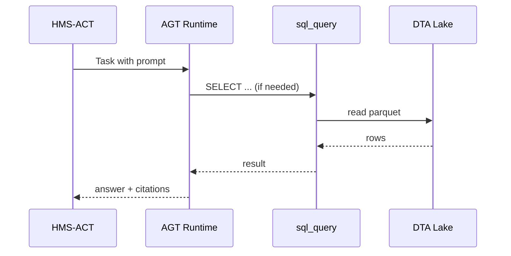

# Chapter 10: AI Agent Framework (HMS-AGT / HMS-AGX)

*(Coming from [Central Data Lake & Registry (HMS-DTA)](09_central_data_lake___registry__hms_dta__.md) you now have clean, well-labeled data.  
But who will read those tables at 2 A.M., answer policy questions, and file reports while humans sleep?  
That job belongs to our trainable “policy interns” — the AI agents.)*

---

## 1. Why Do We Need an Agent Framework? 🕵️‍♀️

### Central Use-Case  
The **St. Lawrence Seaway Development Corporation** wants an **AI lock-scheduler** that:

1. Reads yesterday’s cargo logs from HMS-DTA.  
2. Negotiates with shipping companies for optimal lock times.  
3. Respects environmental policies (e.g., “no nighttime openings during fish spawning”).  
4. Logs every suggestion for human approval in HMS-GOV.

Implementing this from scratch means wrangling chat models, memory, tools, ethics checks, and audit logs.  
**HMS-AGT** supplies the *general intern training*; **HMS-AGX** gives each intern a *specialty badge* (budget, legal, maritime, etc.).

---

## 2. Meet the Two Layers

| Layer | Analogy | What It Provides |
|-------|---------|------------------|
| HMS-AGT | Community College | Core skills: conversation loop, reasoning, memory, guard-rails |
| HMS-AGX | Graduate Certificate | Domain plug-ins: finance, law, health, maritime, etc. |

Think “AGT = driver’s license,” “AGX = commercial truck endorsement.”

---

## 3. Key Concepts (Plain English)

| Term | Think of it as… | Why You Care |
|------|-----------------|--------------|
| Agent | A chatty intern | Executes tasks & talks to users/services |
| Prompt Seed | The intern’s handbook | Base instructions it always follows |
| Memory | The intern’s notebook | Stores facts across turns |
| Tool | A calculator in the intern’s pocket | e.g., SQL query, HTTP call |
| Guard-Rail | HR policy | Blocks disallowed actions |
| Badge (AGX) | Specialty certificate | Unlocks extra tools & vocab |

---

## 4. Five-Minute Quick-Start: Build a “Budget Analyst” Agent

### 4.1  Scaffold with CLI (1 command)

```bash
npx hms-agt new budget-analyst
```

Creates:

```
budget-analyst/
 ├─ agent.yml
 ├─ tools/sql_query.py
 └─ run.py
```

### 4.2  Fill in `agent.yml` (≤15 lines)

```yaml
name: BudgetAnalystBot
role: "Federal Budget Intern"
model: gpt-3.5-turbo
memory: redis://localhost:6379/0
tools:
  - name: sql_query
    path: tools/sql_query.py
    guard: "readonly"     # cannot UPDATE or DELETE
seed_prompt: |
  You are a cautious intern at OMB.
  Only give numbers that you can prove with data.
```

**Explanation**

1. `memory` points to Redis → agent remembers past Q&A.  
2. Tool guard ensures the intern never mutates data.

### 4.3  Write a Tiny Tool (≤14 lines)

```python
# tools/sql_query.py
import dta, os, re

def run(query: str) -> str:
    assert re.match(r"^select", query.strip(), re.I), "Read-only only!"
    token = dta.auth(os.getenv("AGENT_ID"))
    return dta.query(query, token)[:3]   # return first 3 rows for brevity
```

### 4.4  Chat with the Agent (≤10 lines)

```python
# run.py
from agt import Agent
bot = Agent.load("agent.yml")
while True:
    msg = input("👤 ")
    print("🤖", bot.reply(msg))
```

Run:

```bash
python run.py
```

Sample session:

```
👤 How much was spent on Lock maintenance in 2023?
🤖 $12.9 M (source: SELECT SUM(cost) ... WHERE year=2023)
```

---

## 5. Plugging the Agent into a Workflow

When a citizen submits a maintenance FOIA request, **HMS-ACT** can assign a task to the agent.

```yaml
# snippet from a workflow in Chapter 8 style
- id: budget_check
  actor: AI:BudgetAnalystBot
  input: "{{request_id}}"
  on_complete: human_review
```

The agent’s reply (JSON) is stored in the task table and later displayed in HMS-GOV.

---

## 6. What Happens Under the Hood?



No direct DB credentials ever reach the model; the **tool layer** isolates queries.

---

## 7. Peek Inside the Runtime

### 7.1  Life-Cycle Manager (≤18 lines)

```python
# agt/core/lifecycle.py
class AgentRuntime:
    def __init__(self, cfg):
        self.cfg = cfg
        self.mem = RedisMemory(cfg["memory"])
    def reply(self, user_msg):
        ctx = self.mem.load()[-10:]           # last 10 turns
        prompt = self._build_prompt(user_msg, ctx)
        answer = call_openai(cfg["model"], prompt)
        self.mem.save(user_msg, answer)
        return answer
```

*Beginner take*: It’s just **load → build prompt → call model → save**.

### 7.2  Guard-Rail Checker (≤12 lines)

```python
# agt/core/guard.py
BANNED = ["SSN", "classified"]
def check(output):
    for bad in BANNED:
        if bad.lower() in output.lower():
            raise ValueError("Policy breach!")
```

Runs **before** sending a response upstream.  
Full rule set lives in [AI Governance Values Layer](11_ai_governance_values_layer_.md).

---

## 8. Adding a Specialty Badge with HMS-AGX

Want maritime knowledge? Install a badge:

```bash
npx hms-agx add maritime
```

Updates `agent.yml`:

```yaml
badges:
  - maritime
tools:
  - name: lock_schedule_optimizer   # auto-added
    path: agx_maritime/optimizer.py
```

Now the same agent can answer:

```
👤 Suggest an opening sequence for Locks 2-4 tomorrow.
🤖 Proposed schedule uploaded as CSV (energy use −8 %, wait time −12 %)
```

Behind the scenes `lock_schedule_optimizer` called a linear-program solver.

---

## 9. Common Pitfalls & Quick Fixes

| Symptom | Cause | Quick Fix |
|---------|-------|-----------|
| Agent forgets context | Memory store not set | Point `memory:` to Redis or Postgres |
| “Policy breach!” errors | Output includes banned terms | Refine prompt or expand allowed list in Values Layer |
| Tool timeouts | Long SQL queries | Limit rows or move heavy logic to HMS-ACT batch job |

---

## 10. Hands-On Exercise (10 min)

1. `git clone https://github.com/hms-samples/agt-demo && cd agt-demo`  
2. `npm run bootstrap` — starts Redis + dummy DTA API.  
3. `python run.py` and ask: “Total lock tonnage last week?”  
4. Add the **maritime** badge: `npx hms-agx add maritime` and retry.  
5. Open `redis-cli LRANGE BudgetAnalystBot 0 -1` to inspect stored memory.

---

## 11. Recap & What’s Next

You have seen how the **AI Agent Framework**:

• Standardizes agent life-cycle, memory, and tool calls (HMS-AGT).  
• Adds domain super-powers through plug-in badges (HMS-AGX).  
• Integrates cleanly with workflows, data lakes, and governance guard-rails.

Next we dive deeper into the **ethical “rails”** that every agent must respect:  
[AI Governance Values Layer](11_ai_governance_values_layer_.md) 🎛️

---

---

Generated by [HardisonCo [NARA-DOC]](https://github.com/The-Pocket/Tutorial-Codebase-Knowledge)