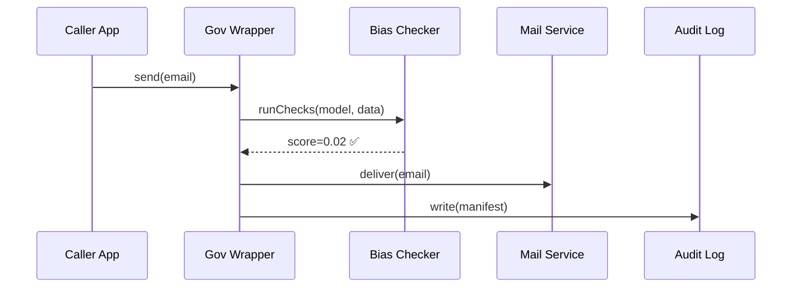

# Chapter 10: AI Governance Layer (Transparency, Ethics, Safety, Privacy)

[← Back to Chapter 9: Data Privacy & Compliance Framework](09_data_privacy___compliance_framework_.md)

---

## 1. Why Do We Need a “Governance Layer” *On Top* of All This Tech?

Meet **Ellie**, a Senate staffer who is reviewing an automated letter the HMS platform just mailed to 2 000 veterans about a benefits change.  
Her boss asks three rapid-fire questions:

1. *“Which AI model wrote this letter?”*  
2. *“Did we check for bias against disabled vets?”*  
3. *“Who approved sending it at 2 a.m.?”*

If Ellie can’t answer **within minutes**, congressional hearings (and public trust) are at risk.

The **AI Governance Layer** bakes answers **into every automated action**—think of it as stapling a mini *Congressional Research Service* report to each decision.  
No more hunting through Slack threads or code repos; the *why*, *who*, and *how safe* are always one click away.

---

## 2. Key Concepts in Plain English

| Concept | Everyday Hill Analogy | Why It Matters |
|---------|----------------------|----------------|
| **Provenance Stamp** | A bill’s *“sponsor + committee history”* | Shows exactly which model & data made the decision |
| **Bias Check Score** | CBO cost estimate appended to a bill | Flags disparate impact before action |
| **Safety Guardrail** | Senate “Byrd Rule” that can nix amendments | Stops unsafe or privacy-breaking outputs |
| **Governance Manifest** | Cover page of a legislative report | Bundles all metadata in one JSON blob |
| **Real-Time Audit Feed** | C-SPAN live broadcast | Oversight teams watch events as they occur |
| **Kill Switch** | Motion to recommit | Instantly rolls back or pauses a model |

Keep these six terms handy—the rest of the chapter is just showing them in action.

---

## 3. A 3-Minute “Hello, World”  

### Goal  
Send an **AI-generated reminder** to veterans and automatically produce a Governance Manifest for each email.

```js
// file: sendReminder.js  ⬇ 18 lines
import { withGovernance } from '@hms/aigov-sdk';
import { composeEmail   } from '@hms/ml-email';

async function run() {
  const send = withGovernance({
    action:      'veteran_benefit_reminder',
    model:       'o4-minio',
    reviewer:    'ellie.senate.gov',
    biasRuleset: 'va-fairness-v1'
  });

  const email = await composeEmail({
    template: 'benefit-reminder',
    variables:{ name: 'Ava Smith', deadline: 'May 1' }
  });

  await send(email, /* to: */ 'ava@email.com');
}

run();
```

**What happened?**

1. `withGovernance()` wraps the *normal* send routine.  
2. Behind the scenes it:
   • records the model version,  
   • runs a bias check,  
   • stamps provenance + timestamp,  
   • streams the manifest to the Audit Feed.  
3. If any guardrail fails, the email is **blocked** and Ellie gets a Slack alert.

---

## 4. Step-by-Step Under the Hood



Five actors—easy to remember!

---

## 5. Peeking at the Implementation

### 5.1 Governance Manifest (JSON, 12 lines)

```json
{
  "id": "act-9081f",
  "action": "veteran_benefit_reminder",
  "model":  "o4-minio@2024-04-23",
  "bias":   { "ruleset":"va-fairness-v1", "score":0.02 },
  "safety": "pass",
  "dataHash": "sha256:ab12…",
  "timestamp": "2024-04-01T06:15Z",
  "approver": "ellie.senate.gov"
}
```

Saved in **`audit.governance_manifest`** table and streamed over WebSockets to oversight dashboards.

---

### 5.2 Bias Checker Rule (Python, 9 lines)

```python
# file: bias_rules/va_fairness_v1.py
def score(text: str) -> float:
    bad_words = ['dishonorable', 'lazy']
    hits = sum(1 for w in bad_words if w in text.lower())
    return hits / len(bad_words)      # 0.0 (good) → 1.0 (bad)
```

• Stays *tiny* for demo; replace with spaCy or OpenAI moderation in prod.

### 5.3 Safety Guardrail Config (YAML, 10 lines)

```yaml
# file: gov/guardrails.yaml
veteran_benefit_reminder:
  maxEmailsPerHour: 5000
  allowAfter: "06:00"
  allowBefore: "22:00"
  killSwitchEnv: "GOV_KILL_EMAILS"
```

If someone toggles `GOV_KILL_EMAILS=true`, all matching actions halt instantly.

### 5.4 10-Line SQL Table

```sql
CREATE TABLE governance_log (
  id          TEXT PRIMARY KEY,
  manifest    JSONB,
  created_at  TIMESTAMPTZ DEFAULT now()
);
```

Every row is immutable (`row_security = FORCE ALL`).

---

## 6. First-Time Integration Checklist

| Step | Command / Action | Time |
|------|------------------|------|
| 1. Install wrapper | `npm i @hms/aigov-sdk` | 15 s |
| 2. Add bias rules file | drop in `bias_rules/` | 30 s |
| 3. Create guardrail YAML | see 5.3 | 1 min |
| 4. Wrap your call | `withGovernance({...})(payload)` | 20 s |
| 5. Tail audit feed | `hms-aigov tail` | 10 s |

Total ≈ **2 minutes** to get transparent, auditable AI.

---

## 7. Common Pitfalls & Tips

1. **Forgetting to Wrap the Call**  
   • Symptom: action executes but no manifest.  
   • Fix: always call through `withGovernance`.

2. **Over-strict Bias Thresholds**  
   • Start generous (`≤0.2`), tighten after pilots.  

3. **Kill Switch Blindsiding Ops**  
   • Document env vars in runbook; tie to PagerDuty.

4. **Metadata Drift**  
   • Pin model/version in config, not free-text.

---

## 8. Where This Fits in the HMS Stack

* **Privacy controls** from [Chapter 9](09_data_privacy___compliance_framework_.md) protect *data*;  
  the **Governance Layer** protects the *decision*.  
* Manifests surface in the **Dashboard Hub** in [HMS-GOV](06_core_system_platform__hms_gov__.md).  
* **AI Representative Agent** (Chapter 3) must pass the same checks before auto-publishing a policy.  
* Human reviewers in **HITL Oversight** (Chapter 4) see full provenance before approving.

---

## 9. Summary & What’s Next

You learned how to:

* Automatically stamp every AI action with provenance, bias score, and safety status.  
* Wrap an existing function in **one line** to gain transparency.  
* Store immutable manifests and expose real-time audit feeds.  
* Configure guardrails and an instant kill switch.

Next we’ll look at how HMS keeps outside systems (e.g., Treasury, VA, DMV) *synchronized* with these governed actions.  
Continue to ➡ [External System Sync](11_external_system_sync_.md)

---

*Transparency and ethics are no longer after-thoughts—they’re first-class citizens baked into every keystroke your AI makes.*

---

Generated by [HardisonCo [NARA-DOC]](https://github.com/The-Pocket/Tutorial-Codebase-Knowledge)