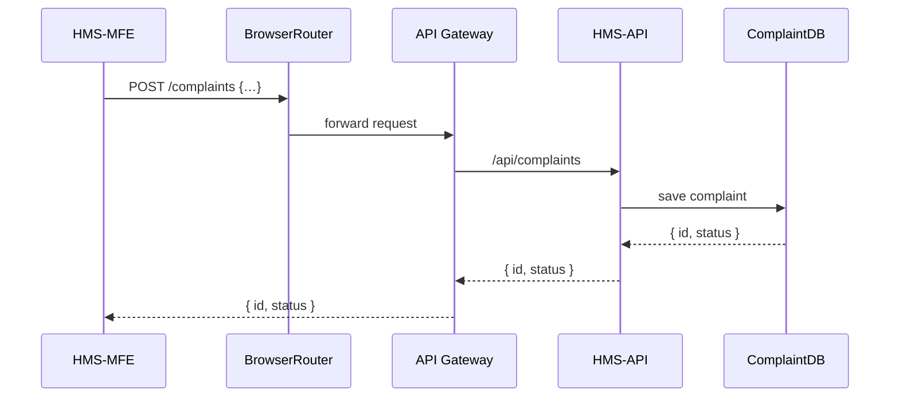

# Chapter 10: Frontend Interfaces (HMS-MFE/HMS-GOV)

In [Chapter 9: External System Synchronization](09_external_system_synchronization_.md), we learned how backend events flow out to partner systems. Now let’s build the **user-facing portals** where citizens and administrators actually log in, submit forms, and manage cases: the **HMS-MFE** (Micro Frontend for citizens) and **HMS-GOV** (Admin/Government Portal).

---

## Motivation & Central Use Case

Problem: Citizens and government staff need two different “service counters” that share the same look, feel, and components—yet each must show the right features.  
Solution: We build two frontends (HMS-MFE for citizens, HMS-GOV for admins) that:

- Use a **shared component library** for buttons, forms, and navigation  
- Handle **intent-driven flows** (see [Chapter 3](03_intent_driven_navigation_.md))  
- Respect **access control** (customers vs. policy-makers)  

Use Case: A prospective recruit uses HMS-MFE on their phone to apply for training at the Federal Law Enforcement Training Centers (FLETC). In parallel, a training officer logs into HMS-GOV to review and approve the application.

---

## Key Concepts

- **Micro Frontends (HMS-MFE)**  
  Separate, self-contained UI modules for citizen interactions (React, Vue, or Angular).

- **Admin Portal (HMS-GOV)**  
  A dashboard with tables, charts, and workflows for administrators.

- **Shared Component Library**  
  A central npm package (`@hms/ui-library`) for consistent design, accessibility, and theming.

- **Routing & State**  
  Client-side routers (e.g., React Router) and a lightweight store (e.g., Redux or Zustand) to keep UI state in sync.

- **Authentication & Roles**  
  JWT or OAuth flows that gate which features appear (submit form vs. manage backlog).

---

## Getting Started with HMS-MFE

1. Install the citizen micro-frontend:

```bash
npm install --save hms-mfe @hms/ui-library
```

2. Mount it in your HTML page:

```javascript
// src/index.js
import { renderCitizenApp } from 'hms-mfe'
import '@hms/ui-library/dist/styles.css'

renderCitizenApp({
  rootId: 'app',
  onError: err => console.error('UI error:', err)
})
```

Explanation:  
- `renderCitizenApp` bootstraps the MFE into a `<div id="app">`.  
- The shared CSS ensures buttons and forms look right.

3. Citizen flow example:

```javascript
// In a component
import { Button, Input } from '@hms/ui-library'
function NoiseComplaintForm() {
  return (
    <form onSubmit={handleSubmit}>
      <Input name="description" label="Describe the noise" />
      <Button type="submit">Send Complaint</Button>
    </form>
  )
}
```

Explanation:  
- We import `Button` and `Input` from the same library HMS-GOV uses—consistent UX!

---

## Getting Started with HMS-GOV

1. Install the admin portal:

```bash
npm install --save hms-gov @hms/ui-library
```

2. Mount the admin dashboard:

```javascript
// src/adminIndex.js
import { renderAdminApp } from 'hms-gov'
import '@hms/ui-library/dist/styles.css'

renderAdminApp({
  rootId: 'admin-root',
  role: 'training-officer',
})
```

3. Admin flow example:

```javascript
// In an admin page component
import { Table, Badge } from '@hms/ui-library'
function PendingApplications({ apps }) {
  return (
    <Table data={apps}>
      <Table.Column header="Name" accessor="applicantName" />
      <Table.Column
        header="Status"
        accessor="status"
        cell={s => <Badge color={s === 'pending' ? 'yellow' : 'green'}>{s}</Badge>}
      />
    </Table>
  )
}
```

Explanation:  
- `renderAdminApp` initializes nav, auth, and data fetching for administrators.

---

## Under the Hood: Request Flow

When a citizen submits a complaint in HMS-MFE, here’s the minimal sequence:



1. The citizen UI calls the client router.  
2. BrowserRouter sends the JSON to the API Gateway.  
3. The gateway forwards to HMS-API.  
4. HMS-API stores it and replies with a ticket ID.

---

## Implementation Details

### Shared Components (`@hms/ui-library`)

File: `ui-library/src/Button.jsx`

```javascript
export function Button({ children, ...props }) {
  return <button className="hms-btn" {...props}>{children}</button>
}
// CSS (.hms-btn) ensures high-contrast and keyboard focus
```

Explanation:  
- All teams use this `Button`, so apps stay consistent and accessible.

### Citizen App Entry (`hms-mfe/src/index.js`)

```javascript
import React from 'react'
import { createRoot } from 'react-dom/client'
import App from './App'

export function renderCitizenApp({ rootId }) {
  const container = document.getElementById(rootId)
  const root = createRoot(container)
  root.render(<App />)
}
```

Explanation:  
- We use React 18’s `createRoot` to mount the citizen app.

### Admin App Entry (`hms-gov/src/index.js`)

```javascript
import Vue from 'vue'
import AdminApp from './AdminApp.vue'

export function renderAdminApp({ rootId }) {
  new Vue({ render: h => h(AdminApp) }).$mount(`#${rootId}`)
}
```

Explanation:  
- The admin portal is Vue-based but shares the same UI library!

---

## Conclusion

In this chapter, you learned how to set up and run the **HMS-MFE** citizen portal and the **HMS-GOV** admin portal using shared components, intent-driven routing, and role-based features. You saw how a simple submit flow travels from UI to database and how both frontends remain consistent.

Next up, we’ll dive into how the server side powers these interfaces in [Chapter 11: Backend Services (HMS-SVC/HMS-API)](11_backend_services__hms_svc_hms_api__.md).

---

Generated by [HardisonCo [NARA-DOC]](https://github.com/The-Pocket/Tutorial-Codebase-Knowledge)