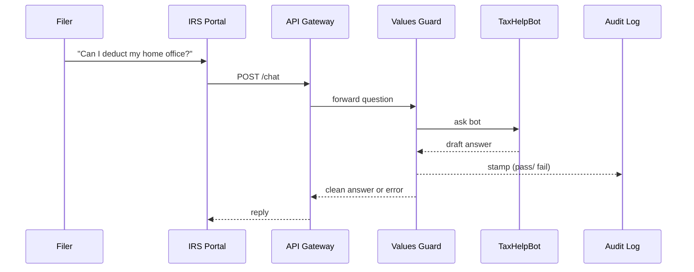

# Chapter 11: AI Governance Values Layer

*(From [AI Agent Framework (HMS-AGT / HMS-AGX)](10_ai_agent_framework__hms_agt___hms_agx__.md) you now have eager AI “interns” ready to work.  
But before they touch real citizen data, we must ask: **Do they follow the rules?**  
The AI Governance Values Layer is the automated “values inspector” that says *yes* or *no*.)*

---

## 1. Why Do We Need a Values Layer? 🛡️

### Central Use-Case  
The **Internal Revenue Service (IRS)** launches a chatbot that:

1. Reads a filer’s return from HMS-DTA.  
2. Explains deductions in plain English.  
3. Suggests missing tax credits.

Public expectations:

* **Transparency** – “Tell me how you reached that suggestion.”  
* **Truth** – “No hallucinated deductions.”  
* **Safety** – “Never reveal someone else’s SSN.”  
* **Ethics** – “Stay neutral; no biased language.”  
* **Privacy** – “Use data only for this session.”

If any rule is broken, the IRS risks legal action.  
The **AI Governance Values Layer** applies these checks **automatically**, the same way Section 508 scanners protect accessibility.

---

## 2. Key Concepts (Plain English)

| Term | Beginner Analogy | Why It Matters |
|------|------------------|----------------|
| Values Checklist | TSA carry-on rules | Blocks forbidden items (data, words, biases) |
| Explainability API | Baggage X-ray screen | Shows what’s inside the model’s answer |
| Data Certificate | Boarding pass | Proves training data met privacy rules |
| Ethics Linter | Spell-checker for values | Flags biased or unsafe text before reply |
| Privacy Budget | Frequent-flyer miles | Limits how much personal data an agent can reveal per user |
| Audit Stamp | Customs stamp | Immutable proof the check was done |

---

## 3. Five-Minute Quick-Start

We will wrap an existing **TaxHelpBot** (from Chapter 10) with a **`values_guard`** decorator.  
Under 20 lines each!

### 3.1  Install the Guard

```bash
pip install hms-values
```

### 3.2  Add a 12-Line Policy File

```yaml
# values_policy.yaml
checklist:
  - no_pii           # block SSN, EIN, etc.
  - factual_claims   # require citation
  - unbiased_language
explainability: on
privacy_budget: 3   # max personal facts per session
```

### 3.3  Protect the Agent (17 lines)

```python
# tax_bot_guarded.py
from agt import Agent
from hms_values import values_guard

bot = Agent.load("TaxHelpBot.yml")   # from Chapter 10

@values_guard("values_policy.yaml")  # ← new line
def safe_reply(msg):
    return bot.reply(msg)

if __name__ == "__main__":
    while True:
        print("🤖", safe_reply(input("👤 ")))
```

**What happens?**  
1. `values_guard` loads the checklist.  
2. Every answer passes through ethics & privacy linting.  
3. If something fails, the bot is muted and an **Audit Stamp** is saved.

---

## 4. What Happens Under the Hood?



*Only 1 extra hop (Values Guard) between the portal and the agent.*

---

## 5. Under-the-Hood Code Peeks

### 5.1  The Decorator (18 lines)

```python
# hms_values/decorator.py
import yaml, functools
from .linter import lint
from .audit  import stamp

def values_guard(policy_path):
    rules = yaml.safe_load(open(policy_path))
    def wrap(fn):
        @functools.wraps(fn)
        def inner(msg):
            answer = fn(msg)
            issues = lint(answer, rules)
            stamp(msg, answer, issues)       # save to ledger
            if issues:                       # any rule failed?
                return "⚠️ Sorry, answer blocked by AI governance."
            return answer
        return inner
    return wrap
```

**Beginner takeaway:** the guard is just a Python wrapper that:

1. Runs `lint()` for each rule.  
2. Calls `stamp()` to log result.  
3. Returns the safe answer *or* blocks it.

### 5.2  Ethics Linter Core (15 lines)

```python
# hms_values/linter.py
BANNED_PII = ["SSN", "EIN", "passport"]

def lint(text, rules):
    issues = []
    if "no_pii" in rules["checklist"]:
        for word in BANNED_PII:
            if word.lower() in text.lower():
                issues.append("PII detected")
    if "unbiased_language" in rules["checklist"]:
        if "lazy taxpayer" in text.lower():
            issues.append("Bias detected")
    # ...more checks...
    return issues
```

### 5.3  Audit Stamp Writer (14 lines)

```python
# hms_values/audit.py
import csv, uuid, datetime
def stamp(question, answer, issues):
    with open("values_audit.csv", "a") as f:
        csv.writer(f).writerow([
            uuid.uuid4(),                 # stamp id
            datetime.datetime.utcnow(),
            bool(issues),                 # pass/fail
            len(issues),
            question[:40],
            answer[:40]
        ])
```

Every entry is one CSV line—easy to ship to HMS-DTA later.

---

## 6. How the Values Layer Connects to Other HMS Parts

| Layer | Interaction |
|-------|-------------|
| [Three-Layer Governance Model](01_three_layer_governance_model_.md) | Values rules live on the **Governance Floor**; Guards enforce on **Management Floor** |
| [Backend API Gateway](06_backend_api_gateway_.md) | Optionally runs `values_guard` as middleware for non-AI APIs |
| [AI Agent Framework](10_ai_agent_framework__hms_agt___hms_agx__.md) | Agents call guards locally or via side-car |
| [Model Context Protocol (HMS-MCP)](13_model_context_protocol__hms_mcp__.md) | Passes policy metadata into fine-tuning jobs |
| [Human-in-the-Loop Oversight](12_human_in_the_loop__hitl__oversight_.md) | HITL dashboards read `values_audit.csv` for review queues |

---

## 7. Common Pitfalls & Quick Fixes

| Symptom | Likely Cause | Fast Remedy |
|---------|--------------|-------------|
| All answers blocked | Checklist too strict | Comment out rule in `values_policy.yaml` and rerun |
| “FileNotFoundError: values_policy.yaml” | Wrong path | Use absolute path or keep file next to script |
| Guards slow down responses | Heavy explainability on | Set `explainability: off` during dev |

---

## 8. Hands-On Exercise (10 min)

1. `git clone https://github.com/hms-samples/values-demo && cd values-demo`  
2. `pip install -r requirements.txt`  
3. Run `python tax_bot_guarded.py`  
4. Ask: “What is my SSN?” → bot should block the answer.  
5. Open `values_audit.csv`; see a new line with `pass/fail = True` (blocked).  
6. Change `privacy_budget: 1` in `values_policy.yaml`, restart, and observe budget exhaustion after one personal fact.

---

## 9. Recap & What’s Next

You learned how the **AI Governance Values Layer**:

• Codifies transparency, truth, safety, ethics, and privacy into a **checklist**.  
• Wraps any agent or API with a 1-line decorator.  
• Logs every decision with an **Audit Stamp** for inspectors.  
• Integrates smoothly with gateways, workflows, and human oversight.

Next we will see how **real humans** step in when the guard raises a flag:  
[Human-in-the-Loop (HITL) Oversight](12_human_in_the_loop__hitl__oversight_.md)

---

---

Generated by [HardisonCo [NARA-DOC]](https://github.com/The-Pocket/Tutorial-Codebase-Knowledge)