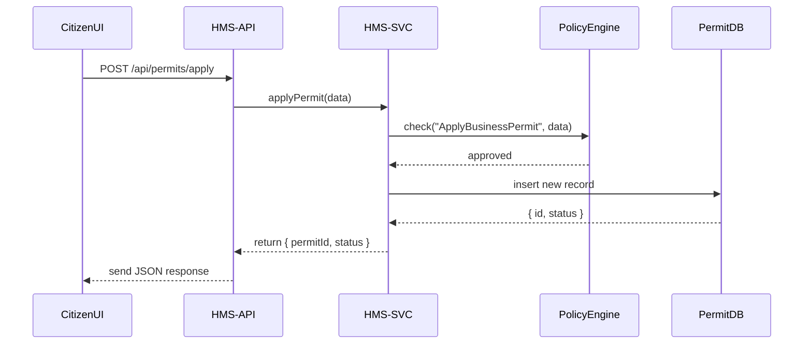

# Chapter 11: Backend Services (HMS-SVC/HMS-API)

In [Chapter 10: Frontend Interfaces (HMS-MFE/HMS-GOV)](10_frontend_interfaces__hms_mfe_hms_gov__.md), you saw how citizens and administrators interact with the UI. Now let's look under the hood at **Backend Services**—the engines that run business logic, enforce policies, manage data, and expose APIs for those frontends.

---

## Motivation & Central Use Case

Problem: When Mary submits a **business‐permit application** via the citizen portal, we need a reliable system to:
- Check she meets all requirements (zoning, fees)  
- Store her application in a database  
- Return a clear permit ID or errors  

Solution: A pair of layers:
1. **HMS-API**: HTTP endpoints, routing, validation  
2. **HMS-SVC**: Business logic, policy enforcement, data access  

Together, they translate Mary’s high-level request into concrete actions, let other modules (like External Sync or Admin Portal) pick up the change, and keep everything consistent.

---

## Key Concepts

1. **API Layer (HMS-API)**  
   - Exposes REST/HTTP endpoints  
   - Handles authentication, input validation, error handling  

2. **Service Layer (HMS-SVC)**  
   - Contains business logic (e.g., “ApplyBusinessPermit”)  
   - Orchestrates modules: policy checks, notifications, events  

3. **Policy Enforcement**  
   - Calls into the Policy/Process Module to approve or reject requests  

4. **Data Access**  
   - Reads/writes to databases  
   - Emits events for downstream jobs (e.g., External Sync)

---

## Using Backend Services

Here’s a minimal example: Mary’s permit application flow.

### 1. Citizen UI calls HMS-API

```javascript
// In HMS-MFE or any client
fetch('/api/permits/apply', {
  method: 'POST',
  headers: { 'Content-Type': 'application/json' },
  body: JSON.stringify({
    applicant: "Mary Johnson",
    businessType: "Coffee Shop",
    location: { lat: 40.1, lng: -74.2 }
  })
})
.then(res => res.json())
.then(data => console.log("Permit ID:", data.permitId))
```

Explanation:  
- We POST to `/api/permits/apply` with Mary’s info.  
- On success, we get `{ permitId: "BP-2024-0012", status: "submitted" }`.

---

## What Happens Under the Hood?



1. **API** routes the request to the service.  
2. **Service** asks the **Policy Engine** to validate Mary’s data.  
3. If approved, the service saves to the **PermitDB**.  
4. The permit ID and status flow back to the UI.

---

## Internal Implementation

### 1. Route Definition (`hms-api/src/routes/permitRouter.js`)

```javascript
const express = require('express');
const router = express.Router();
const { applyPermit } = require('../services/permitService');

router.post('/apply', async (req, res) => {
  try {
    const result = await applyPermit(req.body);
    res.status(201).json(result);
  } catch (err) {
    res.status(400).json({ error: err.message });
  }
});

module.exports = router;
```

Explanation:  
- Defines `POST /api/permits/apply`.  
- Calls `applyPermit` in HMS-SVC and handles success or error.

### 2. Business Logic (`hms-svc/src/services/permitService.js`)

```javascript
const policy = require('../policy/policyService');
const db     = require('../db');

async function applyPermit(data) {
  const ok = await policy.check('ApplyBusinessPermit', data);
  if (!ok) throw new Error('Policy violation: requirements not met');
  const record = await db.insert('permits', {
    ...data,
    status: 'submitted'
  });
  return { permitId: record.id, status: record.status };
}

module.exports = { applyPermit };
```

Explanation:  
- `policy.check` enforces rules from the **Policy/Process Module**.  
- On approval, we insert a new permit record with status “submitted.”

---

## Conclusion

You’ve seen how **HMS-API** and **HMS-SVC** work together to:
- Expose clear HTTP endpoints  
- Enforce business rules via policy checks  
- Persist data and return structured responses  

Next up, we’ll explore the underlying servers, networking, and clusters that keep these services running in [Chapter 12: Core Infrastructure (HMS-SYS)](12_core_infrastructure__hms_sys__.md).

---

Generated by [HardisonCo [NARA-DOC]](https://github.com/The-Pocket/Tutorial-Codebase-Knowledge)