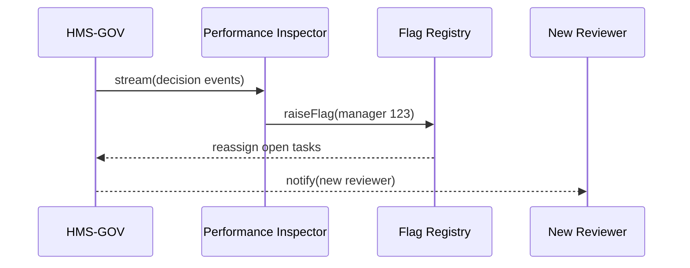

# Chapter 12: Autonomous Performance & Replacement Logic
[← Back to Chapter 11: External System Sync](11_external_system_sync_.md)

---

## 1. Why Do We Need “Self-Healing” Teams?

Picture the **Bureau of Consular Affairs** on a hectic Monday.  
The **AI Representative Agent** has drafted three small routing tweaks that would cut passport wait-times by 40 %.  
Unfortunately, the assigned *human* manager clicks **Reject** on every proposal—no comment, no alternative, just “No.”  
Citizens keep waiting.

If HMS does nothing, service quality plummets and Congress will be knocking.  
**Autonomous Performance & Replacement Logic** is the platform’s quiet referee:

* Scores every *human* **and** *AI* component against its SLA (speed, accuracy, equity).  
* Detects chronic blockers or under-performers.  
* Raises a flag, then auto-reassigns work to a better-scoring peer—similar to an Inspector General stepping in.

End result: passport lines shrink even if one office (or model) drags its feet.

---

## 2. Key Concepts in Plain English

| Term | Everyday Analogy | Why It Matters |
|------|------------------|----------------|
| **SLA** (Service-Level Agreement) | “We promise a 2-day passport renewal.” | Sets the yard-stick. |
| **Scorecard** | School report card (A–F) | Quantifies speed, accuracy, equity. |
| **Inspector** | Mystery shopper | Monitors without disrupting work. |
| **Flag** | Yellow card in soccer | Signals persistent under-performance. |
| **Replacement Policy** | Substitute player joins the game | Auto-routes tasks to a higher scorer. |

Keep these five terms handy; the code samples below revolve around them.

---

## 3. 60-Second “Hello, World”

Goal: flag a **manager** who rejects every AI proposal within 24 h.

```js
// file: score_proposals.js   (18 lines)
import { recordAction, raiseFlag } from '@hms/a2a';

export async function onDecision({ managerId, decision }) {
  // 1️⃣ store the decision
  await recordAction('proposal_review', managerId, { decision });

  // 2️⃣ fetch last 10 decisions
  const last10 = await recordAction.last('proposal_review', managerId, 10);

  // 3️⃣ if 10/10 are "reject", raise a flag
  const allRejects = last10.every(d => d.decision === 'reject');
  if (allRejects) {
    await raiseFlag({
      actor: managerId,
      issue: 'blocks_all_ai_proposals',
      severity: 'medium'
    });
  }
}
```

Explanation  
1. `recordAction` stores a normalized event for scoring.  
2. We look back at the manager’s last 10 reviews.  
3. If every one is **Reject**, we call `raiseFlag()`—the platform handles reassignment and alerts.

---

## 4. What Happens Behind the Curtain?



Four simple actors—easy to remember!

---

## 5. Under-the-Hood Walk-Through

### 5.1 The Scorecard Table (SQL, 9 lines)

```sql
CREATE TABLE scorecard (
  actor_id   TEXT,
  metric     TEXT,    -- speed, accuracy, equity
  window     INTERVAL,
  score      NUMERIC, -- 0.0 – 1.0 (higher is better)
  updated_at TIMESTAMPTZ,
  PRIMARY KEY (actor_id, metric, window)
);
```

* Every **AI model** and **human ID** gets rows here.  
* A nightly job recalculates scores from the raw **event_log**.

---

### 5.2 Mini Flag Evaluator (Python, 15 lines)

```python
# file: evaluator.py
from db import fetch_score

def should_flag(actor):
    speed   = fetch_score(actor, 'speed',  '24 hours')
    equity  = fetch_score(actor, 'equity', '30 days')
    blocks  = fetch_score(actor, 'blocks', '7 days')

    if speed < 0.6:       # too slow
        return 'slow'
    if equity < 0.8:      # unfair outcomes
        return 'bias'
    if blocks > 0.9:      # rejects 90 % of items
        return 'blocks_all_ai'
    return None
```

Beginners’ notes  
* `fetch_score` returns a 0 – 1 number already normalized.  
* We keep thresholds readable in plain code—no ML magic needed.

---

### 5.3 Replacement Policy (YAML, 10 lines)

```yaml
# file: replacement.yaml
rules:
  - whenFlagged: blocks_all_ai
    reassignTo:  role:higher_reviewer
    coolOff:    14d
  - whenFlagged: slow
    reassignTo:  "auto_approve_bot"
    coolOff:    7d
```

*If a human blocks everything, tasks jump to a peer with the `higher_reviewer` role for two weeks.*

---

### 5.4 10-Line Go Handler: “Apply Replacement”

```go
// file: api/replace.go
func Replace(w http.ResponseWriter, r *http.Request) {
  var f Flag
  json.NewDecoder(r.Body).Decode(&f)
  dest := chooseReplacement(f)
  db.Exec(`UPDATE tasks SET assignee=$1 WHERE assignee=$2 AND status='queued'`,
          dest, f.ActorID)
  w.WriteHeader(204)
}
```

`chooseReplacement()` looks up the YAML above—kept <20 lines elsewhere.

---

## 6. First-Time Integration Checklist

| Step | Command / Action | Time |
|------|------------------|------|
| 1 | Install SDK: `npm i @hms/a2a` | 30 s |
| 2 | Emit events: `recordAction(type, actor, data)` | 1 min |
| 3 | Add thresholds in `evaluator.py` | 2 min |
| 4 | Define `replacement.yaml` | 1 min |
| 5 | Watch flags: `hms-a2a watch` | 30 s |

Total ≈ **5 minutes** to gain self-healing oversight.

---

## 7. Common Pitfalls & Tips

1. **Too-Aggressive Thresholds**  
   • Start conservative (e.g., flag at <50 % SLA), tighten later.

2. **Score Gaps for New Actors**  
   • Bootstrap with neutral score `0.8` to avoid immediate flags.

3. **Circular Reassignment Loops**  
   • `coolOff` prevents ping-ponging tasks every minute.

4. **Human Morale**  
   • Send a polite notice to flagged staff explaining next steps.

---

## 8. How This Connects to Earlier Layers

* **Events** originate from tasks in [HMS-GOV](06_core_system_platform__hms_gov__.md) and decisions in [HITL Oversight](04_human_in_the_loop__hitl__oversight_.md).  
* Scorecards are stored alongside **audit manifests** from the [AI Governance Layer](10_ai_governance_layer__transparency__ethics__safety__privacy__.md).  
* If a replacement involves an external system (e.g., rerouting to Treasury), the sync bridge in [External System Sync](11_external_system_sync_.md) still keeps data aligned.

---

## 9. Summary

You learned how HMS:

* Tracks every actor’s speed, accuracy, and fairness.  
* Raises automatic flags for chronic under-performance.  
* Reassigns work through a simple YAML policy—no midnight hot-fixes.  
* Does all this in **under 20 lines** of code per component.

This chapter completes the core HMS-A2A tutorial.  
With self-healing teams, the platform stays resilient—even when people (or models) have an off day.

*Congratulations—your HMS now not only works, it protects itself!*

---

Generated by [HardisonCo [NARA-DOC]](https://github.com/The-Pocket/Tutorial-Codebase-Knowledge)