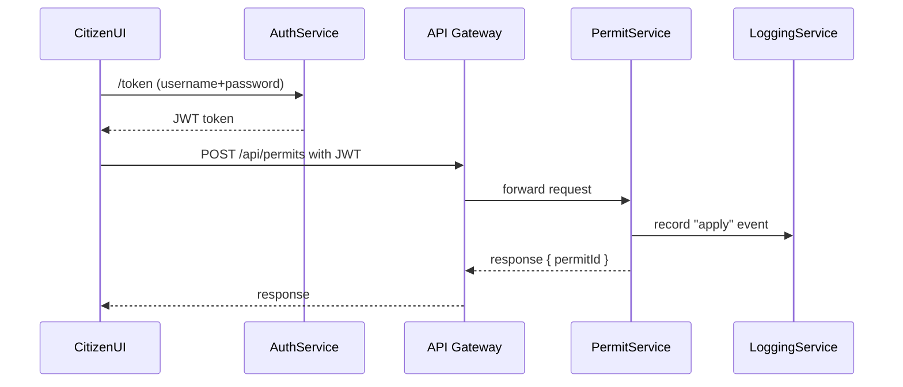

# Chapter 12: Core Infrastructure (HMS-SYS)

In [Chapter 11: Backend Services (HMS-SVC/HMS-API)](11_backend_services__hms_svc_hms_api__.md), you saw how APIs and services handle business logic. Now we’ll zoom out to the **Core Infrastructure (HMS-SYS)**—the “utilities and roads” every service and portal relies on for identity, security, logging, and communication.

## Motivation & Central Use Case

Imagine a citizen logs into the User Portal, submits a request, and several microservices must talk to each other securely. Without a common identity system, each service would build its own login, encryption, and logs—imagine five power plants each digging their own wells! HMS-SYS unifies:

- Authentication & authorization  
- Secure inter-service calls  
- Centralized logging & monitoring  
- Service discovery (who’s running where)

**Use Case:**  
1. Alice logs in at the portal (gets a token).  
2. Portal calls the Permit Service—token in hand.  
3. Permit Service checks policy, writes logs.  
4. A downstream Notification Service picks up events.  

HMS-SYS ensures each step is secure, authenticated, and recorded in one place.

## Key Concepts

1. **Identity & Access Management**  
   Issue tokens (e.g., JWT), validate roles (citizen, admin).

2. **Security & Encryption**  
   Mutual TLS or signed tokens to protect data in flight.

3. **Logging & Monitoring**  
   Central log service that tags every request for audit and troubleshooting.

4. **Service Discovery & Communication**  
   A registry where services register themselves; clients look up endpoints.

## Getting Started with HMS-SYS

Below is a minimal example showing how a frontend authenticates and calls a backend, with logging.

### 1. Authenticate & Get Token

```javascript
import { AuthClient } from 'hms-sys-auth'

async function login(username, password) {
  const token = await AuthClient.acquireToken({ username, password })
  console.log('Received token:', token)
  return token
}
```

This gets a JWT from HMS-SYS. We’ll use it for all calls.

### 2. Secure Service Call & Logging

```javascript
import { ServiceClient } from 'hms-sys-comm'
import { LogClient }     from 'hms-sys-logging'

async function submitPermit(token, data) {
  const client = ServiceClient.create('PermitService', token)
  const result = await client.post('/apply', data)
  LogClient.record({ service: 'PermitService', user: 'alice', action: 'apply', result })
  return result
}
```

- `ServiceClient` looks up the endpoint in the registry, attaches the token.  
- `LogClient` sends a structured audit entry to the central log store.

## What Happens Under the Hood?



1. **AuthService** issues a token.  
2. The UI calls the Gateway with the JWT.  
3. Gateway forwards to **PermitService**.  
4. PermitService logs the action.  
5. The response flows back to the UI.

## Internal Implementation

### 1. Authentication Service (hms-sys/src/services/authService.js)

```javascript
class AuthService {
  async acquireToken({ username, password }) {
    // validate credentials (omitting DB calls)
    const claims = { sub: username, roles: ['citizen'] }
    // sign a JWT
    return Jwt.sign(claims, process.env.JWT_SECRET, { expiresIn: '1h' })
  }
}
module.exports = new AuthService()
```

Simple: checks user, signs a JWT.

### 2. Service Registry (hms-sys/src/services/registryService.js)

```javascript
class RegistryService {
  constructor() { this.services = {} }
  register(name, url) { this.services[name] = url }
  lookup(name) { return this.services[name] }
}
module.exports = new RegistryService()
```

Services call `register()` at startup. Clients call `lookup()` to find where to send requests.

### 3. Logging Service (hms-sys/src/services/logService.js)

```javascript
class LogService {
  async record(entry) {
    // in reality: enqueue to a log store (e.g., Elasticsearch, Kafka)
    console.log('[AUDIT]', JSON.stringify(entry))
  }
}
module.exports = new LogService()
```

Every service uses `LogService` to record actions for traceability.

## Conclusion

You’ve seen how **Core Infrastructure (HMS-SYS)** provides the foundation—identity, security, logging, and service discovery—so that every microservice and portal just “plugs in” without rebuilding common utilities. Next up, dive into how all these pieces fit in our **Microservices Architecture** in [Chapter 13: Microservices Architecture](13_microservices_architecture_.md).

---

Generated by [HardisonCo [NARA-DOC]](https://github.com/The-Pocket/Tutorial-Codebase-Knowledge)