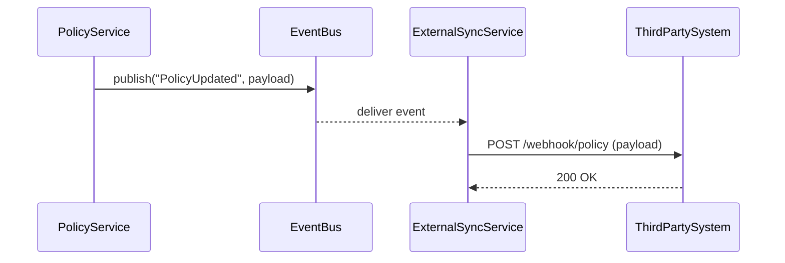

# Chapter 12: External System Synchronization

In [Chapter 11: Autonomous Workflow Engine](11_autonomous_workflow_engine_.md) we automated end-to-end pipelines inside HMS. But in many real-world projects, you also need to keep _external_ systems—like a third-party scheduling tool or a case-management database—in sync with your policy and process changes. That’s what **External System Synchronization** solves: it’s like an electronic notice board that instantly shares updates with all stakeholders.

---

## 12.1 Why External System Synchronization?

Imagine the Office of the Federal Register publishes a new meeting room schedule in HMS. At the same time, a city planning case-management system must see those room bookings to schedule on-site inspections. Rather than manually copying updates back and forth, we want:

- Real-time notifications when a booking or policy changes  
- Automatic delivery of those changes to one or many external endpoints  
- Simple configuration of which events go where  

This saves time, avoids human error, and keeps all parties on the same page.

---

## 12.2 Key Concepts

1. **Event Bus**  
   A simple in-app system that lets services “publish” events (e.g., `PolicyUpdated`).  
2. **ExternalSyncService**  
   A component that _subscribes_ to internal events, transforms them if needed, and _pushes_ them to configured external URLs (via HTTP/webhooks).  
3. **Target Configuration**  
   Metadata defining which event names map to which external endpoint URLs (and any auth tokens).  
4. **Retry / Backoff**  
   A basic mechanism to retry failed deliveries so transient network errors don’t lose data.

---

## 12.3 Using External System Synchronization

Below is a minimal example. We’ll:

1. Create and configure an `ExternalSyncService`.  
2. Have our `PolicyService` publish an event when a policy updates.  
3. Let `ExternalSyncService` catch that event and POST it to a third-party.

### 12.3.1 Configure Sync Targets

```python
# file: sync_setup.py
from external_sync import ExternalSyncService

sync = ExternalSyncService()

# Whenever event "PolicyUpdated" occurs, POST payload to the external URL
sync.register_target(
  event_name="PolicyUpdated",
  endpoint_url="https://thirdparty.gov/webhook/policy",
  auth_token="Bearer abc123"
)
```

Explanation:  
- We import and instantiate `ExternalSyncService`.  
- We call `register_target` with the internal event name, the external endpoint URL, and an auth token.  

### 12.3.2 Publish an Event in PolicyService

```python
# file: policy_service.py
from event_bus import EventBus

def update_policy(policy_id, new_body):
    # … update logic …
    updated = {"id": policy_id, "body": new_body}
    # Notify internal listeners
    EventBus.publish("PolicyUpdated", updated)
    return updated
```

Explanation:  
- After updating a policy, we call `EventBus.publish` with the event name and payload.  
- Any subscriber—like `ExternalSyncService`—will receive this.

---

## 12.4 What Happens Under the Hood?



1. **PolicyService** publishes a `"PolicyUpdated"` event to the **EventBus**.  
2. The **EventBus** broadcasts to all subscribers.  
3. **ExternalSyncService** sees the event, looks up the configured endpoint, and sends an HTTP POST.  
4. The external system acknowledges with `200 OK`.

---

## 12.5 Under the Hood: Implementation Details

### 12.5.1 A Simple Event Bus

```python
# file: event_bus.py
class EventBus:
    _subscribers = {}

    @classmethod
    def subscribe(cls, event_name, handler):
        cls._subscribers.setdefault(event_name, []).append(handler)

    @classmethod
    def publish(cls, event_name, payload):
        for handler in cls._subscribers.get(event_name, []):
            handler(event_name, payload)
```

- `subscribe` lets components register a handler for an event.  
- `publish` calls every handler for that event immediately.

### 12.5.2 ExternalSyncService

```python
# file: external_sync.py
import requests, time
from event_bus import EventBus

class ExternalSyncService:
    def __init__(self):
        self.targets = {}  # event_name -> { url, auth }

    def register_target(self, event_name, endpoint_url, auth_token=None):
        self.targets[event_name] = {"url": endpoint_url, "auth": auth_token}
        # Subscribe to events
        EventBus.subscribe(event_name, self._handle_event)

    def _handle_event(self, event_name, payload):
        cfg = self.targets[event_name]
        headers = {"Content-Type":"application/json"}
        if cfg["auth"]:
            headers["Authorization"] = cfg["auth"]
        # Simple retry loop
        for attempt in range(3):
            try:
                resp = requests.post(cfg["url"], json=payload, headers=headers)
                if resp.status_code == 200:
                    return
            except Exception:
                time.sleep(2 ** attempt)  # exponential backoff
        print(f"⚠️ Failed to sync {event_name}")
```

- We keep a `targets` dict mapping event names to endpoint configs.  
- On `register_target`, we subscribe `_handle_event` to the event.  
- `_handle_event` does an HTTP POST and retries up to 3 times on failure.

---

## 12.6 Conclusion

In this chapter, you learned how to wire up **External System Synchronization** in HMS:

- Use a simple **EventBus** to publish internal events.  
- Configure an **ExternalSyncService** to subscribe to those events and push them to third-party URLs.  
- Enjoy real-time, automated updates—no more manual copy-paste!

With this, HMS can now keep both its own services and outside partners perfectly in sync.

Good luck integrating with your favorite external systems!

---

Generated by [HardisonCo [NARA-DOC]](https://github.com/The-Pocket/Tutorial-Codebase-Knowledge)