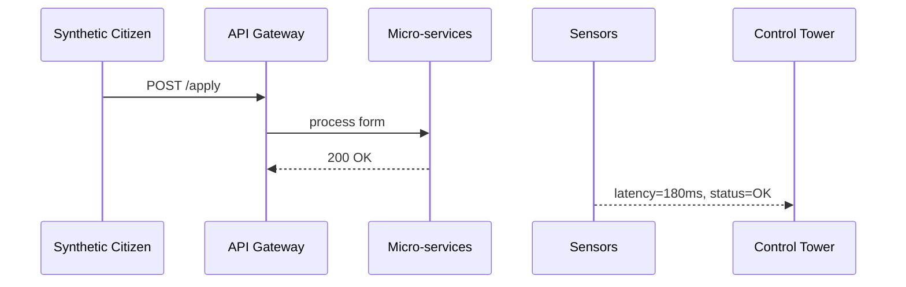

# Chapter 15: Simulation & Testing Environment (HMS-ESR)

*Coming from [Real-Time External System Sync](14_real_time_external_system_sync_.md) you saw how one new lock-schedule can ripple to ships, Coast Guard, and legacy servers in seconds.  
Before we let that kind of change loose on **millions** of real citizens, we need a safe “fire-drill” floor.  
That floor is HMS-ESR — the **Simulation & Testing Environment**.*

---

## 1. Why Do We Need ESR? 🚒

### Central Use-Case  
The **Department of Education (ED)** plans to launch a new “Same-Day Tuition Grant” policy at **08:00 Monday**.

What could go wrong if we skip rehearsals?

| Risk | Real-World Pain |
|------|-----------------|
| 50 000 students hit “Apply” at once | API Gateway melts down |
| Out-of-state applicants sneak through | Policy bug costs \$8 M |
| Coast Guard sync fails (wrong funding codes) | Budget reports break |

**HMS-ESR** lets ED:

1. Spin up **synthetic students** who click buttons, upload PDFs, and even complain on social media.  
2. Inject slow databases or flaky networks to mimic Monday-morning chaos.  
3. Watch live dashboards to spot bottlenecks **before** citizens do.

Think of it as a **fire drill** for software and policy combined.

---

## 2. Key Concepts in Plain English

| Term | Beginner Analogy | What It Does |
|------|------------------|--------------|
| Synthetic Citizen | Actor in a training video | Sends realistic clicks & forms |
| Scenario Script | Movie screenplay | Defines who does what & when |
| Sensor | Smoke detector | Measures latency, error rate, ethics flags |
| Fault Injector | Pulls the fire alarm | Adds outages, slowdowns, bad data |
| Control Tower | Drill instructor | Starts / stops scenarios, shows dashboards |

---

## 3. Five-Minute Quick-Start

We will:

1. Write a **Scenario Script** that simulates 1000 grant applicants.  
2. Run it with ESR.  
3. Read a live “green / yellow / red” dashboard.

### 3.1  Create the Scenario (≤ 18 lines)

```yaml
# scenarios/tuition_grant.yml
name: TuitionGrantLoad
users: 1000
ramp_up: 5m          # reach full load in 5 minutes
script:
  - click: "/apply"
  - fill:
      field: "state"
      value: "{{ random.states }}"
  - upload:
      path: "./fixtures/transcript.pdf"
  - click: "Submit"
checks:
  - type: latency_under_ms
    target: 300        # warn if >300 ms
  - type: status_code_ok
```

*Beginner notes*  
• `{{ random.states }}` auto-samples 50 U.S. states.  
• `checks` define pass/fail gates.

### 3.2  Run the Drill (single command)

```bash
hms-esr run scenarios/tuition_grant.yml
```

Console output:

```
▶ Starting Scenario TuitionGrantLoad (1 000 users)…
⏱ Ramp up complete
✅ Latency p95 = 242 ms   ✅ 0 errors
🏁 Scenario finished (duration 6m 12s)
```

### 3.3  Open the Dashboard

Visit `http://localhost:5050`  
You’ll see gauges for **CPU**, **DB waits**, **Policy rejections**, and **Values Layer flags** — all green if things went well.

---

## 4. What Happens Under the Hood?



1. ESR creates **Synthetic Citizen** containers; each behaves like a browser.  
2. **Sensors** sit as side-cars next to Gateway & services.  
3. **Control Tower** streams metrics and decides pass/fail.

---

## 5. Under-the-Hood Code Peeks

### 5.1  Tiny Traffic Generator (Python, 18 lines)

```python
# generator.py
import asyncio, aiohttp, random, time

async def citizen(id):
    async with aiohttp.ClientSession() as s:
        await s.get("http://gateway/apply")
        data = {"state": random.choice(STATES)}
        async with s.post("http://gateway/submit", json=data) as r:
            await r.text()

async def main(users):
    tasks = [citizen(i) for i in range(users)]
    start = time.time()
    await asyncio.gather(*tasks)
    print(f"⏱ finished in {time.time()-start:.1f}s")

asyncio.run(main(1000))
```

**What it does**  
Creates 1000 async “citizens” who GET the form then POST data.

### 5.2  Latency Sensor (Go, 14 lines)

```go
// sensor/latency.go
func Middleware(next http.Handler) http.Handler {
  return http.HandlerFunc(func(w http.ResponseWriter, r *http.Request) {
     t := time.Now()
     next.ServeHTTP(w, r)
     ms := time.Since(t).Milliseconds()
     metrics.Histogram("latency_ms").Observe(float64(ms))
  })
}
```

Plugs into the Gateway to record every request time.

### 5.3  Fault Injector (Shell, 8 lines)

```bash
# slow_db.sh
CONTAINER=$(docker ps -qf name=db)
echo "Throttling DB I/O to 1MB/s for 120s"
docker pause $CONTAINER
sleep 120
docker unpause $CONTAINER
```

Use with: `hms-esr fault slow_db 120s`.

---

## 6. Where ESR Ties into Other HMS Layers

| Layer | How ESR Uses It |
|-------|-----------------|
| [Backend API Gateway](06_backend_api_gateway_.md) | Sensors attach as middleware |
| [AI Governance Values Layer](11_ai_governance_values_layer_.md) | Synthetic chats verify guards trigger correctly |
| [HITL Oversight](12_human_in_the_loop__hitl__oversight_.md) | Fake overrides ensure queues handle surges |
| [Real-Time External System Sync](14_real_time_external_system_sync_.md) | Mock connectors record outbound traffic |

---

## 7. Common Pitfalls & Quick Fixes

| Symptom | Likely Cause | Quick Fix |
|---------|--------------|-----------|
| Scenario hangs at 0 % | Gateway URL wrong | Update `click` paths in script |
| All latency checks fail | Sensors not loaded | Ensure `sensor` side-cars run with `docker ps` |
| Fault injector crashes DB permanently | Forgot `unpause` | Use `hms-esr fault clear` to reset all tweaks |

---

## 8. Hands-On Exercise (10 min)

1. Clone demo:  
   `git clone https://github.com/hms-samples/esr-demo && cd esr-demo`  
2. `docker-compose up` – spins Gateway, micro-services, ESR Control Tower.  
3. `hms-esr run scenarios/tuition_grant.yml`  
4. While running, execute `hms-esr fault slow_db 60s` – watch dashboard turn **yellow**, then **green** once cleared.  
5. Review `results/tuition_grant_report.html` — auto-generated after the run.

---

## 9. Recap & Where To Go Next

In this final chapter you learned how HMS-ESR:

• Spawns **Synthetic Citizens** to rehearse policy launches.  
• Uses **Sensors** and **Fault Injectors** to expose weak spots safely.  
• Produces dashboards and pass/fail gates so agencies launch with confidence.

Congratulations — you’ve completed the beginner tour of the HMS platform, from governance floors all the way to full-scale fire drills.  
Ready to build your first production module? Circle back to [Three-Layer Governance Model](01_three_layer_governance_model_.md) and map your idea to the right “floor.” Happy (and safe) launching! 🎉

---

Generated by [HardisonCo [NARA-DOC]](https://github.com/The-Pocket/Tutorial-Codebase-Knowledge)