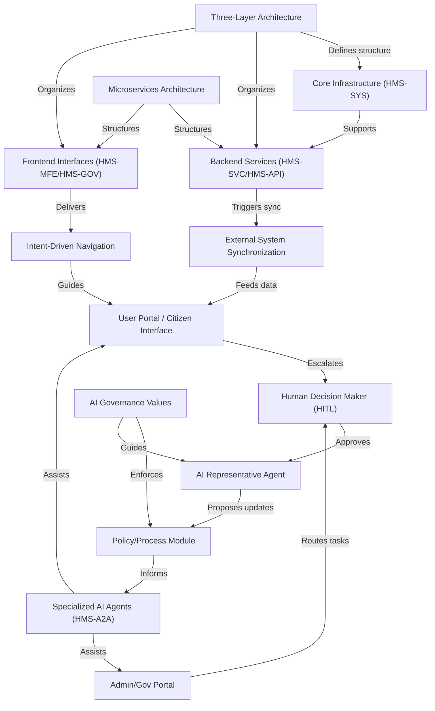

# Tutorial: HMS-A2A

**HMS-A2A** is an *AI-powered* agent system within a multi-layered government platform, helping citizens, administrators, and policy-makers streamline **services**, **policy management**, and **agency operations**.  
It integrates **specialized AI agents** with **human oversight**, ensuring proposals align with *ethical* and *regulatory* standards.

**Source Repository:** [None](None)

## Chapters

1. [User Portal / Citizen Interface
](01_user_portal___citizen_interface_.md)
2. [Admin/Gov Portal
](02_admin_gov_portal_.md)
3. [Intent-Driven Navigation
](03_intent_driven_navigation_.md)
4. [Specialized AI Agents (HMS-A2A)
](04_specialized_ai_agents__hms_a2a__.md)
5. [AI Representative Agent
](05_ai_representative_agent_.md)
6. [Human Decision Maker (HITL)
](06_human_decision_maker__hitl__.md)
7. [Policy/Process Module
](07_policy_process_module_.md)
8. [AI Governance Values
](08_ai_governance_values_.md)
9. [External System Synchronization
](09_external_system_synchronization_.md)
10. [Frontend Interfaces (HMS-MFE/HMS-GOV)
](10_frontend_interfaces__hms_mfe_hms_gov__.md)
11. [Backend Services (HMS-SVC/HMS-API)
](11_backend_services__hms_svc_hms_api__.md)
12. [Core Infrastructure (HMS-SYS)
](12_core_infrastructure__hms_sys__.md)
13. [Microservices Architecture
](13_microservices_architecture_.md)
14. [Three-Layer Architecture
](14_three_layer_architecture_.md)

---

Generated by [HardisonCo [NARA-DOC]](https://github.com/The-Pocket/Tutorial-Codebase-Knowledge)