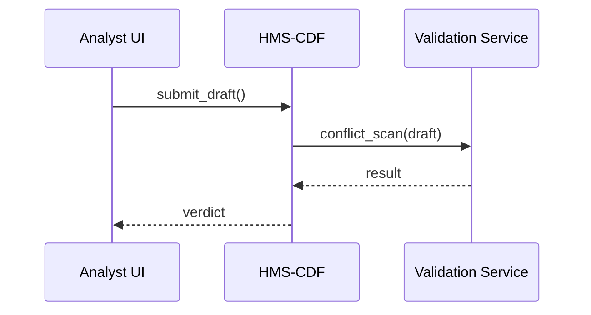
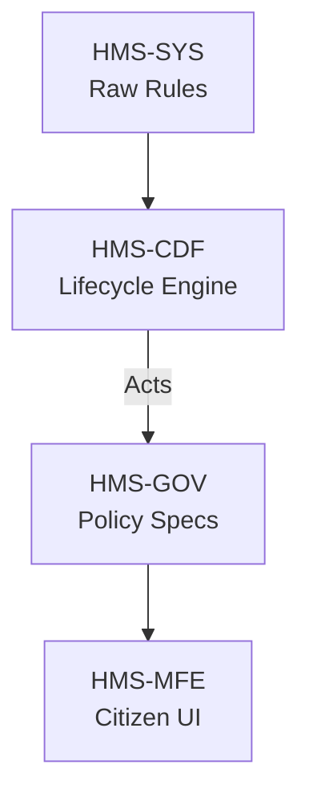

# Chapter 2: Policy Lifecycle Engine (HMS-CDF)

*(A sequel to [Governance Layer (HMS-SYS → HMS-GOV → HMS-MFE)](01_governance_layer__hms_sys___hms_gov___hms_mfe__.md).)*

---

> “Congress in code: draft, debate, decree—in milliseconds.”  
> – HMS-A2A field note

---

## 1. Why Do We Need HMS-CDF?

In Chapter 1 we learned how a single rule file travels from the *basement* (HMS-SYS) to the *lobby* (HMS-MFE).  
But who guarantees that the rule:

* doesn’t clash with yesterday’s regulations?  
* is tested under different economic scenarios?  
* can be rolled back if Congress changes its mind at 3 a.m.?

Enter **HMS-CDF (Policy Lifecycle Engine)**—our “Parliament in silicon.”

### Real-World Story

The U.S. Department of Transportation (DOT) wants to mandate *daytime running lights* for all new school buses.

1. A DOT analyst drafts the rule text.  
2. Legal teams verify it does **not** conflict with existing lighting standards.  
3. Economists simulate the cost impact on small school districts.  
4. Once approved, every downstream portal (manufacturing forms, safety inspections, public dashboards) updates immediately.

Traditionally, this takes months. HMS-CDF does it **while you sip your coffee**.

---

## 2. The Four Stages of the Digital Legislature

| Stage (Analogy) | HMS-CDF Term | What Happens? |
| --------------- | ------------ | ------------- |
| Bill Drafting | **Record** | Store the proposal as an immutable draft. |
| Committee Review | **Detect** | Run fast conflict checks. |
| Floor Debate | **Simulate** | Perform “what-if” scenarios. |
| Act Publication | **Publish** | Emit machine-readable rules to HMS-GOV. |

We’ll walk through each stage using the DOT school-bus rule.

---

## 3. Stage 1 – Record (Draft the Bill)

```rust
// file: record.rs
use hms_cdf::*;

let draft = PolicyDraft::new("DOT-2024-001")
    .title("Daytime Running Lights on School Buses")
    .text("All new school buses must include DRL systems.")
    .author("dot-analyst@dot.gov");

submit_draft(draft)?;
```

**What it does**  
1. Creates an in-memory `PolicyDraft`.  
2. Persists it to the “Bill Ledger” (an append-only store).  
3. Emits `DraftRecorded` so other services know a bill exists.

---

## 4. Stage 2 – Detect (Committee Check)

```rust
// file: detect.rs
let verdict = run_conflict_scan("DOT-2024-001")?;
assert!(verdict.is_clean(), "Lighting rules conflict!");
```

**Beginner takeaway**  
`run_conflict_scan` asks: *“Does another lighting regulation already occupy this namespace?”*  
If a collision is found, the draft is blocked and the author gets a report—usually within a second.

---

### Under the Hood (mini sequence)



*Only three moving parts—easy to reason about, easy to debug.*

---

## 5. Stage 3 – Simulate (Floor Debate)

```rust
// file: simulate.rs
let sim = Simulation::new("DOT-2024-001")
    .scenario("rural_small_district")
    .years(5);

let outcome = sim.run()?;
println!("Average cost per bus: ${}", outcome.cost_per_unit);
```

Explanation  
“HMS-CDF, assume the rule passes—what will it cost a 20-bus district over five years?”  
Simulations are just plug-ins; economists can add new models without touching core code.

---

## 6. Stage 4 – Publish (Become Law)

```rust
// file: publish.rs
if get_vote_result("DOT-2024-001")?.passed() {
    publish_act("DOT-2024-001")?;
}
```

`publish_act` converts the human-friendly draft into a machine policy that HMS-GOV understands—exactly the bridge you saw in Chapter 1.

Example output (trimmed):

```json
{
  "policyId": "dot-schoolbus-drl-v1",
  "effective": "2025-01-01",
  "requirements": {
    "drl": true,
    "applicableVehicles": ["school_bus"]
  }
}
```

Downstream portals subscribe, and—boom—manufacturers now see the new checkbox: *“DRL installed?”* without redeploying code.

---

## 7. Rollback in Milliseconds

What if Congress repeals the rule? A single API call reverts to the previous act.

```rust
rollback_act("dot-schoolbus-drl-v1")?;
```

Because the ledger is immutable, the system simply marks the act inactive and republishes the old one—no database surgery required.

---

## 8. How Does HMS-CDF Fit with the Rest?



Think of HMS-CDF as the **gatekeeper** between “anyone can draft” and “everyone must comply.”

---

## 9. Hands-On Lab: Your First Policy Lifecycle

1. Clone the quick-start repo:

   ```bash
   git clone https://github.com/hms-a2a/cdf-quickstart
   cd cdf-quickstart
   cargo run --example school_bus_drl
   ```

2. Observe console output:

   ```
   ✔ Draft recorded
   ✔ No conflicts found
   ✔ Simulation: cost per bus $143
   ✔ Act published as dot-schoolbus-drl-v1
   ```

*In under 10 seconds you legislated nationally—please use responsibly!*

---

## 10. Key Takeaways

• HMS-CDF mirrors the entire legislative flow: **Record → Detect → Simulate → Publish**.  
• Immutability means every version lives forever; rollback is trivial.  
• Simulations let you pre-test laws before citizens feel the impact.  
• All written in Rust, but you interact with tiny, friendly APIs.

---

## 11. What’s Next?

You’ve seen how a rule becomes an act. Next we’ll dress it up for citizens and internal staff with plug-and-play front-end pieces in the [Micro-Frontend Library (HMS-MFE)](03_micro_frontend_library__hms_mfe__.md).

*(Grab a fresh coffee—your bills will be waiting.)*

---

Generated by [HardisonCo [NARA-DOC]](https://github.com/The-Pocket/Tutorial-Codebase-Knowledge)