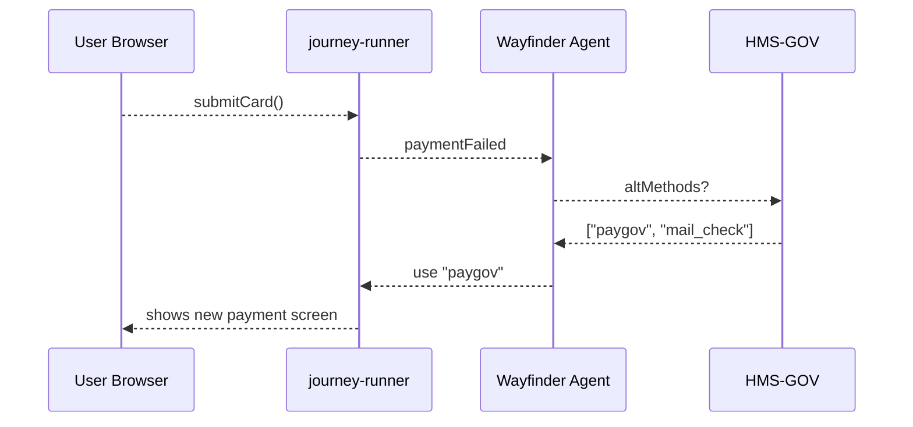

# Chapter 4: Intent-Driven Navigation & AI-Guided Journeys  
*(A sequel to [Micro-Frontend Library (HMS-MFE)](03_micro_frontend_library__hms_mfe__.md))*  

> “Type the destination—**never** the directions.”  
> – a Coast Guard help-desk agent

---

## 1 . Why Another Layer?  

Last chapter you built pages from Lego-style micro-frontends.  
But what happens when a citizen asks:

*“I just spotted a damaged cargo vessel near Key West—what do I do?”*

If you dump them on a maze of forms, they will phone the hotline (and you will miss dinner).  
**Intent-Driven Navigation** lets the user declare *what* they want, and the system figures out *how* to legally arrive there—just like Google Maps for paperwork.

---

## 2 . Running Example – “Report Vessel Sighting”  

Scenario: After a hurricane, Captain Rivera must report a drifting container ship.  
Traditionally she would:  

1. Search the Coast Guard website.  
2. Locate the *“Marine Casualty & Pollution”* PDF.  
3. Find out she also needs an NOAA environmental addendum.  
4. Email both, wait for confirmation.

With HMS-A2A’s intent engine she simply types:  

```
/intent report vessel sighting
```

The system:

1. Builds a **Journey Graph**:  
   “Form 2692 → Oil Spill Addendum → e-Signature → Fee Waiver”.  
2. Guides her step-by-step, re-routing if a document is missing.  
3. Submits to all required agencies automatically.

Captain Rivera finishes in 6 minutes, not 6 hours.

---

## 3 . Key Concepts (Think of a GPS)  

| GPS Term     | HMS Term             | 1-Sentence Beginner Definition                       |
|--------------|----------------------|------------------------------------------------------|
| Destination  | **Intent**          | Short natural-language request (“renew passport”).   |
| Road Map     | **Journey Graph**   | All legal steps & forms that satisfy the intent.     |
| Turn-by-Turn | **Waypoint**        | One concrete action (upload file, pay fee, sign).    |
| Re-route     | **AI Wayfinder**    | Agent that adjusts the graph when obstacles appear.  |
| Traffic Data | **Policy Checkpoint** | Rule from [HMS-GOV](01_governance_layer__hms_sys___hms_gov___hms_mfe__.md) that must be obeyed. |

Keep these five words handy; we’ll meet them in code.

---

## 4 . Your First “Hello, Intent” (5 Minutes)

### 4.1 Install the tiny SDK

```bash
npm i @hms-a2a/intent-sdk
```

### 4.2 Create an intent & print the journey

```js
// file: hello_intent.js
import { createIntent } from "@hms-a2a/intent-sdk";

const journey = await createIntent("report vessel sighting");
/* Example output 👇
[
  { id: "uscg-2692", type: "form", title: "Marine Casualty Report" },
  { id: "noaa-oil-addon", type: "form" },
  { id: "sign-docusign", type: "signature" },
  { id: "fee-waiver", type: "payment", amount: 0 }
]
*/
console.log(journey);
```

Explanation  
`createIntent` sends the phrase to the Intent Engine, which returns an **array of waypoints** ordered for compliance.

### 4.3 Embed the journey in a micro-frontend

```js
MFE.load('journey-runner', {
  target : '#root',
  plan   : journey           // straight from step 4.2
});
```

The `journey-runner` brick auto-renders the right form or payment widget for the current waypoint and moves to the next when finished.

---

## 5 . Life Happens: Rerouting on the Fly  

Suppose Captain Rivera’s credit-card network goes down during the $25 clean-up fee.  
The Wayfinder agent detects the failure and swaps in **“Pay via Treasury Pay.gov”**.



5 actors max, easy to follow!

---

## 6 . What’s Under the Hood? (Light Tour)

1. **Natural-Language Match** – small BERT model picks an *intent id* (`report_vessel`).  
2. **Journey Builder** – looks up `report_vessel.graph.json` (maintained by policy teams).  
3. **Policy Filter** – removes steps that don’t apply (e.g., fee waiver for non-profits).  
4. **Wayfinder Agent** – executes steps, listens for errors, requests alternates.  

All data flows through simple JSON; no RPC marathons.

---

## 7 . Peek at the Journey Graph File  

```json
// file: report_vessel.graph.json
{
  "nodes": [
    { "id": "uscg-2692", "type": "form" },
    { "id": "noaa-oil-addon", "type": "form",
      "requires": "uscg-2692" },
    { "id": "sign-docusign", "type": "signature",
      "requires": ["uscg-2692","noaa-oil-addon"] },
    { "id": "fee-waiver", "type": "payment",
      "optionalIf": "user.role == 'government'" }
  ]
}
```

Beginner take-away  
A journey is a **tiny directed graph** in JSON—easy for policy staff to edit, easy for code to traverse.

---

## 8 . Writing a Custom Wayfinder (Optional, 18 Lines)

```python
# file: wayfinder.py
import json, sys

plan = json.load(open(sys.argv[1]))
for step in plan:
    ok = execute(step)          # pretend this runs the UI
    if not ok:
        alt = ask_gateway(step) # fetch alternate from HMS-GOV
        if alt: plan.insert(0, alt)  # try again first
```

Explanation  
Under 20 lines, this script loops through the journey; on failure it **asks for an alternate** and retries. That’s 80 % of the magic.

---

## 9 . Best Practices for Beginners  

• **Keep intents atomic** – one end goal per intent.  
• **Store graphs in version control** – rollback is painless.  
• **Always annotate optional steps** (`optionalIf`) to help the Wayfinder skip unnecessary hoops.  
• **Log reroutes** – they are gold for UX improvement and policy gaps.  

---

## 10 . Where It Fits in the HMS Universe  

```mermaid
graph LR
A[Citizen Intent] --> WF(Wayfinder Agent)
WF --> G[Journeys & Checkpoints<br/>from HMS-GOV]
WF --> M[Micro-Frontends<br/>(HMS-MFE)]
M --> A
```

The Wayfinder is the **traffic cop** between raw policy and human screens.

---

## 11 . Summary & What’s Next  

You learned to:

1. Capture an intent in one line of code.  
2. Receive an auto-generated, legally compliant journey.  
3. Let an agent reroute around potholes (missing docs, failed payments).  

Your portals now behave like GPS—citizens name the destination, the system drives.

Next we’ll see how journeys can cross agency borders using secure messages:  
[Inter-Agency Protocol (HMS-A2A)](05_inter_agency_protocol__hms_a2a__.md)

---

---

Generated by [HardisonCo [NARA-DOC]](https://github.com/The-Pocket/Tutorial-Codebase-Knowledge)