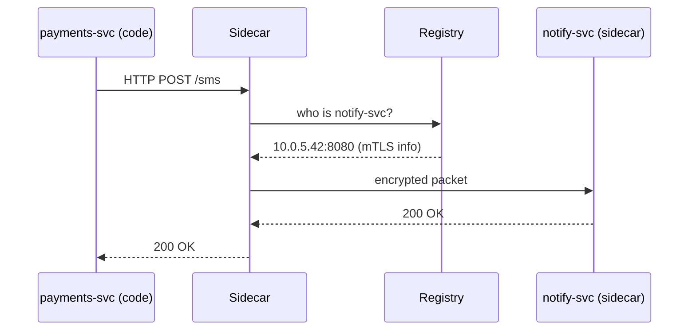

# Chapter 6: Backend Service Mesh (HMS-SVC)

[← Back to Chapter 5: Inter-Agency Protocol (HMS-A2A)](05_inter_agency_protocol__hms_a2a__.md)

---

> “Plug in a new service like you plug in a lamp—power and network already there.” 
> – an HMS-SVC engineer

---

## 1. Why Do We Need a Service Mesh?

### 90-Second Story – Disaster-Relief Payments

1. A hurricane survivor submits a **single** “Disaster Relief” form.  
2. Behind the scenes at FEMA:  
   • `identity-svc` confirms personal data.  
   • `eligibility-svc` runs the rule set coming from [HMS-GOV](01_governance_layer__hms_sys___hms_gov___hms_mfe__.md).  
   • `payments-svc` moves money.  
   • `notify-svc` texts: “Funds on the way!” 

All four are tiny micro-services.  
Without a mesh each service would need to know IPs, TLS certificates, retries, logs … that’s dozens of lines of networking code **per project**.

**HMS-SVC** is the invisible lattice that lets those services talk safely and reliably, just by knowing each other’s **name**.

---

## 2. Pneumatic-Tube Analogy

Think of a 1950s bank:

• Each teller drops a note in a **tube** marked “ACCOUNTING.” 
• Air pressure whooshes it to the right desk—nobody cares about pipes or pressure.

HMS-SVC ≈ thousands of digital tubes:

| Pneumatic world | HMS-SVC world |
| --------------- | ------------- |
| Tube label      | Service name (`payments-svc`) |
| Central blower  | Mesh gateway |
| Airtight canister | Encrypted gRPC/HTTP packet |
| Spare tube path | Automatic retry path |

---

## 3. Key Concepts (Beginner Cheat-Sheet)

| Term | 1-Line Beginner Definition |
|------|----------------------------|
| **Service** | A small process that owns exactly one business function (e.g., `tax-calc`). |
| **Sidecar** | A helper container automatically injected to handle network chores so the service stays dumb. |
| **Gateway** | Entry/exit doors of the mesh; enforce TLS and auth. |
| **Service Registry** | Live phone book. “Where is `notify-svc` running today?” |
| **Circuit Breaker** | Tiny fuse; if a service misbehaves, the mesh stops calling it until healthy. |
| **mTLS** | “Mutual TLS” – both sides present certificates, so no impostors. |
| **Retry & Backoff** | Automatic “try again” with smart wait times. |

Remember these seven words; they cover 90 % of mesh talk.

---

## 4. Quick Start – Calling a Service through HMS-SVC

> Prerequisites  
> • Docker Desktop  
> • `git clone https://github.com/hms-a2a/svc-quickstart`  
> • `cd svc-quickstart && docker compose up`

### 4.1 Example: `payments-svc` → `notify-svc`

```python
# pay_and_notify.py
import requests

payload = { "userId": "HUD123", "amount": 500 }

# DNS name ends with .svc  ---> resolved by HMS-SVC
r = requests.post("http://payments-svc.svc/pay", json=payload)
r.raise_for_status()

requests.post("http://notify-svc.svc/sms",
              json={ "userId": "HUD123",
                     "msg": "Your $500 relief payment is processing." })
```

Explanation  
1. The code never knows IP addresses.  
2. Both URLs are plain HTTP; sidecars upgrade to **mTLS** automatically.  
3. If `notify-svc` is overloaded the mesh retries with back-off; our script stays 4 lines.

---

### 4.2 What You Did NOT Code

```
🚫 Certificate pinning
🚫 Load-balancer discovery
🚫 Timeout tuning
🚫 JSON tracing headers
```

HMS-SVC pasted those concerns into the sidecars at runtime.

---

## 5. Hands-On: Adding a New Service in 6 Lines

```yaml
# services/eligibility-svc.yaml
name: eligibility-svc
port: 7000
image: hms/eligibility:latest
policy: allow_from_any   # mesh ACL; refine later
```

Run:

```bash
hms-svc deploy services/eligibility-svc.yaml
```

The registry now resolves `eligibility-svc.svc` within 3 seconds; every other service can start calling it immediately.

---

## 6. What Happens Under the Hood?



1. Business code sends an ordinary HTTP request to its **localhost** sidecar.  
2. Sidecar resolves the **service name** via the Registry.  
3. Mutual TLS is negotiated; packets fly encrypted.  
4. Any failure triggers automatic retry and (if needed) circuit-breaking.

Only 4 actors; easy to reason about.

---

## 7. Tiny Glimpse at a Sidecar (14 Lines)

```go
// sidecar/main.go  (simplified)
for {
  req := <-inbound          // channel from app
  target := registry.Lookup(req.Host)
  for i:=0; i<3; i++ {      // retries
      resp, err := mTLSSend(target, req)
      if err == nil { break }
      time.Sleep(backoff(i))
  }
  outbound <- resp          // back to app
}
```

Take-away:  
The sidecar is **just a loop** with lookup, send, retry. Complexity lives here, not in your business code.

---

## 8. Common Recipes (1 Minute Each)

### 8.1 Call with Timeout

```python
requests.get("http://eligibility-svc.svc/check",
             params={"userId": "HUD123"},
             timeout=2)          # seconds
# Mesh enforces 2 s + 1 automatic retry
```

### 8.2 Rate-Limit a Hot Service

```bash
hms-svc limit set notify-svc 50rps
```

Mesh drops or queues excess traffic; no code change.

### 8.3 Observe Traffic

```bash
hms-svc tap payments-svc --last 10
```

Live log shows caller, callee, latency – courtesy of [Monitoring, Metrics & OPS](13_monitoring__metrics___ops_.md).

---

## 9. Relation to Neighboring Chapters

• HMS-SVC carries the **envelopes** defined in [Inter-Agency Protocol (HMS-A2A)](05_inter_agency_protocol__hms_a2a__.md).  
• Delivered payloads can be archived in [Data Lake & Registry (HMS-DTA)](09_data_lake___registry__hms_dta__.md).  
• Circuit-breaker events feed metrics dashboards in [Monitoring, Metrics & OPS](13_monitoring__metrics___ops_.md).

---

## 10. Best Practices (Sticky-Note Edition)

1. **One port per service.** Simpler ACLs, faster discovery.  
2. **Pin versions** – deploy `tax-calc:v1.2`, not `latest`.  
3. **Quarantine slow calls** by setting per-route timeouts (`hms-svc route set ...`).  
4. **Tag traffic** (`x-hms-trace-id`) for end-to-end debugging.  
5. **Let sidecars crash.** They auto-restart; don’t add custom retries in your code.

---

## 11. Summary

You learned:

• Why a mesh turns dozens of fragile connections into one reliable fabric.  
• How to call any micro-service with a simple URL and zero network code.  
• What the sidecar + registry + gateway trio does behind the curtain.  
• Quick recipes for limits, timeouts, and live traffic taps.

Your pneumatic tubes are now humming—ready to connect **outside** government data centers?  
Head over to [Chapter 7: External System Synchronisation](07_external_system_synchronisation_.md).

---

---

Generated by [HardisonCo [NARA-DOC]](https://github.com/The-Pocket/Tutorial-Codebase-Knowledge)