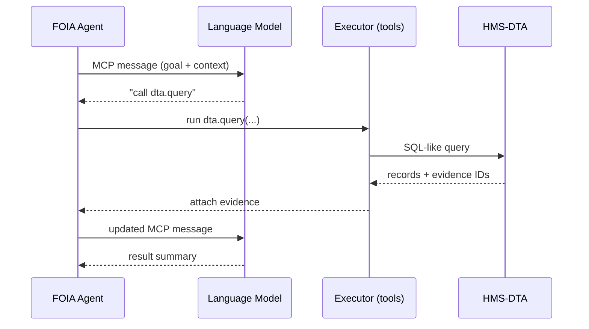

# Chapter 10: Model Context Protocol (HMS-MCP)

[← Back to Chapter 9: Data Lake & Registry (HMS-DTA)](09_data_lake___registry__hms_dta__.md)

---

> “USB let every printer talk to every computer.  
>  MCP lets every AI mind talk to every government system.”  
> – an HMS-A2A team lead

---

## 1. Why Do We Need a *Model* Protocol?

### Use-case – **One-Stop FOIA Assistant**

1. A citizen asks:  
   *“Please send me every flood-permit within 5 km of Baton Rouge issued this year.”*
2. Our **FOIA Agent** (built in Chapter 8) must:
   • Define the **goal**.  
   • Pull matching permits from [HMS-DTA](09_data_lake___registry__hms_dta__.md).  
   • Redact personal data.  
   • Produce a zip file + summary letter.

Without a **uniform contract**, swapping the language model, upgrading the redaction tool, or adding a new data source would break the agent.

**HMS-MCP** is that contract.  
It is the *USB plug* between any AI model (“mind”) and the rest of the HMS stack.

---

## 2. Key Concepts (Pocket Glossary)

| MCP Term            | Beginner Analogy                       | One-Sentence Explanation                                 |
|---------------------|----------------------------------------|----------------------------------------------------------|
| Goal                | “Mission order”                        | What the agent wants (`"list flood permits"`).           |
| Context Block       | “Backpack”                             | Facts & past messages the model may need.                |
| Tool Request        | “Power drill voucher”                  | Ask the stack to run code: *“call redaction.tool v1”*.   |
| Evidence            | “Footnote”                             | A pointer to a record in HMS-DTA or A2A envelope.        |
| Result              | “Finished report”                      | Model’s structured answer, ready for downstream tools.   |

Remember these five nouns; 90 % of MCP is just them.

---

## 3. The Smallest MCP Message (≤ 15 Lines)

```json
{
  "goal": "Fetch redacted flood permits for Baton Rouge, 2024",
  "context": {
    "geo": { "lat": 30.45, "lon": -91.15, "radius_km": 5 },
    "year": 2024
  },
  "tool": { "name": "dta.query", "version": "1.0" },
  "evidence": [],
  "result": null          // will be filled by the model
}
```

What happens?  
1. **Agent** sends the JSON to any compliant model.  
2. Model sees: *“Ah, I must call dta.query”* → returns a new message with the request filled.  
3. The runtime executes the tool, appends the **evidence**, and loops until `result` is complete.

---

## 4. Talking to a Model in 12 Lines

```python
# mcp_roundtrip.py
import mcp   # tiny helper library
msg = mcp.new(
    goal = "Summarise all Baton Rouge permits",
    context = {"year": 2024},
    tool = None
)

while not msg["result"]:
    msg = mcp.send("o4-minio", msg)   # any model that speaks MCP
    mcp.act(msg)                    # run tool or attach evidence
print(msg["result"][:200], "...")
```

Explanation  
• `mcp.send()` posts the JSON to the model (could be OpenAI, Claude, local Llama—doesn’t matter).  
• `mcp.act()` interprets the model’s response: run a tool, pull data, attach evidence, or finish.

*The wrapper is only ~20 s LOC; you do **not** rewrite it when you swap models.*

---

## 5. Step-by-Step Walk-Through



Four actors—easy to debug and swap.

---

## 6. Inside `mcp.act()` (≤ 18 Lines)

```python
def act(msg):
    if "tool" in msg and msg["tool"]:
        name = msg["tool"]["name"]
        if name == "dta.query":
            data, ev = dta_query(**msg["tool"]["args"])
            msg["evidence"].append(ev)
            msg["context"]["queryResult"] = data
            msg["tool"] = None        # clear, ask model to continue
    return msg
```

Take-away  
`mcp.act()` is a tiny **switch statement** mapping tool calls to real functions.  
Add a new tool? Just insert one more `elif`.

---

## 7. Where Does the Evidence Live?

Each evidence item is a **pointer**, never raw bytes:

```json
{
  "id": "DTA:permits-raw/permit_2024_042.json",
  "sha": "ab12…ff",
  "reason": "Matches geo filter"
}
```

Because the pointer uses HMS-DTA IDs, privacy controls & retention still apply automatically.

---

## 8. Hot-Swap a Model (No Code Change)

```bash
export MCP_MODEL=claude-3-sonnet
python mcp_roundtrip.py
```

As long as *claude-3-sonnet* knows the five MCP fields, the script “just works.”

---

## 9. Adding a New Tool in 5 Lines

```yaml
# tools/redact.yaml
name: redact.pdf
version: 1.0
args: [file_id]
returns: redacted_file_id
```

Register:

```bash
hms-mcp tool add tools/redact.yaml
```

Models can now write:

```json
"tool": { "name": "redact.pdf", "version": "1.0",
          "args": { "file_id": "DTA:permits-raw/42.pdf" } }
```

No redeploys, no SDK changes.

---

## 10. Best Practices (Sticky-Note Edition)

1. **One loop, many turns** – keep sending the *same* MCP message back & forth until `result` is ready.  
2. **Keep context small** – pass pointers (`DTA:…`) not megabytes.  
3. **Enforce tool version** – models must specify `"version": "x.y"`; break early, never silently.  
4. **Log every turn** – the entire MCP transcript goes to [Monitoring, Metrics & OPS](13_monitoring__metrics___ops_.md).  
5. **Fail closed** – if a model returns invalid MCP, abort and escalate to a human.

---

## 11. How MCP Fits the Bigger Picture

```mermaid
graph TD
AGT[Agents<br/>(HMS-AGT)] --> MCP[MCP Transcript]
MCP --> MD[LLM / Reasoner]
MCP --> EX[Tool Executor]
EX --> DTA[Data Lake (HMS-DTA)]
```

Swap any box, keep the wires—thanks to the uniform **MCP transcript** in the middle.

---

## 12. Summary & What’s Next

You learned how **HMS-MCP**:

1. States the *goal*, *context*, *tool*, *evidence*, and *result* in one JSON envelope.  
2. Lets any model, tool, or data source plug-in like USB.  
3. Protects privacy by passing **pointers**, not raw data.  
4. Simplifies code to a tiny loop: *send → act → repeat*.

Ready to **publish** your new tools and skills for everyone in the government ecosystem?  
Jump to [Marketplace of Capabilities (HMS-MKT)](11_marketplace_of_capabilities__hms_mkt__.md).

---

Generated by [HardisonCo [NARA-DOC]](https://github.com/The-Pocket/Tutorial-Codebase-Knowledge)