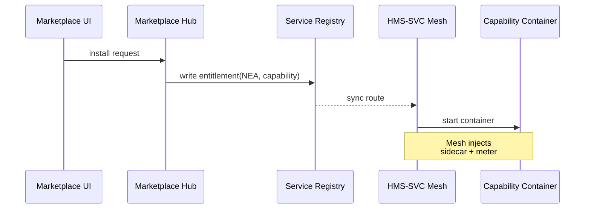

# Chapter 11: Marketplace of Capabilities (HMS-MKT)

[← Back to Chapter 10: Model Context Protocol (HMS-MCP)](10_model_context_protocol__hms_mcp__.md)

---

> “Install a budget-forecasting robot as easily as you install a weather app on your phone.”  
> – a delighted state-agency CFO

---

## 1  Why Do We Need a *Marketplace*?

### 90-Second Story — “Zero-Click Budget Forecast”

1. The **National Endowment for the Arts (NEA)** must submit a 5-year funding forecast to OMB.  
2. NEA has **no data-science team**—only spreadsheets.  
3. In HMS-MKT they search *“budget forecast.”*  
4. The *Treasury-Budget-AI* capability appears:  
   • $29/month,  
   • FedRAMP-ready,  
   • SLA > 99.9 %.  
5. One click → the micro-service is installed in NEA’s **Service Mesh** (see [HMS-SVC](06_backend_service_mesh__hms_svc__.md)).  
6. An agent calls it via [HMS-A2A](05_inter_agency_protocol__hms_a2a__.md); results arrive in minutes.  
7. Billing, security, and support are already negotiated.

Without HMS-MKT, NEA would have written an RFP, waited months, and paid 10× more.

---

## 2  Key Concepts (Beginner Cheat-Sheet)

| App-Store Analogy | HMS-MKT Term | One-Sentence Explanation |
|-------------------|--------------|--------------------------|
| App | **Capability** | A micro-service, data set, or AI skill you can install. |
| App Card | **Listing** | Human-readable page (logo, price, docs). |
| `.apk` / `.deb` | **Package** | Container or wheel with code + manifest. |
| Install button | **Entitlement** | Grants an agency the right to run & update the package. |
| In-App Purchase | **Usage Meter** | Counts calls, GB, or CPU seconds for billing. |
| App Store | **Marketplace Hub** | Registry + payment + SLA checker. |

Remember these six nouns; they cover ~90 % of HMS-MKT.

---

## 3  Quick Start — Publish & Install in 3 Commands

> Prerequisites  
> • Docker Desktop  
> • `pip install hms-mkt-cli` (tiny CLI)  
> • A sandbox Marketplace Hub at `https://mkt.sandbox.gov`

### 3.1 Create a Listing Manifest (15 lines)

```yaml
# file: treasury_budget_ai.yaml
id: treasury-budget-ai
version: 1.0.0
title: Treasury Budget Forecast AI
type: micro-service                # or dataset / skill
image: registry.gov/treasury/budget-ai:1.0.0
endpoint: /forecast
pricing:
  monthly: 29
  per_call: 0.002
sla: "99.9% uptime, 1 s p95 latency"
compliance: ["FedRAMP Moderate"]
```

*Explanation* – One YAML file holds everything buyers need: where to pull the container, how much it costs, and the SLA.

---

### 3.2 Publish It

```bash
mkt publish treasury_budget_ai.yaml --hub https://mkt.sandbox.gov
```

CLI output:

```
✔ Uploaded image hash: aa9f…
✔ Listing created at https://mkt.sandbox.gov/c/treasury-budget-ai
```

*What happened?*  
1. Image pushed to the Marketplace registry.  
2. Manifest validated (schema + compliance tags).  
3. Listing appears in the catalog.

---

### 3.3 Install from Another Agency

```bash
mkt install treasury-budget-ai --agency NEA --hub https://mkt.sandbox.gov
```

```
✔ Entitlement granted to NEA
✔ Service routed at http://treasury-budget-ai.svc
```

NEA immediately sees a DNS name inside its mesh—no extra DevOps work.

---

## 4  Using the Installed Capability

```python
import requests, json, datetime

payload = {"past_spend": [1.2, 1.3, 1.4], "years": 5}
r = requests.post("http://treasury-budget-ai.svc/forecast", json=payload)
print("Forecast:", json.loads(r.text))
```

*Explanation* – Business code calls a **local** URL; HMS-SVC handles mTLS, retries, and usage metering.

---

## 5  Under the Hood — “From Click to Call” (5 Steps)



1. **Install button** sends an API call.  
2. **Hub** records the entitlement and triggers a route in the central registry.  
3. **Mesh** pulls the container, injects a sidecar, starts counting usage.  
4. DNS `treasury-budget-ai.svc` resolves inside NEA’s VPC.

Four actors—easy to debug.

---

## 6  Internal Files in the Package

```
treasury-budget-ai/
 ├─ Dockerfile
 ├─ budget.py
 ├─ manifest.yaml     ← the listing two pages above
 └─ mkt_hook.py       ← 12-line lifecycle script
```

### `mkt_hook.py` (≤ 12 lines)

```python
def post_install(env):
    # seed with public Treasury data on first boot
    import requests, json
    data = requests.get("https://api.fiscal.treasury.gov/v1/bulkdata").json()
    open("/data/cache.json","w").write(json.dumps(data))
```

*Explanation* – Any package may ship tiny *hooks* (`pre_install`, `post_update`, etc.). They run inside the container, not on the host.

---

## 7  Metering & Billing in 8 Lines

```python
# sidecar, simplified
class Meter:
    def wrap(request):
        start = time()
        resp  = forward(request)
        usage = {"bytes": len(request.body),
                 "lat": time()-start}
        emit("usage", usage)         # to Marketplace Hub
        return resp
```

Take-away – The provider writes **zero** billing code; the Marketplace sidecar emits usage tokens trusted by the hub.

---

## 8  Common Recipes (≤ 60 Seconds Each)

### 8.1 Update a Package

```bash
# bump version, push again
mkt publish treasury_budget_ai.yaml --version 1.1.0
mkt rollout treasury-budget-ai 1.1.0 --agency NEA
```

Marketplace does a canary rollout; if health checks fail, auto-revert.

### 8.2 Pin a Version

```bash
mkt lock treasury-budget-ai --agency NEA --version 1.0.0
```

Avoids surprise upgrades during audit season.

### 8.3 Rate-Limit Expensive Calls

```bash
mkt limit treasury-budget-ai --agency NEA --per_min 100
```

Mesh enforces; provider still gets paid for over-quota calls.

---

## 9  Security & Compliance at a Glance

| Concern        | How HMS-MKT Handles It |
|----------------|------------------------|
| Vulnerability scanning | Runs Trivy on every image before publish. |
| FedRAMP or HIPAA tags  | Manifest must list compliance IDs; Hub blocks non-compliant installs. |
| Least privilege runtime | Sidecar applies seccomp + read-only FS unless manifest opts out. |
| SLA violation | Hub compares uptime vs. SLA; auto credits buyer if broken. |

Almost all guardrails live in the **Hub**, not in agency scripts.

---

## 10  Best Practices (Sticky-Note Edition)

1. **One capability = one micro-service**; keep packages small.  
2. **Semantic versioning** (`1.2.3`) → easy rollback.  
3. **Write clear pricing**; hidden tiers erode trust.  
4. **Ship OpenAPI docs** in the manifest; MFE can auto-render playground.  
5. **Tag dependencies** (needs `HMS-MCP >= 0.4`); prevents runtime mismatch.

---

## 11  How HMS-MKT Fits in the Whole HMS Picture

```mermaid
graph LR
MKT[Marketplace Hub<br/>(HMS-MKT)]
DEV[Capability Publishers] -- publish --> MKT
AGENCY[Agencies] -- install --> MKT
MKT --> SVC[Backend Mesh (HMS-SVC)]
SVC --> AGT[Agents (HMS-AGT)]
MKT --> OPS[Metrics & OPS (Ch 13)]
```

Marketplace glues **providers** to **consumers**; everything else (mesh, agents, governance) keeps running with zero edits.

---

## 12  Summary & What’s Next

You learned how HMS-MKT lets any agency:

1. **Publish** a micro-service with a 15-line manifest.  
2. **Install** it instantly—billing, security, and SLA included.  
3. **Use** it via a local mesh URL with no extra glue code.

In the next chapter we’ll see how humans can step in whenever a capability—or any part of HMS—needs a second pair of eyes:  
[Human-in-the-Loop Control Loop](12_human_in_the_loop_control_loop_.md)

---

---

Generated by [HardisonCo [NARA-DOC]](https://github.com/The-Pocket/Tutorial-Codebase-Knowledge)