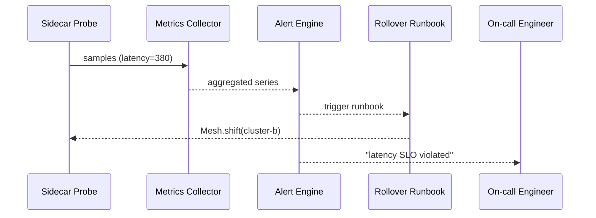

# Chapter 13: Monitoring, Metrics & OPS  
*(A sequel to [Human-in-the-Loop Control Loop](12_human_in_the_loop_control_loop_.md))*  

> “If citizens notice the outage, our radar already failed.”  
> – an HMS-OPS duty-officer  

---

## 1 Why Do We Need HMS-OPS?

### 60-Second Story — “Hurricane Aid Without Downtime”

1. A category-4 hurricane hits Louisiana.  
2. Thousands of victims open the *Disaster Relief* portal built on   [HMS-MFE](03_micro_frontend_library__hms_mfe__.md).  
3. Behind the scenes, **hundreds of micro-services** (payments, eligibility, SMS, etc.) and **dozens of agents** (fraud checkers, document OCR) light up at once.  
4. Fifteen minutes in, *eligibility-svc* starts timing-out; applicants see spinning wheels.  
5. **HMS-OPS** detects that latency crossed its 300 ms budget, auto-runs a *rollover runbook* that shifts traffic to the warm-standby cluster, and alerts the on-call engineer **before Twitter notices**.  
6. Citizens keep filing claims; FEMA meets its five-nines SLA.

Without HMS-OPS, the crisis team would sift through logs manually while the public screams.

---

## 2 Key Concepts (Air-Traffic Control Cheat-Sheet)

| Control-Tower Analogy | HMS-OPS Term | Beginner Definition |
|-----------------------|--------------|---------------------|
| Radar ping            | **Metric**   | Numeric sample every few seconds (e.g., latency = 312 ms). |
| Flight path           | **Trace**    | End-to-end record of one request hopping across services. |
| Storm alert           | **Alert**    | Rule that fires when a metric breaks its *error budget*. |
| Tower screen          | **Dashboard**| Live panel of graphs & gauges. |
| Standard procedure    | **Runbook**  | Scripted action (e.g., restart pod, fail-over DB). |
| 5-nines promise       | **SLO**      | “99.999 % of disaster claims < 500 ms” – drives budgets & alerts. |

Remember these six words; 90 % of HMS-OPS is just them.

---

## 3 Your First 8-Line Monitor

> Prerequisites  
> `pip install hms-ops`

```python
# file: latency_probe.py   (≤8 lines)
from hms_ops import Metric

lat = Metric("eligibility.latency_ms")
lat.budget(300)                 # SLO = 300 ms
while True:
    t = ping("http://eligibility-svc.svc/health")
    lat.record(t*1000)          # convert sec→ms
```

**What it does**  
1. Creates a metric called `eligibility.latency_ms`.  
2. Sets an error-budget of 300 ms.  
3. Records a sample every loop; HMS-OPS grabs, stores, and evaluates it.

If the rolling average > 300 ms for 2 minutes, **HMS-OPS auto-raises an alert**.

---

## 4 Hook a Runbook in 12 Lines

```python
# file: rollover_runbook.py
from hms_ops import Runbook, Mesh

@Runbook.on_alert("eligibility.latency_ms")
def rollover(ctx):
    Mesh.shift("eligibility-svc", to="cluster-b")
    ctx.note("traffic shifted to cluster-b")
```

Explanation  
The decorator ties the runbook to the alert. When the metric bursts, HMS-OPS executes the function inside a **sandboxed container** and stores the annotation for audits.

---

## 5 What Happens Under the Hood?



1. Every service/agent pod ships with a **sidecar probe** that scrapes local metrics.  
2. **Collector** batches and stores them in a time-series DB.  
3. **Alert Engine** checks SLOs once per second.  
4. On breach → fires webhook to the bound **Runbook** *and* sends a push notification.  
5. Sidecar confirms shift; latency drops; alert auto-resolves.

Five actors, nothing magic.

---

## 6 Inside the Collector (≤15 Lines)

```python
# hms_ops/collector.py (simplified)
def scrape():
    for target in registry.targets():
        data = http_get(f"http://{target}:9100/metrics")
        for name,val in parse(data):
            store(name, val, ts=now())
schedule.every(15).seconds.do(scrape)
```

Take-away: the collector is a **tiny loop** that hits `/metrics`, parses, and dumps into the TSDB.

---

## 7 Live Dashboards in One Command

```bash
hms-ops dashboard eligibility-svc
```

Opens a Grafana-like page pre-wired with:

* p50 / p95 latency  
* Request rate  
* Error ratio  
* Runbook executions timeline

No YAML, no front-end coding.

---

## 8 Distributed Tracing, the 10-Second Setup

1. Add this one liner to any service (sidecar auto-injected):

```python
from hms_ops import trace
@trace
def pay_claim():
    ...
```

2. Call graph appears in the *Traces* tab, coloured by latency.  
3. Clicking a span reveals **MCP context** and **A2A envelope IDs**—handy for debugging across agencies.

---

## 9 Putting It All Together — A Mini Lab

```bash
# 1. spin tiny demo stack
git clone https://github.com/hms-a2a/ops-demo && cd ops-demo
docker compose up

# 2. watch dashboards
hms-ops dashboard eligibility-svc

# 3. inject fault
curl http://eligibility-svc.svc/fake_slow?ms=500

# 4. observe
# - latency graph spikes
# - alert banner turns red
# - runbook shifts traffic
# - latency returns to green
```

Total lab time: ~3 minutes.

---

## 10 Best Practices (Sticky-Note Edition)

1. **Alert on budgets, not on raw spikes** – avoids pager fatigue.  
2. **One SLO per critical user journey** (e.g., *file claim*, *pay grant*).  
3. **Write an automated runbook** *before* you page humans.  
4. **Log every runbook stdout/stderr** in [Data Lake & Registry](09_data_lake___registry__hms_dta__.md).  
5. **Correlate trace IDs** (`x-hms-trace-id`) across A2A envelopes for root-cause speed.

---

## 11 Where HMS-OPS Fits in the Ecosystem

```mermaid
graph LR
SVC[Service Mesh<br/>(HMS-SVC)] --> OPS
AGT[Agents<br/>(HMS-AGT)] --> OPS
HITL[Human-in-the-Loop](Ch 12) --> OPS
OPS --> CDF[Policy Lifecycle<br/>(HMS-CDF)]
OPS --> ESR[Simulation Sandbox<br/>(Ch 14)]
```

*Everything* emits metrics; OPS watches, reacts, and feeds data back into simulation & policy engines.

---

## 12 Summary & Next Steps

You learned how HMS-OPS:

1. Collects metrics & traces automatically via sidecars.  
2. Enforces SLOs and fires alerts only when budgets break.  
3. Executes scripted runbooks to self-heal before citizens feel pain.  
4. Provides dashboards and audit trails with almost zero code.

Ready to *practice* fail-overs, latency storms, and runbook drills without touching production?  
Jump to [Simulation & Training Sandbox (HMS-ESR)](14_simulation___training_sandbox__hms_esr__.md).

---

Generated by [HardisonCo [NARA-DOC]](https://github.com/The-Pocket/Tutorial-Codebase-Knowledge)