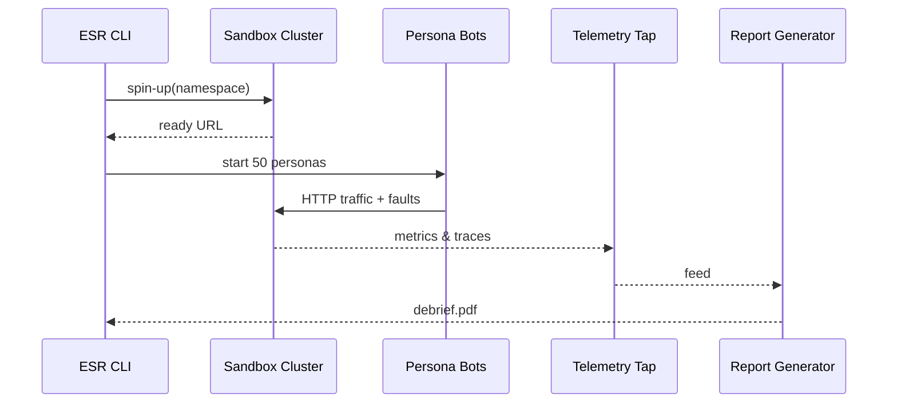

# Chapter 14: Simulation & Training Sandbox (HMS-ESR)

[← Back to Chapter 13: Monitoring, Metrics & OPS](13_monitoring__metrics___ops_.md)

---

> “Flight schools save pilots; ESR saves production launches.”  
> — a State Department release-manager

---

## 1. Why do we need a Sandbox?

Picture the U.S. State Department rolling out a **brand-new passport renewal journey** that touches:

* 6 micro-frontends (HMS-MFE)  
* 14 backend services (HMS-SVC)  
* 3 partner agencies via secure envelopes (HMS-A2A)  
* A budget-fraud agent and a HITL queue

If any tiny rule in [HMS-GOV](01_governance_layer__hms_sys___hms_gov___hms_mfe__.md) is wrong, **millions** of citizens could be stuck mid-application on launch day.

**HMS-ESR** spins up a **full copy of that workflow with synthetic users** so product owners can rehearse edge cases—like a flight simulator for civil servants.

---

## 2. Key Concepts (Beginner Cheat-Sheet)

| Flight-school Analogy | HMS-ESR Term        | 1-Sentence Definition               |
|-----------------------|---------------------|-------------------------------------|
| Simulator cockpit     | **Sandbox**         | Isolated cluster that mimics prod.  |
| Training scenario     | **Scenario**        | Script of steps the fake users will try. |
| Student pilot         | **Persona**         | Synthetic citizen/agent with data.  |
| Engine-failure lever  | **Probe**           | Intentional fault (slow DB, 403 error…). |
| Black-box recorder    | **Telemetry Tap**   | Collects every metric & trace in the run. |
| Flight de-brief       | **Debrief Report**  | Auto-generated PDF of findings.     |

Six nouns, 90 % of ESR.

---

## 3. A 4-Step Use-Case — “Test Passport Renewal”

> Prerequisites  
> `pip install hms-esr`

### 3.1 Define the Scenario (≤ 15 lines)

```yaml
# passport_renewal.scn.yaml
scenario: passport-renewal-v1
steps:
  - visit:  "/start"
  - fill:   "passport_id"  value: "X12345678"
  - upload: "photo.jpg"    sizeKB: 420
  - pay:    "credit_card"  failIf: "amount>200"
  - expect: { page: "/confirmation", status: 200 }
probes:
  - slow_service: eligibility-svc latency_ms=800
personas: 50        # 50 synthetic citizens
duration: "15m"
```

*Explanation* – This file is **the entire flight plan**: what users do, what fault to inject, and for how long.

---

### 3.2 Launch the Sandbox (4 lines)

```bash
esr up passport_renewal.scn.yaml \
      --gov-source dev-rules.yaml \
      --mfe-branch feature/passport-v2
```

*What happens?*

1. ESR clones the latest micro-frontends & services into an isolated k8s namespace.  
2. Applies the draft rules & UI branch.  
3. Populates test data through [HMS-DTA](09_data_lake___registry__hms_dta__.md).  

Launch time ≈ 90 seconds.

---

### 3.3 Run the Simulation (≤ 10 lines)

```bash
esr run passport-renewal-v1 --watch
```

Console preview:

```
👥 50 personas active
⏱️  latency spike injected (eligibility-svc → 800 ms)
✅  47 completed
❌   3 failed at /pay (timeout)
```

### 3.4 Download the Debrief

```bash
esr report passport-renewal-v1 --out debrief.pdf
```

The PDF lists:

* Success rate 94 % (goal ≥ 99 %)  
* Slowest path 7.2 s (`eligibility-svc`)  
* Top error “HTTP 504 on /pay” — lines 912-920 in trace  
* Suggested fix: bump payments timeout or add HITL fallback  

---

## 4. What Happens Under the Hood?



Only five actors—easy to reason about.

---

## 5. Inside ESR: Tiny Code Peek (≤ 18 lines)

```python
# esr/run.py  (highly simplified)
def run(scn):
    ns = create_namespace(scn.id)
    deploy_services(ns, scn.gov_source, scn.mfe_branch)
    bots = PersonaSwarm(ns, scn.personas)
    inject_probes(ns, scn.probes)
    bots.execute(scn.steps, scn.duration)
    metrics = tap_collect(ns)
    make_report(scn, metrics)
```

Take-away: ESR is a **wrapper** around k8s + load-test bots + Grafana exporter.

---

## 6. Common Recipes (≤ 60 seconds each)

### 6.1 Compare Two Branches Side-by-Side

```bash
esr diff --scenario passport-renewal \
         --branchA main \
         --branchB feature/photo-check
```

Outputs a table of success-rate and 95-th percentile latency for each branch.

### 6.2 Re-run Only the Failing Step

```bash
esr rerun passport-renewal-v1 --step pay
```

Helpful after a quick hot-fix.

### 6.3 Share a Read-Only Sandbox

```bash
esr share passport-renewal-v1 --with DHS.AUDIT
```

Generates a temporary URL + SSO tokens so auditors can click through without damaging state.

---

## 7. Best Practices (Sticky-Note Edition)

1. **One probe at a time** — easier root-cause.  
2. **Tag scenarios** (`tag: high_risk`) so CI pipelines decide which to auto-run.  
3. **Limit persona PII** — fake names via [Agent Framework](08_agent_framework__hms_agt___hms_agx__.md) generators.  
4. **Fail the build** if success rate < 99 % or p95 latency > 2× SLO.  
5. **Store debriefs in HMS-DTA** for historical trend analysis.

---

## 8. Where ESR Fits in the HMS Universe

```mermaid
graph LR
GOV[Draft Rules<br/>(HMS-GOV)] --> ESR
MFE[UI Branches<br/>(HMS-MFE)] --> ESR
ESR --> OPS[Metrics & OPS<br/>(Ch 13)]
ESR --> HITL[HITL Queue<br/>(Ch 12)]
ESR --> CDF[Policy Lifecycle<br/>(HMS-CDF)]
```

ESR is the **practice field**; nothing leaves it until the coaches (HITL) and scoreboards (OPS) say “good game.”

---

## 9. Conclusion

In this chapter you:

1. Spun up a **Sandbox** in 4 commands.  
2. Ran 50 synthetic citizens through a brand-new passport flow.  
3. Injected latency faults and captured full telemetry.  
4. Read an auto-generated debrief to guide fixes **before** production.

With ESR, launch day feels like déjà vu—because you already flew the mission safely.

Next, we’ll make sure all those simulated (and real) workflows stay inside legal guardrails in  
[Compliance & Legal Reasoning (HMS-ESQ)](15_compliance___legal_reasoning__hms_esq__.md).

---

Generated by [HardisonCo [NARA-DOC]](https://github.com/The-Pocket/Tutorial-Codebase-Knowledge)