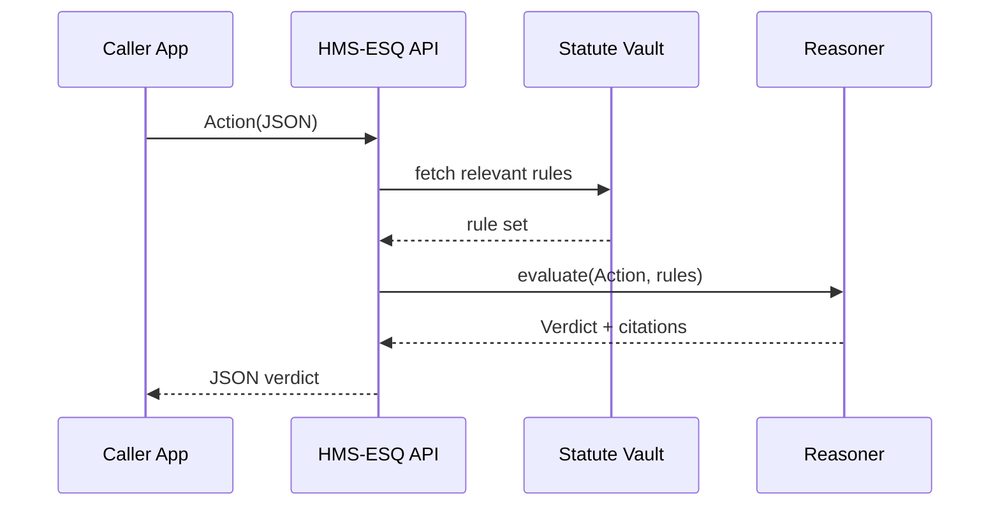

# Chapter 15: Compliance & Legal Reasoning (HMS-ESQ)

[← Back to Chapter 14: Simulation & Training Sandbox (HMS-ESR)](14_simulation___training_sandbox__hms_esr__.md)

---

> “AI moves in milliseconds; the law still moves.  
>  HMS-ESQ keeps them synchronized.”  
> – a Government Accountability Office (GAO) auditor

---

## 1  Why Do We Need HMS-ESQ?

### 60-Second Story — *“Can We Share This File?”*

1. The **Department of Energy (DOE)** holds a CSV that lists the location of several *AmeriCorps Seniors* volunteer sites (PII + building schematics).  
2. The **Federal Labor Relations Authority (FLRA)** wants the data to study workplace safety.  
3. Engineers are ready to send the file through [HMS-A2A](05_inter_agency_protocol__hms_a2a__.md).  
4. A privacy lawyer shouts:  
   *“Wait! Is facility blue-print data even shareable under 42 U.S.C. §2165?”*  
5. They open **HMS-ESQ**.  
6. ESQ reads the proposed share, checks statutory constraints, and answers **“Allowed if field *‘blueprint_pdf’* is removed.”**  
7. Engineers call the redaction tool, resend, and the project ships. No late-night phone calls, no IG report.

**HMS-ESQ is the platform’s built-in lawyer.** Every action—data share, payment, policy tweak—runs through ESQ first, so software never outruns the law.

---

## 2  Key Concepts (Pocket Glossary)

| Courthouse Analogy | HMS-ESQ Term | Beginner-Friendly Definition |
|--------------------|-------------|------------------------------|
| Law library        | **Statute Vault** | Versioned YAML/JSON copies of statutes, agency directives, court rulings. |
| Judge’s ruling     | **Verdict** | Result of a compliance check: *ALLOW*, *DENY*, or *ALLOW WITH REMEDIATION*. |
| Footnote           | **Citation** | Exact section(s) that justify the verdict. |
| Court order        | **Remediation** | Concrete steps (e.g., redact field, add consent checkbox) to turn *DENY* into *ALLOW*. |
| Case docket        | **Docket ID** | Trace-ID that links the action, verdict, and follow-up audits. |

Remember these five nouns; they cover 90 % of day-to-day ESQ use.

---

## 3  Quick-Start — Ask the Robot Lawyer in 15 Lines

> Prerequisites  
> ```bash
> pip install hms-esq
> ```

```python
# file: share_check.py     (15 lines)
from hms_esq import check, Action

action = Action(
    kind       = "DATA_SHARE",
    actor      = "DOE",
    target     = "FLRA",
    payload_id = "DTA:volunteer_sites_2024.csv",
    purpose    = "workplace_safety_study"
)

verdict = check(action)
print("Verdict :", verdict.status)          # ALLOW / DENY / REMEDIATE
print("Cites   :", verdict.citations)       # ['42 USC §2165(b)(3)', ...]
print("Fixes   :", verdict.remediation)     # ['Remove blueprint_pdf column']
```

**What happens?**

1. `check()` ships the `Action` to the ESQ service (HTTPS + mTLS).  
2. ESQ loads relevant constraints from the *Statute Vault*.  
3. A rules engine returns a **Verdict** object.  
4. Engineers act on `verdict.remediation` (if any) and try again.

Total time ≈ 50 ms; no lawyer calendars harmed.

---

## 4  Under the Hood (Plain-English Walkthrough)



Four actors—easy to reason about; nothing touches the live database until ESQ says *yes*.

---

## 5  Peeking Inside the Reasoner (≤ 18 Lines)

```python
# hms_esq/reasoner.py  (highly simplified)
def evaluate(action, rules):
    cites, fixes = [], []

    for r in rules:
        if not r["applies_to"](action):
            continue
        ok = r["test"](action)
        if not ok:
            cites.append(r["cite"])
            fixes += r.get("remedy", [])
    status = "ALLOW" if not cites else ("REMEDIATE" if fixes else "DENY")
    return {
        "status": status,
        "citations": cites,
        "remediation": fixes
    }
```

Take-away: the Reasoner loops over **tiny rule objects** (`applies_to`, `test`, `remedy`). Adding a new law = add a YAML file → auto-compiled into one more rule.

---

### Example Rule File (8 Lines)

```yaml
# vault/42_usc_2165.yaml
id: DOE-FACILITY-DATA
cite: "42 USC §2165(b)(3)"
applies_to: kind == "DATA_SHARE" and actor == "DOE"
test: "not payload.has_field('blueprint_pdf')"
remedy: ["Remove blueprint_pdf column or aggregate to room_count"]
```

Lawyers update YAML; no code changes, no redeploys.

---

## 6  Using ESQ in Other Flows

### 6.1 Gate a HITL Proposal

In [Human-in-the-Loop](12_human_in_the_loop_control_loop_.md) you can insert ESQ:

```python
from hms_esq import check
if check(proposal)["status"] == "ALLOW":
    queue.enqueue(proposal)
```

### 6.2 Validate an Agent’s Outbox

```python
# inside an HMS-AGT agent
if esq.check(outgoing_env)["status"] != "ALLOW":
    escalate("Legal block")
else:
    outbox.push(outgoing_env)
```

### 6.3 Fail Simulation Early

In [HMS-ESR](14_simulation___training_sandbox__hms_esr__.md):

```yaml
probes:
  - esq_guard: DENY_IF status != "ALLOW"
```

The sandbox aborts if any simulated step violates the law.

---

## 7  Common Recipes (≤ 60 s Each)

### 7.1 Bulk-Scan a Data Lake Bucket

```bash
hms-esq scan-bucket --bucket permits-raw --actor MRC
```

Prints a table of objects + violation cites.

### 7.2 Add a One-Off Waiver

```python
esq.waive("DOE", action_id="123ABC", cite="OMB Memo 2024-19")
```

Waivers are logged and expire automatically after a date you set.

### 7.3 Generate an Audit Packet

```bash
hms-esq audit --docket 92EF --out packet.zip
```

Contains the original action, verdict, statutes, and timestamps—hand it to IG, done.

---

## 8  Best Practices (Sticky-Note Edition)

1. **Keep rules atomic**—one YAML per citation.  
2. **Never hard-code agency names**; use `actor` and `target` tags so mergers are painless.  
3. **Log the Docket ID** (`x-hms-docket-id`) in every downstream service for traceability.  
4. **Run ESQ in CI**—fail the build if new code triggers *DENY*.  
5. **Review rule diffs like code**—lawyers use pull requests too!

---

## 9  Where HMS-ESQ Fits in the HMS Universe

```mermaid
graph LR
SYS[Rules Store<br/>(HMS-SYS)] --> ESQ
CDF[Policy Lifecycle<br/>(HMS-CDF)] --> ESQ
A2A[Secure Envelopes<br/>(HMS-A2A)] --> ESQ
HITL[Human Loop<br/>(HMS-HITL)] --> ESQ
OPS[Metrics & OPS] --> ESQ
ESQ --> AGT[Agents]<br>blocks or allows
```

ESQ is the **traffic light** in the middle of every road.

---

## 10  Conclusion

You now have a **robot lawyer** that:

1. Reads machine-friendly statutes from the *Statute Vault*.  
2. Returns instant **verdicts, citations, and fixes** for any proposed action.  
3. Connects seamlessly to agents, sandboxes, HITL queues, and even CI pipelines.  

With HMS-ESQ, compliance becomes an API call, not a project delay.

*Congratulations—you’ve reached the end of the HMS-A2A beginner journey!  
You now hold all the Lego bricks: governance, agents, models, sandboxes, metrics, and, finally, legal guardrails. Go build safe, swift, and citizen-friendly government software.*

---

Generated by [HardisonCo [NARA-DOC]](https://github.com/The-Pocket/Tutorial-Codebase-Knowledge)