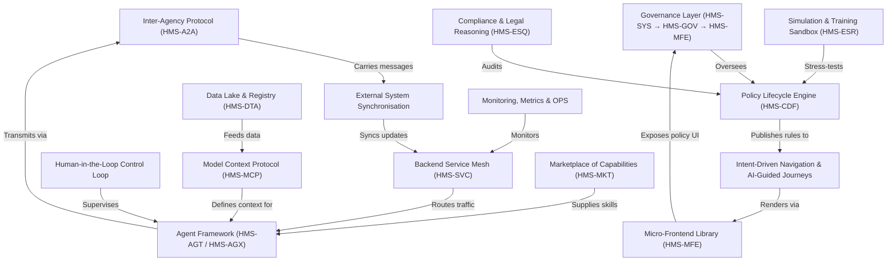

# Tutorial: HMS-A2A

**HMS-A2A** sits inside a larger *HMS* ecosystem that turns complex public-sector
processes—​law-making, benefit delivery, agency coordination—​into one
AI-assisted, app-store-style platform.  
• Citizens and civil-servants interact through micro-frontends while **AI agents**
  guide them step-by-step.  
• Behind the scenes, a **service mesh**, **data lake**, and **inter-agency
  protocol** move information securely across departments.  
• A Rust-powered **Policy Lifecycle Engine** codifies legislation in real time,
  and a **Governance Layer** publishes those rules to every program.  
• Continuous **human-in-the-loop** checkpoints, legal reasoning, and
  monitoring dashboards keep the system transparent, lawful, and resilient—
  making it possible to launch new citizen services or update policies at the
  speed of software while still meeting government oversight requirements.

**Source Repository:** [None](None)

## Chapters

1. [Governance Layer (HMS-SYS → HMS-GOV → HMS-MFE)
](01_governance_layer__hms_sys___hms_gov___hms_mfe__.md)
2. [Policy Lifecycle Engine (HMS-CDF)
](02_policy_lifecycle_engine__hms_cdf__.md)
3. [Micro-Frontend Library (HMS-MFE)
](03_micro_frontend_library__hms_mfe__.md)
4. [Intent-Driven Navigation & AI-Guided Journeys
](04_intent_driven_navigation___ai_guided_journeys_.md)
5. [Inter-Agency Protocol (HMS-A2A)
](05_inter_agency_protocol__hms_a2a__.md)
6. [Backend Service Mesh (HMS-SVC)
](06_backend_service_mesh__hms_svc__.md)
7. [External System Synchronisation
](07_external_system_synchronisation_.md)
8. [Agent Framework (HMS-AGT / HMS-AGX)
](08_agent_framework__hms_agt___hms_agx__.md)
9. [Data Lake & Registry (HMS-DTA)
](09_data_lake___registry__hms_dta__.md)
10. [Model Context Protocol (HMS-MCP)
](10_model_context_protocol__hms_mcp__.md)
11. [Marketplace of Capabilities (HMS-MKT)
](11_marketplace_of_capabilities__hms_mkt__.md)
12. [Human-in-the-Loop Control Loop
](12_human_in_the_loop_control_loop_.md)
13. [Monitoring, Metrics & OPS
](13_monitoring__metrics___ops_.md)
14. [Simulation & Training Sandbox (HMS-ESR)
](14_simulation___training_sandbox__hms_esr__.md)
15. [Compliance & Legal Reasoning (HMS-ESQ)
](15_compliance___legal_reasoning__hms_esq__.md)

---

Generated by [HardisonCo [NARA-DOC]](https://github.com/The-Pocket/Tutorial-Codebase-Knowledge)