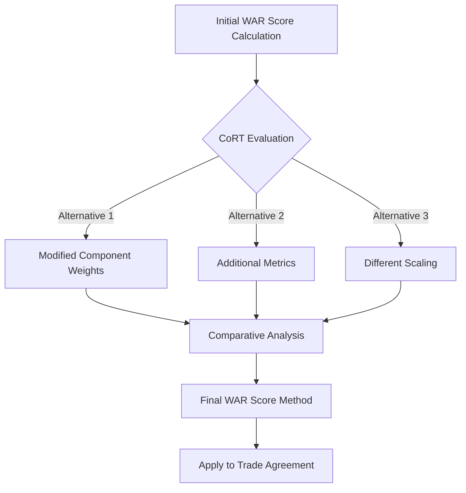
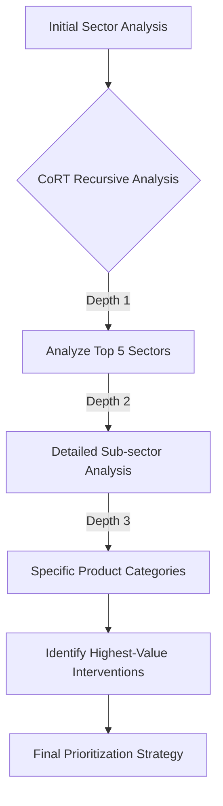
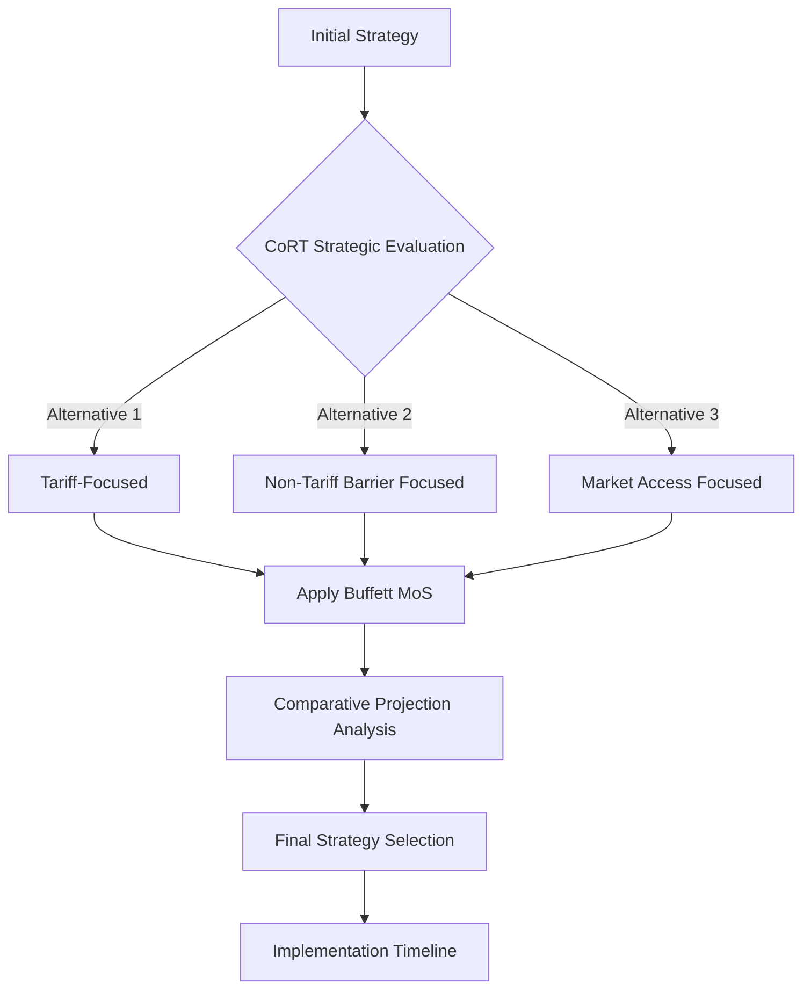
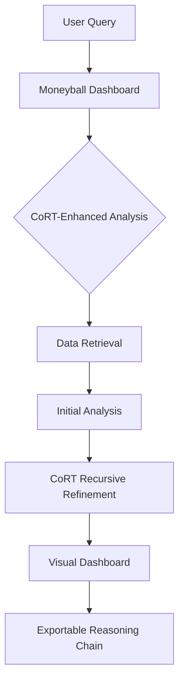
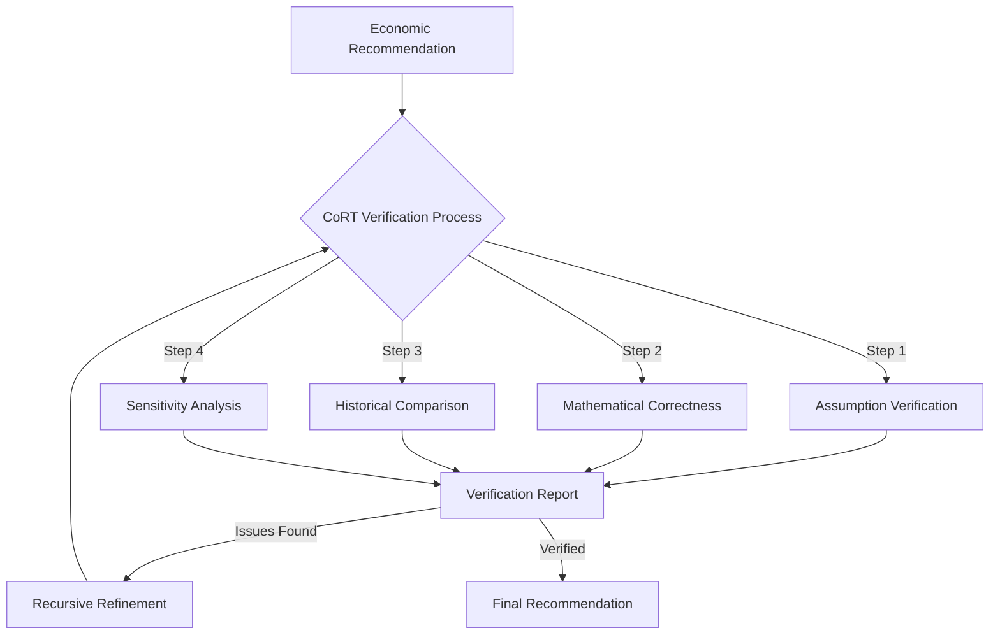

# Chain of Recursive Thoughts (CoRT) Integration for Economic Domain Model

This document outlines how to integrate the Chain of Recursive Thoughts (CoRT) algorithm with the Moneyball-Buffett economic model for enhanced trade policy analysis and decision-making.

## 1. Overview

The CoRT algorithm enhances decision-making through recursive self-evaluation and refinement, making it particularly valuable for complex economic analyses where multiple factors and trade-offs must be considered. By integrating CoRT with the Moneyball-Buffett approach, we can create a more robust system for trade policy analysis that:

1. Considers multiple policy alternatives
2. Recursively evaluates each approach
3. Refines strategies based on quantitative metrics
4. Provides transparent reasoning chains for human review
5. Continuously improves through feedback loops

## 2. CoRT Integration Points

### 2.1 WAR Score Evaluation



**Implementation:**
```python
def evaluate_war_score_with_cort(trade_agreement):
    # Initial calculation
    initial_score = calculate_war_score(trade_agreement)
    
    # Create CoRT session
    cort_session = cort.start(
        user="trade_analyst",
        goal="Optimize WAR Score calculation for trade agreement"
    )
    
    # Generate alternatives
    cort.think("Current WAR calculation uses fixed weights")
    alternative_1 = recalculate_with_dynamic_weights(trade_agreement)
    
    cort.think("Consider additional metrics beyond the standard four")
    alternative_2 = calculate_with_expanded_metrics(trade_agreement)
    
    cort.think("Explore different scaling methods")
    alternative_3 = calculate_with_logarithmic_scaling(trade_agreement)
    
    # Evaluate alternatives
    evaluation = evaluate_alternatives([
        initial_score, 
        alternative_1, 
        alternative_2, 
        alternative_3
    ])
    
    cort.answer(f"Selected approach: {evaluation['best_approach']}")
    cort.answer(f"Final WAR score: {evaluation['best_score']}")
    
    return evaluation['best_score']
```

### 2.2 Sector Prioritization Analysis



**Implementation:**
```python
def sector_prioritization_with_cort(trade_data, max_depth=3):
    # Initial broad sector analysis
    initial_analysis = analyze_sectors(trade_data)
    
    # Create CoRT session
    cort_session = cort.start(
        user="sector_analyst",
        goal="Identify highest-impact trade opportunities"
    )
    
    # Initial thinking
    cort.think("Analyzing top sectors by deficit contribution")
    top_sectors = get_top_n_sectors(initial_analysis, n=5)
    
    results = []
    # Recursive analysis for each top sector
    for sector in top_sectors:
        cort.jump(f"Deep analysis of {sector['name']}")
        # This creates a sub-chain for each sector
        sector_results = analyze_sector_recursively(
            sector, 
            current_depth=1, 
            max_depth=max_depth
        )
        results.append(sector_results)
    
    # Synthesize results
    prioritized_opportunities = synthesize_opportunities(results)
    
    cort.answer(f"Top opportunities: {prioritized_opportunities[:3]}")
    
    return prioritized_opportunities
```

### 2.3 Deficit Reduction Strategy Development



**Implementation:**
```python
def develop_deficit_strategy_with_cort(baseline_deficit, country_data):
    # Create CoRT session
    cort_session = cort.start(
        user="economic_strategist",
        goal=f"Develop optimal deficit reduction strategy for {country_data['name']}"
    )
    
    # Initial strategy based on baseline approach
    cort.think("Developing initial balanced approach")
    initial_strategy = create_balanced_strategy(baseline_deficit, country_data)
    
    # Generate alternative strategies
    cort.think("Consider tariff-focused approach")
    tariff_strategy = create_tariff_strategy(baseline_deficit, country_data)
    
    cort.think("Consider non-tariff barrier focused approach")
    non_tariff_strategy = create_non_tariff_strategy(baseline_deficit, country_data)
    
    cort.think("Consider market access focused approach")
    market_access_strategy = create_market_access_strategy(baseline_deficit, country_data)
    
    # Apply Buffett Margin of Safety to all strategies
    strategies = [
        apply_buffett_mos(initial_strategy),
        apply_buffett_mos(tariff_strategy),
        apply_buffett_mos(non_tariff_strategy),
        apply_buffett_mos(market_access_strategy)
    ]
    
    # Project outcomes for each strategy
    projections = []
    for i, strategy in enumerate(strategies):
        cort.think(f"Projecting outcomes for strategy {i+1}")
        projection = project_deficit_impact(baseline_deficit, strategy, years=10)
        projections.append(projection)
    
    # Evaluate and select best strategy
    best_strategy_index = select_best_strategy(projections)
    best_strategy = strategies[best_strategy_index]
    
    # Create implementation timeline
    cort.think("Developing implementation timeline")
    timeline = create_implementation_timeline(best_strategy)
    
    cort.answer(f"Selected strategy: Strategy {best_strategy_index+1}")
    cort.answer(f"10-year deficit reduction: {projections[best_strategy_index]['year_10']['reduction']}")
    
    return {
        "strategy": best_strategy,
        "projection": projections[best_strategy_index],
        "timeline": timeline
    }
```

## 3. Enhancing Moneyball Dashboard with CoRT

The Moneyball Dashboard can be enhanced with CoRT to provide deeper insights and more transparent reasoning:



**Implementation Features:**
1. **CoRT Sessions Panel**: Displays active and past reasoning chains
2. **Alternative Explorer**: Allows users to view alternative analyses considered
3. **Reasoning Depth Controls**: Lets users adjust how deep the recursive analysis goes
4. **Audit Trail**: Provides complete history of the decision-making process
5. **Insight Highlights**: Automatically highlights key insights from the CoRT process

## 4. HMS Component Integration

### HMS-ESR (Economic System Representation)

```python
# Integration with HMS-ESR
class CoRTEnhancedEconomicModel:
    def __init__(self, base_model):
        self.base_model = base_model
        self.cort_manager = CoRTSessionManager()
    
    def analyze_trade_relationship(self, country_a, country_b):
        # Start CoRT session
        session_id = self.cort_manager.start_session(
            goal=f"Analyze trade relationship between {country_a} and {country_b}"
        )
        
        # Initial analysis from base model
        initial_analysis = self.base_model.analyze_trade_relationship(country_a, country_b)
        
        # Enhance with recursive thought chains
        enhanced_analysis = self.cort_manager.enhance_analysis(
            session_id, 
            initial_analysis,
            depth=3
        )
        
        return enhanced_analysis
```

### HMS-MKT (Market Analytics)

```python
# Integration with HMS-MKT
class CoRTMarketAnalyzer:
    def __init__(self, market_analyzer):
        self.market_analyzer = market_analyzer
        self.cort_manager = CoRTSessionManager()
    
    def find_market_opportunities(self, sector_data):
        # Start CoRT session
        session_id = self.cort_manager.start_session(
            goal=f"Identify market opportunities in {sector_data['name']}"
        )
        
        # Generate and evaluate multiple approaches
        opportunities = []
        
        self.cort_manager.think(session_id, "Statistical analysis of market trends")
        statistical_opps = self.market_analyzer.statistical_analysis(sector_data)
        
        self.cort_manager.think(session_id, "Competitive advantage analysis")
        competitive_opps = self.market_analyzer.competitive_analysis(sector_data)
        
        self.cort_manager.think(session_id, "Growth potential analysis")
        growth_opps = self.market_analyzer.growth_analysis(sector_data)
        
        # Recursively analyze each opportunity set
        for opp_set in [statistical_opps, competitive_opps, growth_opps]:
            refined_opps = self.cort_manager.recursive_analyze(
                session_id,
                opp_set,
                max_depth=3
            )
            opportunities.extend(refined_opps)
        
        # Synthesize and rank opportunities
        ranked_opps = self.cort_manager.synthesize(session_id, opportunities)
        
        return ranked_opps
```

### HMS-CDF (Collaborative Decision Framework)

```python
# Integration with HMS-CDF
class CoRTEnhancedPolicyFramework:
    def __init__(self, policy_framework):
        self.policy_framework = policy_framework
        self.cort_manager = CoRTSessionManager()
    
    def develop_trade_policy(self, issue, stakeholders):
        # Start CoRT session
        session_id = self.cort_manager.start_session(
            goal=f"Develop trade policy for {issue['name']}"
        )
        
        # Initial policy proposal
        initial_policy = self.policy_framework.draft_policy(issue)
        
        # Generate alternative approaches
        alternatives = []
        for i in range(3):
            self.cort_manager.think(
                session_id, 
                f"Developing alternative {i+1} with different emphasis"
            )
            alt = self.policy_framework.generate_alternative(
                issue, 
                focus_area=["economic", "diplomatic", "developmental"][i]
            )
            alternatives.append(alt)
        
        # Evaluate against stakeholder interests
        evaluations = []
        for policy in [initial_policy] + alternatives:
            eval_results = self.policy_framework.evaluate_against_stakeholders(
                policy, 
                stakeholders
            )
            evaluations.append(eval_results)
        
        # Use CoRT to recursively refine the best policy
        best_policy_idx = self.cort_manager.select_best_option(evaluations)
        best_policy = [initial_policy] + alternatives[best_policy_idx]
        
        refined_policy = self.cort_manager.recursive_refine(
            session_id,
            best_policy,
            stakeholders,
            max_depth=3
        )
        
        return refined_policy
```

## 5. Verifying Economic Recommendations

CoRT enables robust verification of economic recommendations through its recursive reasoning structure:



**Implementation Approach:**
```python
def verify_economic_model_with_cort(model, test_cases):
    # Start CoRT session
    cort_session = cort.start(
        user="verification_specialist",
        goal="Thoroughly verify economic model"
    )
    
    # Steps to verify
    verification_steps = [
        "assumption_verification",
        "mathematical_correctness",
        "historical_comparison",
        "sensitivity_analysis"
    ]
    
    all_results = {}
    issues_found = False
    
    # Run verification steps
    for step in verification_steps:
        cort.think(f"Performing {step}")
        
        # Jump to specialized verification
        cort.jump(f"Detailed {step}")
        
        # This would be a sub-chain with its own recursive thinking
        results = run_verification_step(model, step, test_cases)
        all_results[step] = results
        
        if results.get('issues'):
            issues_found = True
            cort.think(f"Issues found in {step}: {results['issues']}")
    
    # If issues found, request model refinement
    if issues_found:
        cort.think("Model requires refinement based on verification results")
        refinement_suggestions = generate_refinement_suggestions(all_results)
        
        cort.answer("Verification failed - model needs refinement")
        return {
            "verified": False,
            "issues": all_results,
            "refinement_suggestions": refinement_suggestions
        }
    else:
        cort.answer("Model successfully verified")
        return {
            "verified": True,
            "verification_results": all_results
        }
```

## 6. Implementing Chain of Recursive Thoughts in Python

A basic implementation of the CoRT system for economic analysis:

```python
class EconomicCoRTManager:
    def __init__(self, base_dir="./cort_sessions"):
        self.base_dir = base_dir
        self.sessions = {}
        self.ensure_directory()
    
    def ensure_directory(self):
        """Ensure the base directory exists."""
        if not os.path.exists(self.base_dir):
            os.makedirs(self.base_dir)
    
    def start_session(self, user, goal):
        """Start a new CoRT session."""
        session_id = str(uuid.uuid4())
        timestamp = datetime.datetime.now().strftime("%Y-%m-%dT%H-%M-%S")
        session_name = f"{timestamp}_{goal[:20].replace(' ', '_')}"
        
        session_file = os.path.join(self.base_dir, f"{session_name}.md")
        
        with open(session_file, "w") as f:
            f.write(f"# Goal: {goal}\n\n")
            f.write(f"Session started by {user} at {timestamp}\n\n")
        
        self.sessions[session_id] = {
            "file": session_file,
            "goal": goal,
            "user": user,
            "depth": 0,
            "parent": None
        }
        
        return session_id
    
    def think(self, session_id, thought):
        """Record a thinking step."""
        if session_id not in self.sessions:
            raise ValueError(f"Unknown session: {session_id}")
        
        with open(self.sessions[session_id]["file"], "a") as f:
            f.write(f"🤔 THINK: {thought}\n")
    
    def answer(self, session_id, answer):
        """Record an answer/conclusion."""
        if session_id not in self.sessions:
            raise ValueError(f"Unknown session: {session_id}")
        
        with open(self.sessions[session_id]["file"], "a") as f:
            f.write(f"✅ ANSWER: {answer}\n")
    
    def jump(self, session_id, new_goal, max_depth=5):
        """Create a recursive branch."""
        if session_id not in self.sessions:
            raise ValueError(f"Unknown session: {session_id}")
        
        # Check recursion depth
        current_depth = self.sessions[session_id]["depth"]
        if current_depth >= max_depth:
            with open(self.sessions[session_id]["file"], "a") as f:
                f.write(f"⚠️ MAX RECURSION DEPTH REACHED: Cannot create sub-chain for {new_goal}\n")
            return None
        
        # Log the jump
        with open(self.sessions[session_id]["file"], "a") as f:
            f.write(f"🔄 BRANCH: {new_goal}\n")
        
        # Create child session
        child_id = self.start_session(
            user=f"sub-chain-depth-{current_depth+1}",
            goal=new_goal
        )
        
        # Set parent-child relationship
        self.sessions[child_id]["parent"] = session_id
        self.sessions[child_id]["depth"] = current_depth + 1
        
        return child_id
    
    def get_session_content(self, session_id):
        """Get the content of a session file."""
        if session_id not in self.sessions:
            raise ValueError(f"Unknown session: {session_id}")
        
        with open(self.sessions[session_id]["file"], "r") as f:
            return f.read()
```

## 7. Integration with DeepSeek-Prover V2

DeepSeek-Prover provides formal verification capabilities that can enhance the CoRT process for economic models:

```python
def verify_with_deepseek(economic_model):
    """
    Use DeepSeek-Prover V2 to formally verify economic model properties.
    """
    # Convert economic model to formal specification
    formal_spec = convert_model_to_formal_spec(economic_model)
    
    # Define properties to prove
    properties = [
        "deficit_reduction > 0 for all valid policy configurations",
        "war_score calculation is monotonic w.r.t. component improvements",
        "buffett_safety_margin ensures worst-case outcome is non-negative"
    ]
    
    # Run DeepSeek-Prover
    prover = DeepSeekProver()
    verification_results = []
    
    for prop in properties:
        result = prover.verify_property(formal_spec, prop)
        verification_results.append({
            "property": prop,
            "verified": result.verified,
            "counterexample": result.counterexample if not result.verified else None,
            "proof": result.proof if result.verified else None
        })
    
    return verification_results
```

## 8. Example CoRT Session for Trade Analysis

Below is an example CoRT session file for trade deficit analysis:

```markdown
# Goal: Analyze US-China trade deficit reduction strategies

Session started by economic_analyst at 2025-05-02T14:30:25

🤔 THINK: Need to gather current baseline deficit data
✅ ANSWER: Baseline 2023 US-China trade deficit: $279.1 billion ($426.8B imports - $147.7B exports)

🤔 THINK: Calculate deficit as percentage of total bilateral trade
✅ ANSWER: Deficit is 48.6% of total bilateral trade ($279.1B/$574.5B)

🤔 THINK: Calculate China's share of global US deficit
✅ ANSWER: China accounts for 26.3% of total $1,062.1B US global trade deficit

🤔 THINK: Calculate current WAR score for US-China trade relationship
✅ ANSWER: Current WAR Score: 2.1/5.0 (Target for balanced trade: 3.5/5.0)

🤔 THINK: Need to identify sectors with highest deficit contribution
🔄 BRANCH: Analyze top 5 deficit contributing sectors

🤔 THINK: Need to develop potential policy interventions
🔄 BRANCH: Generate policy intervention options

🤔 THINK: Need to project deficit impact for different policy scenarios
🔄 BRANCH: Project deficit impact for policy options

🤔 THINK: Apply Buffett Margin of Safety to all projections
✅ ANSWER: Standard projection and Conservative (Buffett MoS) projection calculated

🤔 THINK: Identify highest-priority sectors based on SPS score
✅ ANSWER: Highest SPS sectors: Semiconductor Manufacturing (3.8/5.0), Advanced Materials (3.7/5.0)

🤔 THINK: Identify highest-impact non-tariff barrier opportunities
✅ ANSWER: Top NTB opportunities: IP protection ($14.2B), Standards alignment ($8.7B), Regulatory streamlining ($6.3B)

🤔 THINK: Synthesize findings into coherent strategy
✅ ANSWER: Multi-phase strategy developed with Foundation (Y1), Acceleration (Y2-3), Scaling (Y4-5), and Institutionalization (Y6-10) phases

🤔 THINK: Evaluate strategy against historical case studies
🔄 BRANCH: Compare strategy to historical trade interventions

🤔 THINK: Final review of complete analysis
✅ ANSWER: Analysis complete with baseline data, sector prioritization, policy recommendations, implementation timeline, and projected outcomes
```

## 9. Conclusion

Integrating the Chain of Recursive Thoughts (CoRT) algorithm with the Moneyball-Buffett economic model creates a powerful framework for trade policy analysis that combines:

1. **Data-driven quantitative analysis** from the Moneyball approach
2. **Conservative long-term thinking** from the Buffett approach
3. **Recursive self-improvement** from the CoRT algorithm

This integration enables:

- More thorough exploration of policy alternatives
- Better identification of high-impact interventions
- Transparent reasoning for human review and collaboration
- Continuous improvement through feedback loops
- Formal verification of economic properties

The implementation leverages the HMS component architecture, particularly HMS-ESR, HMS-MKT, and HMS-CDF, to provide a comprehensive solution for trade deficit analysis and policy development.