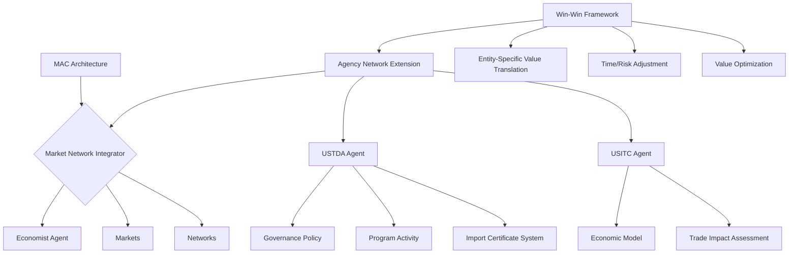
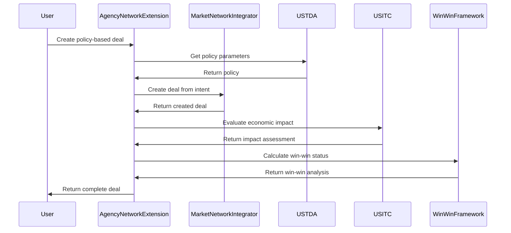

# Market Network Architecture for Global Trade Balance

This document outlines the mathematical and economic foundations of the Market Network Architecture integrated with USTDA and USITC agency agents to address trade imbalances using the Moneyball-Buffett approach.

## 1. Economic Theory: The Buffett Certificate System

### 1.1 Mathematical Foundation of Import Certificates

Warren Buffett's Import Certificate (IC) system provides the mathematical foundation for our trade balancing approach. In its essence, the system enforces the constraint:

$$\text{Imports} \leq \text{Exports}$$

This is achieved through a certificate mechanism where:

$$\forall \text{ import transaction } T_i, \exists \text{ certificate } C_j \text{ such that } \text{value}(T_i) \leq \text{value}(C_j)$$

The certificate price discovery follows a dynamic equilibrium model:

$$P_{IC}(t) = P_{IC}(t-1) \cdot e^{-\kappa \left(\frac{S(t)}{D(t)} - 1\right)}$$

Where:
- $P_{IC}(t)$ is the certificate price at time $t$
- $S(t)$ is the supply of certificates at time $t$
- $D(t)$ is the demand for certificates at time $t$
- $\kappa$ is the price sensitivity parameter

### 1.2 Economic Efficiency of Certificate Trading

The efficiency of the certificate market is measured by the ratio of transaction costs to total trade value:

$$E = 1 - \frac{\sum_{i} TC_i}{\sum_{i} V_i}$$

Where:
- $TC_i$ is the transaction cost of trade $i$
- $V_i$ is the value of trade $i$

### 1.3 Optimal Certificate Allocation

The allocation problem is formulated as:

$$\max_{x \in X} \sum_{i=1}^{N} U_i(x_i)$$

Subject to:
$$\sum_{i=1}^{N} x_i = S_{total}$$
$$x_i \geq 0, \forall i$$

Where:
- $U_i(x_i)$ is the utility function for agent $i$ with allocation $x_i$
- $S_{total}$ is the total supply of certificates
- $X$ is the feasible set of allocations

## 2. Market Network Economic Model

### 2.1 Integrated Market Network Utility

The market network integrates multiple economic components through a unified utility function:

$$U_{network}(x, G) = \prod_{j=1}^{R} x_{j}^{\alpha_{j}} \cdot \prod_{k=1}^{E} N_k(G)^{\beta_k}$$

Where:
- $x_{j}$ is the allocation of resource $j$
- $\alpha_{j}$ is the preference weight for resource $j$
- $N_k(G)$ is the network effect function of type $k$
- $\beta_k$ is the network effect sensitivity parameter
- $G$ is the network graph

### 2.2 Network Value Proposition

The network creates value through four distinct mechanisms:

1. **Direct Value Creation**: 
$$V_{direct} = \sum_{i=1}^{N} v_i$$

2. **Network Effect Value**: 
$$V_{network} = \gamma \cdot n \log(n)$$
   Where $n$ is the number of network participants and $\gamma$ is a scaling parameter

3. **Knowledge Diffusion Value**:
$$V_{knowledge} = \sum_{i=1}^{N}\sum_{d=1}^{D} K_{id}(t) - K_{id}(0)$$
   Where $K_{id}(t)$ is agent $i$'s knowledge in domain $d$ at time $t$

4. **Matching Efficiency Value**:
$$V_{matching} = \sum_{i=1}^{M} (v_i^{actual} - v_i^{counterfactual})$$
   Where $v_i^{actual}$ is the value of match $i$ and $v_i^{counterfactual}$ is the value without the network

The total network value is:
$$V_{total} = V_{direct} + V_{network} + V_{knowledge} + V_{matching}$$

### 2.3 Specialized Market Mechanisms

The market network supports multiple market mechanisms:

#### 2.3.1 Continuous Double Auction (CDA)

Price discovery follows:

$$P_t = \frac{1}{2}(B_t + A_t)$$

Where:
- $P_t$ is the transaction price at time $t$
- $B_t$ is the highest bid price
- $A_t$ is the lowest ask price

#### 2.3.2 Certificate-Regulated Market

For imports subject to certificate requirements:

$$\text{is\_valid}(Order) = \begin{cases}
True & \text{if } Order.type = \text{"sell"} \\
True & \text{if } Order.type = \text{"buy"} \land \text{has\_certificate}(Order.agent, Order.value) \\
False & \text{otherwise}
\end{cases}$$

## 3. Agency Integration: USTDA and USITC

### 3.1 Three-Layer Agency Architecture

Both USTDA and USITC implement a three-layer architecture:

1. **Governance Layer**: Policy definition and regulatory framework
2. **Management Layer**: Program implementation and execution
3. **Interface Layer**: User and system interaction points

Mathematically, the layer interaction is modeled as:

$$L_{interface} = f_{interface}(L_{management})$$
$$L_{management} = f_{management}(L_{governance})$$

Where:
- $L_{layer}$ represents the state of a specific layer
- $f_{layer}$ is the transformation function of the layer

### 3.2 USTDA Economic Impact Model

The USTDA agent evaluates program economic impact through:

$$I_{program} = \sum_{i=1}^{S} w_i \cdot I_i$$

Where:
- $I_{program}$ is the program impact score
- $I_i$ is the impact in sector $i$
- $w_i$ is the weight of sector $i$
- $S$ is the number of sectors

The trade development potential is calculated as:

$$TDP = \alpha \cdot EG + \beta \cdot TD + \gamma \cdot SB$$

Where:
- $EG$ is economic growth potential
- $TD$ is technology development potential
- $SB$ is strategic benefit
- $\alpha, \beta, \gamma$ are weighting parameters

### 3.3 USITC Trade Impact Assessment

The USITC agent conducts trade impact assessments using:

$$Impact = \{GDP_{\Delta}, Jobs_{\Delta}, Trade_{\Delta}, Revenue_{\Delta}\}$$

Where each component is calculated as:

$$GDP_{\Delta} = \sum_{i=1}^{S} \sum_{j=1}^{R} \delta_{ij} \cdot p_i \cdot q_{ij}$$

$$Jobs_{\Delta} = \sum_{i=1}^{S} \lambda_i \cdot Output_{\Delta i}$$

$$Trade_{\Delta} = Exports_{\Delta} - Imports_{\Delta}$$

$$Revenue_{\Delta} = \sum_{i=1}^{S} \tau_i \cdot Imports_{\Delta i}$$

Where:
- $\delta_{ij}$ is the value-added coefficient for sector $i$ and resource $j$
- $p_i$ is the price in sector $i$
- $q_{ij}$ is the quantity change in sector $i$ for resource $j$
- $\lambda_i$ is the employment coefficient for sector $i$
- $\tau_i$ is the tariff rate for sector $i$

### 3.4 War Score Calculation

The Win Above Replacement (WAR) score for trade policies is:

$$WAR = \sum_{i=1}^{C} w_i \cdot \left(\frac{P_i - P_i^{baseline}}{P_i^{optimal} - P_i^{baseline}}\right)$$

Where:
- $P_i$ is the performance in category $i$
- $P_i^{baseline}$ is the baseline performance
- $P_i^{optimal}$ is the optimal performance
- $w_i$ is the weight for category $i$
- $C$ is the number of categories

## 4. Win-Win Calculation Framework

### 4.1 Entity-Specific Value Translation

Value is translated specifically for each entity type:

$$V_{entity} = f_{entity\_type}(V_{components}, E_{profile})$$

Where:
- $V_{entity}$ is the entity-specific value
- $V_{components}$ is the set of value components
- $E_{profile}$ is the entity profile
- $f_{entity\_type}$ is the entity-specific translation function

For example, government value translation:

$$V_{government} = \sum_{i=1}^{D} \sum_{j=1}^{G} \alpha_{ij} \cdot V_i \cdot G_j$$

Where:
- $V_i$ is the value in dimension $i$
- $G_j$ is the government dimension $j$
- $\alpha_{ij}$ is the translation coefficient
- $D$ is the number of value dimensions
- $G$ is the number of government dimensions

### 4.2 Time-Adjusted Value

Time preferences are incorporated through:

$$V_{time} = \sum_{t=0}^{T} \frac{V_t}{(1 + r)^t}$$

Where:
- $V_t$ is the value at time $t$
- $r$ is the discount rate
- $T$ is the time horizon

### 4.3 Risk-Adjusted Value

Risk preferences are incorporated through:

$$V_{risk} = \sum_{i=1}^{N} V_i \cdot p_i^{1+\rho}$$

Where:
- $V_i$ is the value of component $i$
- $p_i$ is the probability of component $i$
- $\rho$ is the risk aversion parameter

### 4.4 Win-Win Criterion

A deal is win-win if:

$$\forall e \in E, V_{risk,e} > 0 \land V_{time,e} > 0$$

Where:
- $E$ is the set of all entities
- $V_{risk,e}$ is the risk-adjusted value for entity $e$
- $V_{time,e}$ is the time-adjusted value for entity $e$

## 5. Integration with MAC Architecture

### 5.1 Component Mapping

The MAC-Agency integration follows this component mapping:

| MAC Component | Agency Component | Integration Point |
|---------------|------------------|-------------------|
| Economist Agent | Economic Model | $f_{integration}(EA, EM)$ |
| Market | Certificate System | $M_{enhanced} = M_{base} + CS_{rules}$ |
| Network | Agency Network | $G_{integrated} = G_{MAC} \cup G_{agency}$ |
| Resource Allocation | Program Financing | $RA_{joint} = \alpha \cdot RA_{MAC} + (1-\alpha) \cdot PF_{agency}$ |

### 5.2 AgencyNetworkExtension Class

The `AgencyNetworkExtension` enhances the MAC architecture with:

```
AgencyNetworkExtension(market_integrator) {
    - Registers agency agents
    - Applies policies to markets
    - Evaluates deal economic impacts
    - Calculates win-win status
    - Creates policy-based deals
}
```

Mathematically represented as:

$$MAC_{enhanced} = MAC_{base} + ANE_{capabilities}$$

Where:
- $MAC_{enhanced}$ is the enhanced MAC architecture
- $MAC_{base}$ is the base MAC architecture
- $ANE_{capabilities}$ is the set of agency network extension capabilities

## 6. Implementation Architecture

### 6.1 System Component Diagram



### 6.2 Data Flow

The data flow through the system follows:



## 7. Moneyball Integration

### 7.1 WAR Score Calculation in Market Context

The WAR score is calculated for trade relationships as:

$$WAR_{trade} = \sum_{i=1}^{4} w_i \cdot S_i$$

Where:
- $S_1$ = Balance Score = $1 - |\frac{Imports - Exports}{Imports + Exports}|$
- $S_2$ = Growth Score = $\min(1, \frac{Growth_{actual}}{Growth_{target}})$
- $S_3$ = Value-Added Score = $\frac{ValueAdded_{actual}}{ValueAdded_{potential}}$
- $S_4$ = Strategic Score (based on sector priorities)
- $w_i$ are the category weights, where $\sum_{i=1}^{4} w_i = 1$

### 7.2 Undervalued Opportunities

Following Moneyball principles, we identify undervalued trade opportunities with:

$$UVO = \{o \in O | \frac{V_{intrinsic}(o)}{V_{market}(o)} > \theta\}$$

Where:
- $O$ is the set of all opportunities
- $V_{intrinsic}(o)$ is the calculated intrinsic value
- $V_{market}(o)$ is the current market valuation
- $\theta$ is the threshold ratio for identification

### 7.3 Buffett Margin of Safety

The Buffett Margin of Safety is applied to all projections:

$$V_{conservative} = V_{expected} \cdot (1 - MoS)$$

Where:
- $V_{expected}$ is the expected value
- $MoS$ is the margin of safety (typically 15-40%)

Only opportunities that remain positive after applying the margin of safety are pursued:

$$O_{approved} = \{o \in O | V_{conservative}(o) > 0\}$$

## 8. Performance Metrics

### 8.1 System Efficiency

System efficiency is measured through:

$$E_{system} = \frac{V_{output}}{C_{input}}$$

Where:
- $V_{output}$ is the value created
- $C_{input}$ is the cost of inputs

### 8.2 Trade Balance Improvement

Trade balance improvement is measured as:

$$TBI = \frac{|D_{before}| - |D_{after}|}{|D_{before}|}$$

Where:
- $D_{before}$ is the deficit before intervention
- $D_{after}$ is the deficit after intervention

### 8.3 Network Value Growth

Network value growth is measured as:

$$NVG = \frac{V(G_{t+1}) - V(G_t)}{V(G_t)}$$

Where:
- $V(G_t)$ is the network value at time $t$

## 9. Implementation Considerations

### 9.1 Scalability

The system must scale with the number of agents $(n)$ and transactions $(m)$:

$$T_{processing} = O(n \log n + m \log m)$$

### 9.2 Robustness

System robustness is measured by the stability under perturbations:

$$R = 1 - \frac{|\Delta Output|}{|\Delta Input|}$$

Where higher values indicate greater robustness.

### 9.3 Interoperability

System components must maintain interoperability through standardized interfaces:

$$I_{components} = \{(c_i, c_j, API_{ij}) | c_i, c_j \in C, i \neq j\}$$

Where:
- $c_i, c_j$ are components
- $API_{ij}$ is the API between components
- $C$ is the set of all components