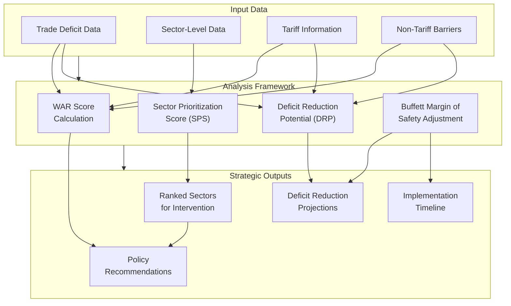
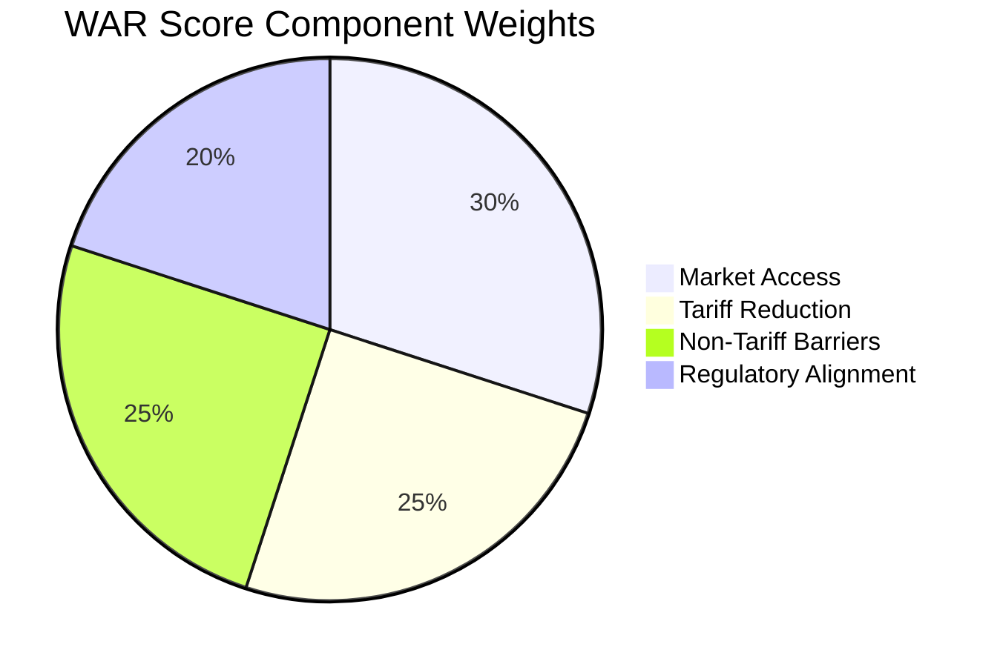
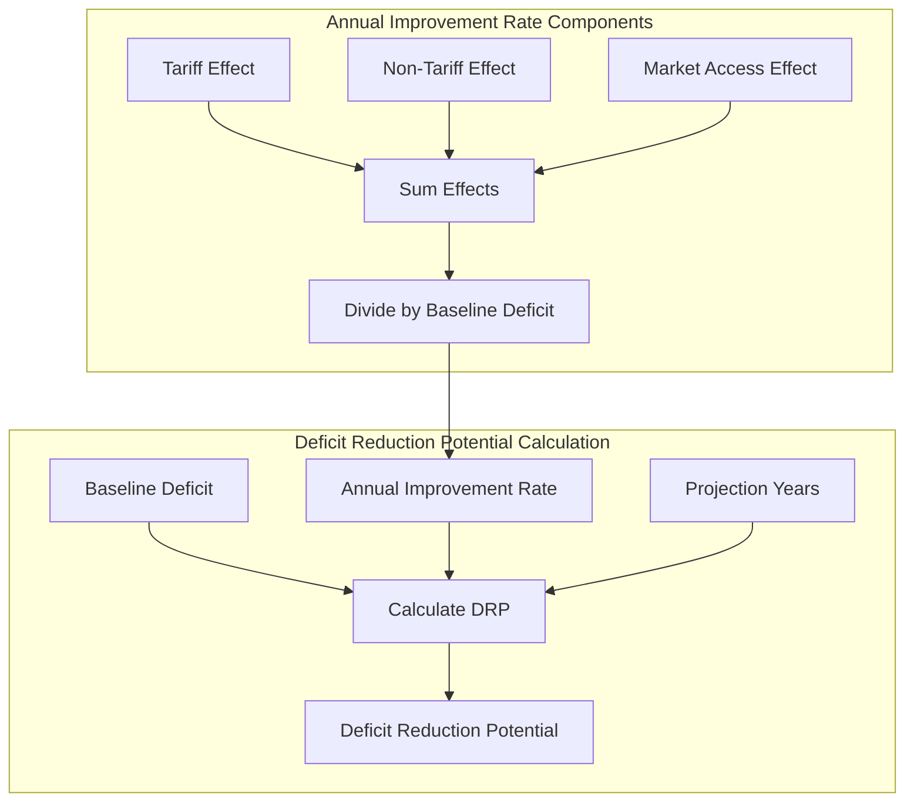
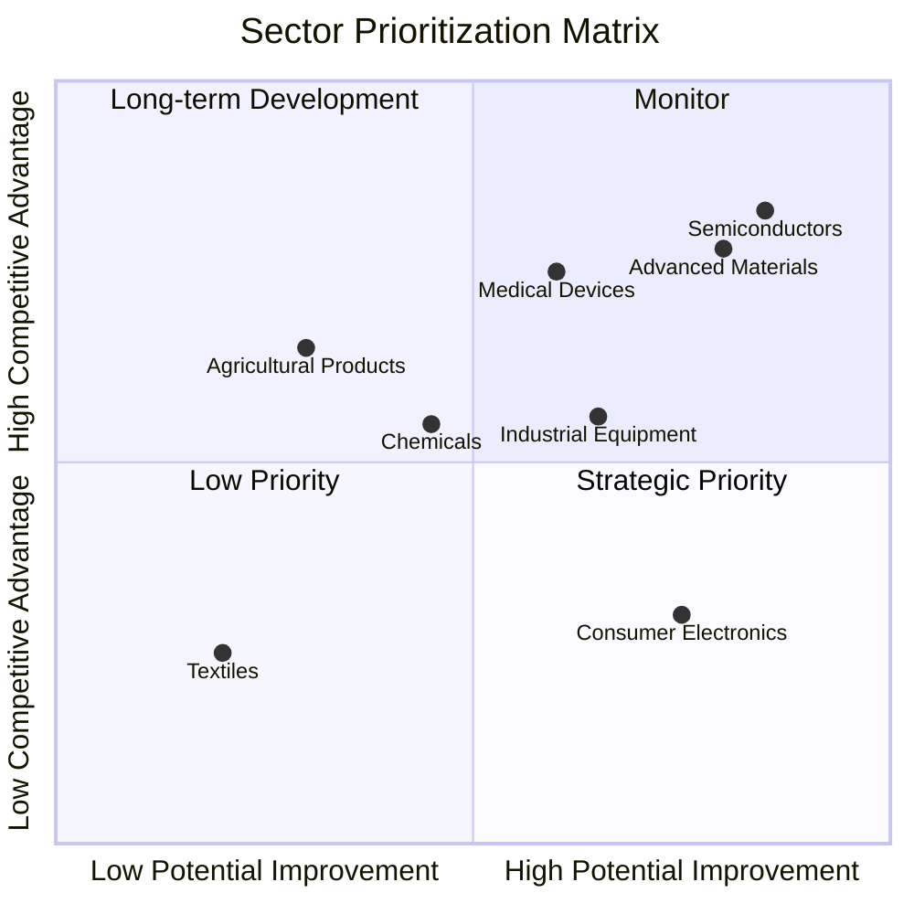
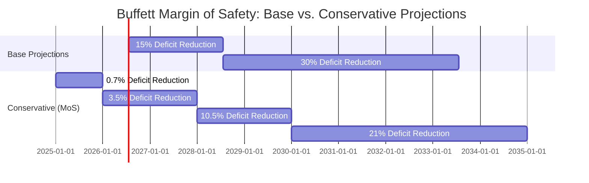

# The Moneyball-Buffett Approach to Trade Deficit Reduction

This document explains how the HMS Trade System combines principles from "Moneyball" statistical analysis and Warren Buffett's investment philosophy to address international trade deficits, with specific application to the U.S.-China trade relationship.

## Introduction

The U.S.-China trade deficit represents one of the most significant economic imbalances in global trade:

- **2023 Bilateral Deficit**: $279.1 billion ($426.8B imports - $147.7B exports)
- **Deficit Share**: 48.6% of total bilateral trade
- **Global Impact**: China accounts for 26.3% of the total $1,062.1B U.S. global trade deficit

Traditional approaches to addressing trade deficits have often relied on broad policy instruments with limited targeting. The HMS Trade System takes a fundamentally different approach, applying data-driven analytics to identify high-impact intervention points.

## The Moneyball Philosophy: Finding Undervalued Opportunities

The Moneyball approach, pioneered in baseball analytics, focuses on identifying undervalued assets and opportunities through statistical analysis rather than conventional wisdom.

### Application to Trade Policy

In the context of trade policy, the Moneyball approach means:

1. **Quantitative Evaluation**: Using the WAR (Weighted Agreement Return) score to objectively evaluate trade agreements and policies

2. **Statistical Identification**: Finding sectors, products, and markets where small policy changes can yield outsized returns

3. **Data Over Intuition**: Replacing conventional trade wisdom with evidence-based statistical analysis

4. **Targeting Inefficiencies**: Identifying specific policy inefficiencies with high-impact remedies

## The Buffett Philosophy: Long-Term Value with Margin of Safety

Warren Buffett's investment philosophy emphasizes:

1. **Long-term perspective**: Looking beyond short-term results
2. **Margin of safety**: Building in protection against uncertainty
3. **Circle of competence**: Focusing on areas of competitive advantage
4. **Compound returns**: The power of small advantages multiplied over time

### Application to Trade Policy

Applied to trade deficit reduction:

1. **Long-term Perspective**: Prioritizing sustainable deficit reduction over quick fixes that may have unintended consequences

2. **Margin of Safety**: Applying conservative estimates to all projections and building in resilience against economic shocks

3. **Circle of Competence**: Focusing on sectors where the U.S. has established or emerging competitive advantages

4. **Compound Returns**: Demonstrating how small policy adjustments compound over time to create substantial deficit improvements

## Mathematical Framework for Deficit Analysis

The HMS Trade System implements these philosophies through a mathematical framework:

### Mathematical Model Overview



### 1. WAR Score Calculation

The WAR (Weighted Agreement Return) score quantifies the effectiveness of a trade policy:

```
WAR Score = (Market Access Score × 0.3) + 
            (Tariff Reduction Score × 0.25) + 
            (Non-Tariff Barrier Score × 0.25) + 
            (Regulatory Alignment Score × 0.2)
```

Each component score is normalized from 0-5, making the maximum possible WAR Score 5.0.



### 2. Deficit Reduction Potential (DRP)

```
DRP = Baseline Deficit × (1 - (1 - Annual Improvement Rate)^Years)
```

Where Annual Improvement Rate is calculated as:

```
Annual Improvement Rate = (Tariff Effect + Non-Tariff Effect + Market Access Effect) / Baseline Deficit
```



### 3. Sector Prioritization Score (SPS)

```
SPS = (Sector Deficit Contribution / Total Deficit) × 
      (Potential Improvement / Implementation Difficulty) × 
      (U.S. Competitive Advantage Score)
```

This creates a ranked list of sectors for targeted intervention.



### 4. Buffett Margin of Safety Adjustment

All projections incorporate a Margin of Safety discount:

```
Conservative Projection = Base Projection × 0.7  # 30% safety buffer
```



## Case Study: U.S.-China Trade Deficit

### Current Situation Analysis

Based on 2023 data:
- Total bilateral deficit: $279.1 billion
- Key contributing sectors:
  - Electronics & Telecommunications: $93.8B (33.6%)
  - Manufacturing & Industrial Equipment: $68.4B (24.5%)
  - Consumer Goods: $55.3B (19.8%)
  - Chemicals & Pharmaceuticals: $21.7B (7.8%)
  - Others: $39.9B (14.3%)

### Moneyball Analysis Findings

1. **WAR Score Assessment**:
   Current U.S.-China trade relationship WAR Score: 2.1/5.0
   Baseline for balanced trade: 3.5/5.0
   Gap: 1.4 points

2. **Sector Opportunity Analysis**:
   - **Highest SPS**: Semiconductor Manufacturing
     - Current deficit contribution: $13.2B
     - Competitive advantage score: 4.2/5.0
     - Implementation difficulty: 2.8/5.0
     - SPS: 3.8/5.0
   
   - **Second Highest SPS**: Advanced Materials
     - Current deficit contribution: $8.7B
     - Competitive advantage score: 4.0/5.0
     - Implementation difficulty: 2.3/5.0
     - SPS: 3.7/5.0

3. **Non-Tariff Barrier Analysis**:
   - Intellectual property protection improvements: +$14.2B potential
   - Standards alignment in high-tech sectors: +$8.7B potential
   - Regulatory approvals streamlining: +$6.3B potential

### Buffett Approach Implementation

1. **Long-term Deficit Reduction Model**:
   - Year 1: $275.2B (-1.4%)
   - Year 2: $268.9B (-3.7%) 
   - Year 3: $260.1B (-6.8%)
   - Year 5: $234.6B (-15.9%)
   - Year 10: $178.9B (-35.9%)

2. **Margin of Safety Conservative Model**:
   - Year 1: $276.7B (-0.9%)
   - Year 2: $272.4B (-2.4%)
   - Year 3: $266.2B (-4.6%)
   - Year 5: $250.5B (-10.2%)
   - Year 10: $210.6B (-24.5%)

3. **Circle of Competence Focus Areas**:
   - Advanced manufacturing
   - Intellectual property-intensive industries
   - High-skilled services
   - Energy technologies

## Policy Recommendations

Based on the Moneyball-Buffett analysis, the HMS Trade System generates specific recommendations:

1. **Targeted Sector Interventions**:
   - Develop semiconductor manufacturing investment program with 5-year timeline
   - Create export facilitation program for advanced materials with streamlined approval process
   - Establish innovation partnerships in clean energy technologies

2. **Non-Tariff Barrier Focus**:
   - Prioritize IP protection enforcement with specific compliance metrics
   - Negotiate standards alignment in medical devices and telecommunications
   - Streamline export control processes for non-sensitive technologies

3. **Regulatory Optimization**:
   - Implement risk-based approval process for technology exports
   - Develop reciprocal certification programs in key sectors
   - Create regulatory coordination offices for exporters

4. **Long-term Strategic Positioning**:
   - Invest in workforce development programs aligned with high-potential export sectors
   - Develop supply chain resilience in critical technologies
   - Create innovation clusters around export-oriented industries

## Implementation Timeline

The recommended implementation follows a staged approach:

### Phase 1: Foundation (Year 1)
- Establish measurement frameworks
- Implement data collection systems
- Identify quick wins with high SPS scores

### Phase 2: Acceleration (Years 2-3)
- Launch sector-specific programs
- Begin regulatory alignment negotiations
- Implement export promotion initiatives

### Phase 3: Scaling (Years 4-5)
- Expand successful programs
- Address second-tier opportunities
- Adjust based on outcome data

### Phase 4: Institutionalization (Years 6-10)
- Integrate successful approaches into permanent trade architecture
- Develop adaptive policies for changing economic conditions
- Establish ongoing monitoring systems

## Conclusion

The Moneyball-Buffett approach to trade deficit reduction represents a paradigm shift in how we address international trade imbalances. By combining data-driven analysis with conservative long-term thinking, the HMS Trade System provides a framework for identifying high-impact interventions that can significantly reduce deficits while building sustainable competitive advantages.

This approach moves beyond traditional debates about "free trade" versus "protectionism" to focus on targeted, evidence-based policies that can achieve measurable improvements in trade balances while supporting economic growth and resilience.

---

## Data Sources

### U.S. Trade Representative (USTR):
- "U.S. goods exports to China in 2023 were $147.7 billion"
- "U.S. goods imports from China in 2023 totaled $426.8 billion"

### U.S. Census Bureau:
- "2023 U.S. trade in goods with World: total exports $2,018,059.3 M, imports $3,080,170.3 M, balance -$1,062,111.0 M"
- "2023 U.S. trade in goods with China; monthly deficits from January through October ranged from -$16.9 B to -$28.4 B"

### Calculation Methodology
- Bilateral Trade Deficit = Imports − Exports = $426.8 B − $147.7 B = $279.1 B
- Deficit as Share of Total Bilateral Trade = ($279.1 B / $574.5 B) × 100 ≈ 48.6 %
- China's Share of Global U.S. Deficit = ($279.1 B / $1,062.1 B) × 100 ≈ 26.3 %