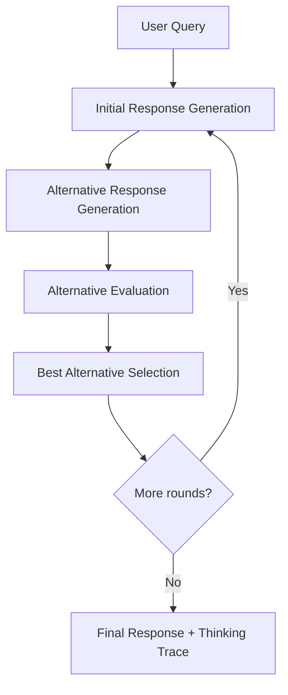

# HMS-A2A Agent Architecture

This document provides an overview of the agent architecture in the HMS-A2A framework, including the integration of Chain of Recursive Thoughts (CoRT) for enhanced reasoning.

## Overview

The HMS-A2A system uses a LangGraph-based agent architecture with several enhancements:

1. **ReAct Pattern**: Uses reasoning and acting for structured decision-making
2. **Chain of Recursive Thoughts (CoRT)**: Enhances reasoning through multiple thinking rounds
3. **A2A Protocol**: Enables communication between specialized agents
4. **MCP Integration**: Supports the Model Context Protocol for standardized interactions
5. **Standards Compliance**: Validates against domain standards and regulations

## Key Components

### Base Agent Architecture

The core agent architecture is based on LangGraph and follows patterns for migrating from LangChain agents to the more flexible LangGraph approach:

```python
from langgraph.prebuilt import create_react_agent
from src.agents.specialized.registry import registry

# Create agent with tools
agent = create_react_agent(model, tools)

# Execute
result = agent.invoke({"messages": [("human", query)]})
```

### Chain of Recursive Thoughts (CoRT) Enhancement

The HMS-A2A system incorporates Chain of Recursive Thoughts (CoRT) to enhance agent reasoning through recursive self-critique:

```python
from src.core.framework.cort_react_agent import CoRTReactAgent

# Create agent with CoRT enabled
agent = CoRTReactAgent(
    use_cort=True,
    max_rounds=3,
    generate_alternatives=3,
    dynamic_rounds=True
)

# Execute with enhanced reasoning
result = agent.invoke({"messages": [("human", query)]})

# Access thinking trace
thinking_trace = result.get("thinking_trace", [])
```

#### CoRT Process Flow

1. User query is received by the agent
2. Initial response is generated
3. Multiple alternative responses are created
4. Each alternative is evaluated against specific criteria
5. The best alternative is selected
6. This process repeats for multiple rounds
7. The final, refined response is returned with full thinking trace

#### Key Enhancements

- **Multi-Round Thinking**: Enables deeper reasoning through multiple rounds
- **Alternative Generation**: Creates diverse approaches to the problem
- **Self-Critique**: Evaluates its own reasoning from multiple perspectives
- **Domain-Specific Instructions**: Supports specialized reasoning guidance
- **Tool-Aware Reasoning**: Considers available tools during reasoning
- **Transparent Thinking**: Provides complete thinking trace for auditability

> Note: In LangGraph, the graph replaces LangChain's agent executor. It manages the agent's cycles and tracks the scratchpad as messages within its state. The LangChain "agent" corresponds to the prompt and LLM you've provided.

## Core Architecture Components

The HMS-A2A agent framework consists of several key architectural components:

### 1. LangGraph ReAct Agent

The base agent uses the ReAct pattern (Reasoning + Acting) via LangGraph:

```python
from langgraph.prebuilt import create_react_agent
from langchain_google_genai import ChatGoogleGenerativeAI

# Create LLM model
model = ChatGoogleGenerativeAI(model="gemini-1.5-pro")

# Define tools
tools = [tool1, tool2, tool3]

# Create agent
agent = create_react_agent(model, tools)
```

### 2. CoRT Enhancement Layer

The Chain of Recursive Thoughts enhancement layer integrates with the ReAct agent:

```python
from src.common.utils.recursive_thought import get_recursive_thought_processor

# Create CoRT processor
processor = get_recursive_thought_processor(
    llm_fn=llm_generator,
    max_rounds=3,
    generate_alternatives=3
)

# Use CoRT in an agent
result = processor.process(
    query="Query requiring deep reasoning",
    prompt_instructions="Consider multiple perspectives"
)
```

### 3. Specialized Agent Integration

The specialized agents are integrated using the A2A protocol:

```python
from src.agents.specialized.registry import registry

# Create specialized agent
agriculture_agent = registry.create_agent("agriculture", "Specialist")

# Access specialized tools
soil_analysis_result = agriculture_agent.execute_tool(
    "soil_analysis", 
    {"soil_type": "clay", "location": "midwest"}
)
```

### 4. Government Agent System

The government agent system provides a structured approach to government agencies:

```python
from src.agents.gov.agency_registry import agency_registry
from src.agents.gov.government_agent import GovernmentAgent

# Create government agent
fbi_agent = agency_registry.get_or_create_agent("fbi")

# Access internal operations
internal_result = fbi_agent.execute_internal_operation("case_analysis", case_data)

# Access civilian-facing services
civilian_service = fbi_agent.get_civilian_service("fraud_reporting")
```

### 5. Integration with HMS-SVC

The agents integrate with the HMS-SVC backend:

```python
from src.server.hms_svc_src.server import ServiceIntegration

# Initialize integration
service_integration = ServiceIntegration()

# Create program
program = service_integration.create_program(
    name="Loan Application Process",
    steps=["eligibility", "document_collection", "review", "decision"]
)

# Execute protocol
protocol_result = service_integration.execute_protocol(
    program_id="loan_program_123",
    protocol_id="eligibility_check",
    parameters={"income": 75000, "credit_score": 720}
)
```

## CoRT Integration with LangGraph

The Chain of Recursive Thoughts (CoRT) implementation enhances the base LangGraph agent architecture with recursive self-critique capabilities. Here's how it's integrated:

### 1. Custom CoRT Agent Class

The HMS-A2A framework includes a custom CoRT-enhanced React agent:

```python
from src.core.framework.cort_react_agent import CoRTReactAgent

# Create CoRT-enhanced agent
cort_agent = CoRTReactAgent(
    llm=llm,
    tools=tools,
    use_cort=True,
    max_rounds=3,
    generate_alternatives=3,
    dynamic_rounds=True
)

# Execute agent with enhanced reasoning
result = cort_agent.invoke({"messages": [("human", query)]})
```

### 2. Enhanced Process Flow

The execution flow in a CoRT-enhanced agent includes additional steps:



### 3. Enhanced Deal Evaluation

Deal negotiation is specifically enhanced with CoRT for better evaluation:

```python
from src.agents.specialized.collaboration.cort_deal_negotiator import CoRTDealEvaluator

# Create CoRT deal evaluator
evaluator = CoRTDealEvaluator(llm=llm)

# Evaluate deal with recursive thinking
result = evaluator.evaluate_deal(
    deal=deal_data,
    evaluator_role="Financial Analyst",
    prompt_instructions="Focus on long-term value and risk assessment"
)

# Access approval status and full thinking trace
approval_status = result["approval_status"]  # approved/rejected/conditional
thinking_trace = result["thinking_trace"]
```

## LangChain vs LangGraph Implementation Comparison

This section shows the migration from LangChain agents to LangGraph, highlighting key differences and advantages.

### Basic Agent Creation

#### In LangChain

```python
from langchain.agents import AgentExecutor, create_tool_calling_agent
from langchain_core.prompts import ChatPromptTemplate

prompt = ChatPromptTemplate.from_messages([
    ("system", "You are a helpful assistant"),
    ("human", "{input}"),
    # Placeholders fill up a **list** of messages
    ("placeholder", "{agent_scratchpad}"),
])

agent = create_tool_calling_agent(model, tools, prompt)
agent_executor = AgentExecutor(agent=agent, tools=tools)

agent_executor.invoke({"input": query})
```

#### In LangGraph

```python
from langgraph.prebuilt import create_react_agent

langgraph_agent_executor = create_react_agent(model, tools)

messages = langgraph_agent_executor.invoke({"messages": [("human", query)]})
{
    "input": query,
    "output": messages["messages"][-1].content,
}
```

### Message History and Continuations

In LangGraph, the entire conversation state is managed directly in the message structure:

```python
message_history = messages["messages"]
new_query = "Pardon?"

messages = langgraph_agent_executor.invoke(
    {"messages": message_history + [("human", new_query)]}
)
```

### Prompt Customization

#### In LangChain

Prompt templates are directly passed to the agent constructor:

```python
prompt = ChatPromptTemplate.from_messages([
    ("system", "You are a helpful assistant. Respond only in Spanish."),
    ("human", "{input}"),
    ("placeholder", "{agent_scratchpad}"),
])

agent = create_tool_calling_agent(model, tools, prompt)
```

#### In LangGraph

Prompts can be passed in several ways, including system messages, strings, functions, or Runnables:

```python
# Option 1: As a system message
system_message = "You are a helpful assistant. Respond only in Spanish."
agent = create_react_agent(model, tools, prompt=system_message)

# Option 2: As a custom function
def _modify_state_messages(state):
    return [
        ("system", "You are a helpful assistant. Respond only in Spanish."),
        state["messages"][0],
        ("user", "Also say 'Pandamonium!' after the answer.")
    ]
agent = create_react_agent(model, tools, prompt=_modify_state_messages)
```

### Memory Implementation

#### In LangChain

Memory in LangChain requires explicit setup:

```python
from langchain_core.chat_history import InMemoryChatMessageHistory
from langchain_core.runnables.history import RunnableWithMessageHistory

memory = InMemoryChatMessageHistory(session_id="test-session")
agent_with_chat_history = RunnableWithMessageHistory(
    agent_executor,
    lambda session_id: memory,
    input_messages_key="input",
    history_messages_key="chat_history",
)

config = {"configurable": {"session_id": "test-session"}}
result = agent_with_chat_history.invoke({"input": "Hi, I'm polly!"}, config)
```

#### In LangGraph

Memory in LangGraph is handled through checkpointing:

```python
from langgraph.checkpoint.memory import MemorySaver

memory = MemorySaver()
agent = create_react_agent(model, tools, prompt=system_message, checkpointer=memory)

config = {"configurable": {"thread_id": "test-thread"}}
result = agent.invoke({"messages": [("user", "Hi, I'm polly!")]}, config)
```

### Iterating Through Steps

#### In LangChain

```python
for step in agent_executor.stream({"input": query}):
    print(step)
```

#### In LangGraph

```python
for step in agent.stream({"messages": [("human", query)]}, stream_mode="updates"):
    print(step)
```

### Setting Execution Limits

#### Max Iterations

In LangChain:
```python
agent_executor = AgentExecutor(agent=agent, tools=tools, max_iterations=3)
```

In LangGraph:
```python
try:
    for chunk in agent.stream(
        {"messages": [("human", query)]},
        {"recursion_limit": 7},  # Approximately 3 iterations (2*3+1)
        stream_mode="values",
    ):
        print(chunk["messages"][-1])
except GraphRecursionError:
    print("Agent stopped due to max iterations.")
```

#### Execution Time Limits

In LangChain:
```python
agent_executor = AgentExecutor(agent=agent, tools=tools, max_execution_time=2)
```

In LangGraph:
```python
# Option 1: Step timeout
agent.step_timeout = 2

# Option 2: Overall timeout using asyncio
import asyncio
try:
    task = asyncio.create_task(stream(agent, inputs))
    await asyncio.wait_for(task, timeout=3)
except asyncio.TimeoutError:
    print("Task Cancelled.")
```

### State Management

LangGraph's primary advantage is its explicit state management, which allows for:

1. Full visibility into the conversation state at any point
2. Easier debugging and monitoring of agent behavior 
3. More flexible customization of agent execution flow
4. Native support for complex agent architectures