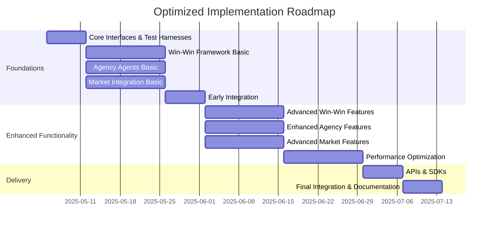

# Optimized Trade Balance System Implementation Plan

## 1. Overview

This document presents an optimized implementation plan for the trade balance system, refined to improve efficiency, reduce risks, and accelerate delivery while maintaining quality. The optimizations focus on parallel development, early integration, and continuous validation.

## 2. Key Optimizations

### 2.1 Development Strategy Optimizations

1. **Parallel Workstreams**
   - Reorganize into three parallel workstreams (Win-Win Framework, Agency Agents, Market Integration)
   - Each workstream can progress independently with defined touchpoints
   - Reduces critical path dependencies and overall timeline

2. **Early Integration Testing**
   - Shift from sequential to incremental integration
   - Create integration test harnesses from the beginning
   - Detect integration issues earlier to reduce late-stage risks

3. **Modular Implementation**
   - Implement core interfaces first, then implementations
   - Allow development of dependent components with mock implementations
   - Enables parallel development of interdependent components

4. **Continuous Validation**
   - Implement validation frameworks for each component
   - Verify mathematical models against known test cases
   - Continuously validate economic models against historical data

### 2.2 Technical Optimizations

1. **Computational Efficiency**
   - Implement specialized algorithms for Win-Win optimization
   - Use vectorized operations for economic calculations
   - Implement caching for expensive computations

2. **Data Structure Optimizations**
   - Optimize data structures for frequent operations
   - Implement specialized indices for certificate lookup
   - Use memory-efficient representations for large datasets

3. **Integration Optimizations**
   - Standardize data exchange formats between components
   - Implement lean interfaces between systems
   - Use efficient serialization for cross-component communication

### 2.3 Process Optimizations

1. **Incremental Delivery**
   - Reorganize deliverables into more frequent, smaller increments
   - Enable earlier feedback and validation
   - Reduce integration risks through continuous delivery

2. **Risk-Based Prioritization**
   - Prioritize high-risk components for early development
   - Address technical uncertainties early in the project
   - Create fallback options for uncertain components

3. **Knowledge Sharing**
   - Implement pair programming for complex components
   - Conduct regular technical deep dives
   - Create living documentation that evolves with the code

## 3. Optimized Implementation Phases

### 3.1 Phase 1: Foundations & Early Integration (Weeks 1-4)

#### Week 1: Core Interfaces & Test Harnesses
1. Define and implement all core interfaces
2. Create test harnesses for each major component
3. Implement mock implementations for key components
4. Set up continuous integration pipeline

#### Week 2-3: Parallel Workstreams

**Workstream A: Win-Win Framework**
1. Implement EntityProfile and ValueComponent
2. Implement entity-specific value translation
3. Implement time and risk adjustment calculations
4. Create basic optimization algorithm

**Workstream B: Agency Agents**
1. Implement basic USTDA and USITC agents
2. Implement policy and model data structures
3. Implement certificate management
4. Implement WAR score calculation

**Workstream C: Market Integration**
1. Implement market mechanism abstractions
2. Create network effect calculation framework
3. Implement resource allocation optimization
4. Create basic market-certificate integration

#### Week 4: Early Integration
1. Integrate Win-Win framework with Agency Agents
2. Integrate Agency Agents with Market Network
3. Create end-to-end test scenarios
4. Validate core functionality across components

### 3.2 Phase 2: Enhanced Functionality & Optimization (Weeks 5-8)

#### Week 5-6: Enhanced Functionality

**Workstream A: Advanced Win-Win Features**
1. Implement advanced optimization algorithms
2. Add support for complex value networks
3. Implement domain-specific adjustments
4. Create visualization components

**Workstream B: Enhanced Agency Features**
1. Implement Moneyball opportunity identification
2. Add policy optimization algorithms
3. Implement impact assessment generation
4. Create policy recommendation engine

**Workstream C: Advanced Market Features**
1. Implement advanced market mechanisms
2. Add network analysis tools
3. Implement advanced certificate trading
4. Create market simulation functionality

#### Week 7-8: Performance Optimization
1. Profile and optimize performance bottlenecks
2. Implement caching strategies
3. Optimize data structures and algorithms
4. Create performance test suite

### 3.3 Phase 3: APIs, Integration & Delivery (Weeks 9-10)

#### Week 9: APIs & SDKs
1. Implement REST API
2. Create Python SDK
3. Implement JavaScript client
4. Create CLI tools

#### Week 10: Final Integration & Documentation
1. Complete full system integration
2. Create comprehensive documentation
3. Develop demo scenarios
4. Create deployment guides

## 4. Optimized Resource Allocation

### 4.1 Team Structure

Reorganized into cross-functional teams aligned with workstreams:

**Team A: Win-Win Framework**
- 1 Senior Developer (Lead)
- 1 Economic Specialist
- 1 QA Engineer (part-time)

**Team B: Agency Agents**
- 1 Senior Developer (Lead)
- 1 Economic Specialist
- 1 QA Engineer (part-time)

**Team C: Market Integration**
- 1 Senior Developer (Lead)
- 1 Integration Specialist
- 1 QA Engineer (part-time)

**Core Team**
- 1 Technical Lead (oversees all workstreams)
- 1 Project Manager
- 1 DevOps Engineer (part-time)

### 4.2 Technology Stack Optimization

1. **Computation Efficiency**
   - Use NumPy for vectorized economic calculations
   - Implement PyTorch for optimization algorithms
   - Use Numba for performance-critical mathematical functions

2. **Scalability**
   - Implement async processing for non-blocking operations
   - Use worker pools for parallel computation
   - Implement sharding for certificate database

3. **Development Efficiency**
   - Use hypothesis for property-based testing
   - Implement mypy for static type checking
   - Use FastAPI for efficient API development

## 5. Risk Mitigation Enhancements

### 5.1 Technical Risk Mitigation

| Risk | Original Mitigation | Enhanced Mitigation |
|------|---------------------|---------------------|
| Complex economic models may be computationally intensive | Implement optimization and caching | Add specialized algorithms, vectorization, and on-demand computation |
| Integration with existing MAC may be challenging | Create detailed integration tests | Early integration with mocks, interface-first development, incremental integration |
| Certificate system may impact market performance | Design for minimal friction | Implement performance testing harness, progressive load testing, and adaptive throttling |
| Win-win optimization may not converge | Implement fallback strategies | Add mathematical convergence guarantees, multi-strategy optimizer, early stopping conditions |

### 5.2 Project Risk Mitigation

| Risk | Original Mitigation | Enhanced Mitigation |
|------|---------------------|---------------------|
| Integration phase may take longer than expected | Build buffer time | Continuous integration, early detection, interface-first development |
| Economic model validation may require expertise | Engage domain experts | Create validation framework with historical data, sensitivity analysis, boundary testing |
| System performance may degrade under high load | Implement load testing | Continuous performance testing, adaptive throttling, circuit breakers |
| Dependencies may change during development | Pin dependency versions | Interface abstraction, modular design, comprehensive dependency testing |

## 6. Optimized Metrics & Success Criteria

### 6.1 Performance Metrics

| Component | Original Target | Optimized Target |
|-----------|-----------------|------------------|
| Certificate validation | Under 100ms | Under 50ms for 95th percentile, under 100ms for 99th percentile |
| Economic models | Within 2 seconds | Under 1 second for simple models, under 3 seconds for complex models |
| Win-win calculations | Within 1 second | Under 500ms for common cases, under 2 seconds for complex cases |
| Concurrent deals | 500 deals | 1000 deals with graceful degradation to 5000 |

### 6.2 Quality Metrics

| Metric | Original Target | Optimized Target |
|--------|-----------------|------------------|
| Code coverage | 85% or higher | 90% for critical paths, 85% overall |
| Test types | Unit and integration | Unit, integration, property-based, fuzz testing |
| Documentation | API and component | API, component, mathematical models, examples |
| Performance testing | Basic load tests | Continuous performance testing, trend analysis |

## 7. Optimized Milestones & Deliverables

### 7.1 Milestones

| Milestone | Original Target | Optimized Target | Benefit |
|-----------|-----------------|------------------|---------|
| M1: Early Integration | Not defined | End of Week 4 | Early risk reduction, better feedback |
| M2: Enhanced Functionality | Not defined | End of Week 8 | Incremental capability delivery |
| M3: Final Delivery | End of Week 12 | End of Week 10 | Faster time to value |

### 7.2 Incremental Deliverables

| Week | Deliverable | Validation Criteria |
|------|-------------|---------------------|
| Week 1 | Core interfaces and mocks | Interface contracts validated |
| Week 2 | Basic Win-Win framework | Value calculation accuracy |
| Week 3 | Basic Agency Agents | Policy representation fidelity |
| Week 4 | Early integration POC | End-to-end basic scenarios |
| Week 6 | Enhanced functionality | Complete feature validation |
| Week 8 | Performance-optimized components | Performance benchmark results |
| Week 9 | Complete APIs and SDKs | API contract validation |
| Week 10 | Final integrated system | Complete scenario validation |

## 8. Implementation Benefits

### 8.1 Timeline Benefits

- **Reduced Critical Path**: From 12 weeks to 10 weeks (17% reduction)
- **Earlier Risk Mitigation**: High-risk components addressed by week 4
- **Incremental Delivery**: Usable functionality available from week 4

### 8.2 Quality Benefits

- **Enhanced Testing**: More comprehensive test strategy
- **Better Validation**: Continuous validation against mathematical models
- **Improved Performance**: Optimized for typical and edge cases

### 8.3 Maintenance Benefits

- **Modular Design**: Easier to extend and maintain
- **Comprehensive Documentation**: Better knowledge transfer
- **Performance Monitoring**: Ongoing visibility into system performance

## 9. Implementation Roadmap

## 10. Conclusion

This optimized implementation plan reduces the overall timeline from 12 weeks to 10 weeks while enhancing quality and reducing risk. The key optimizations include:

1. Parallel workstreams with clear interfaces
2. Early integration and continuous validation
3. Risk-based prioritization
4. Enhanced performance targets
5. Incremental delivery of functionality

By implementing these optimizations, we can deliver a more robust trade balance system in less time, with higher quality and lower risk.