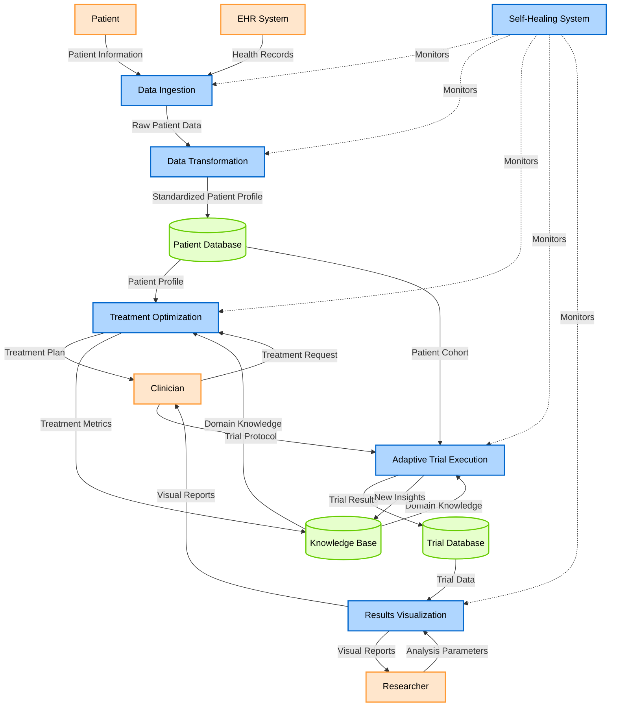
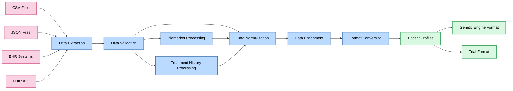
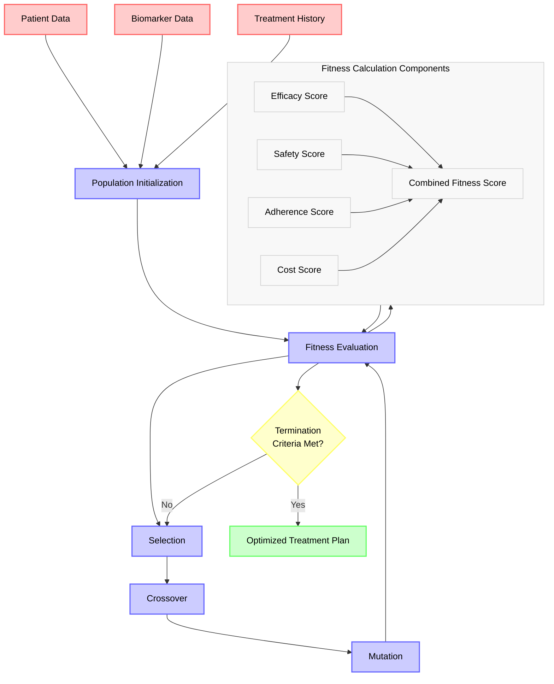
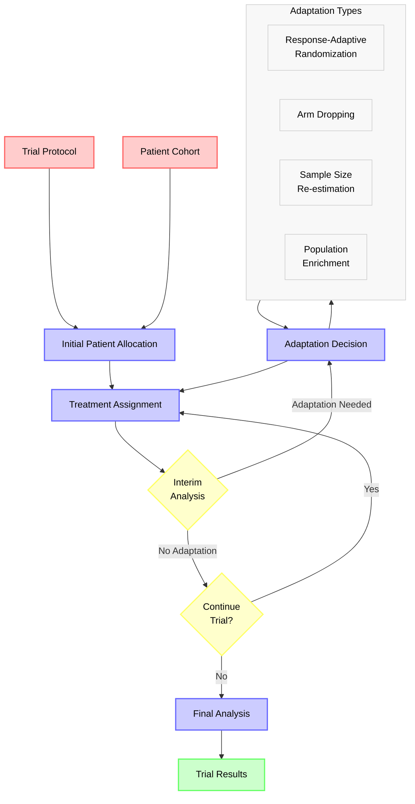
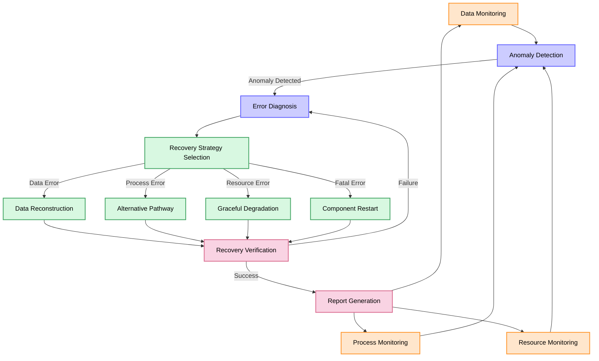
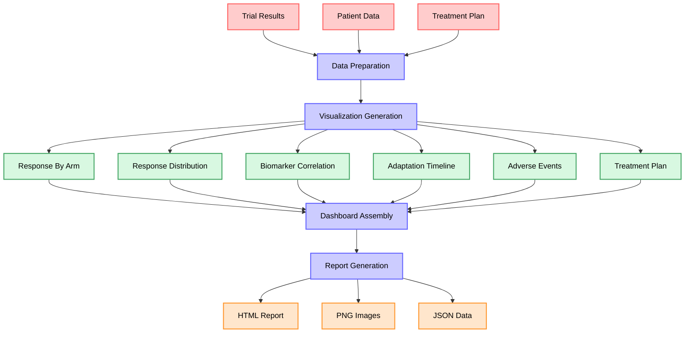

# Data Flow Diagram for Crohn's Treatment System

## System-Level Data Flow



## Detailed Data Transformation Flow



## Genetic Algorithm Optimization Flow



## Adaptive Trial Execution Flow



## Self-Healing System Flow



## Visualization Pipeline Flow



## Key Data Structures

### Patient Profile

```json
{
  "patient_id": "string",
  "demographics": {
    "age": "integer",
    "sex": "string",
    "ethnicity": "string",
    "weight": "float",
    "height": "float"
  },
  "clinical_data": {
    "crohns_type": "string (ileal|colonic|ileocolonic|perianal)",
    "diagnosis_date": "date",
    "disease_activity": {
      "CDAI": "float",
      "SES-CD": "float",
      "fecal_calprotectin": "float"
    }
  },
  "biomarkers": {
    "genetic_markers": [
      {
        "gene": "string",
        "variant": "string",
        "zygosity": "string"
      }
    ],
    "microbiome_profile": {
      "diversity_index": "float",
      "key_species": [
        {
          "name": "string",
          "abundance": "float"
        }
      ]
    },
    "serum_markers": {
      "CRP": "float",
      "ESR": "float"
    }
  },
  "treatment_history": [
    {
      "medication": "string",
      "response": "string",
      "start_date": "date",
      "end_date": "date",
      "adverse_events": ["string"]
    }
  ]
}
```

### Treatment Plan

```json
{
  "treatment_plan": [
    {
      "medication": "string",
      "dosage": "float",
      "unit": "string",
      "frequency": "string",
      "duration": "integer"
    }
  ],
  "fitness": "float",
  "confidence": "float",
  "explanations": ["string"],
  "biomarker_influences": {
    "biomarker_name": "float"
  },
  "alternatives": [
    {
      "treatment_plan": [],
      "fitness": "float"
    }
  ]
}
```

### Trial Protocol

```json
{
  "trial_id": "string",
  "title": "string",
  "phase": "integer",
  "arms": [
    {
      "armId": "string",
      "name": "string",
      "treatment": {
        "medication": "string",
        "dosage": "string",
        "unit": "string",
        "frequency": "string"
      },
      "biomarkerStratification": [
        {
          "biomarker": "string",
          "criteria": "string"
        }
      ]
    }
  ],
  "adaptiveRules": [
    {
      "triggerCondition": "string",
      "action": "string",
      "parameters": {}
    }
  ],
  "primaryEndpoints": [
    {
      "name": "string",
      "metric": "string",
      "timepoint": "string"
    }
  ],
  "secondaryEndpoints": []
}
```

### Trial Results

```json
{
  "trial_id": "string",
  "status": "string",
  "patient_outcomes": [
    {
      "patient_id": "string",
      "arm": "string",
      "response": "float",
      "adverse_events": ["string"]
    }
  ],
  "adaptations": [
    {
      "type": "string",
      "triggerCondition": "string",
      "timestamp": "datetime",
      "parameters": {}
    }
  ]
}
```

## Data Transformation Logic

### From EHR to Patient Profile

```javascript
function transformEhrToPatientProfile(ehrData) {
  return {
    patient_id: ehrData.patient.id,
    demographics: {
      age: calculateAge(ehrData.patient.birthDate),
      sex: ehrData.patient.gender,
      ethnicity: ehrData.patient.ethnicity,
      weight: extractLatestWeight(ehrData.vitals),
      height: extractLatestHeight(ehrData.vitals)
    },
    clinical_data: {
      crohns_type: extractCrohnsType(ehrData.conditions),
      diagnosis_date: extractDiagnosisDate(ehrData.conditions),
      disease_activity: extractDiseaseActivity(ehrData.labs, ehrData.procedures)
    },
    biomarkers: extractBiomarkers(ehrData.labs, ehrData.genetics),
    treatment_history: extractTreatmentHistory(ehrData.medications)
  };
}
```

### From Profile to Genetic Engine Format

```javascript
function transformProfileForGeneticEngine(patientProfile) {
  return {
    patient_id: patientProfile.patient_id,
    age: patientProfile.demographics.age,
    weight: patientProfile.demographics.weight,
    crohns_type: patientProfile.clinical_data.crohns_type,
    severity: determineSeverity(patientProfile.clinical_data),
    genetic_markers: extractGeneticMarkers(patientProfile.biomarkers),
    biomarker_values: normalizeBiomarkers(patientProfile.biomarkers),
    previous_treatments: transformTreatmentHistory(patientProfile.treatment_history)
  };
}
```

### From Trial Results to Visualization

```javascript
function transformResultsForVisualization(trialResults) {
  return {
    trial_id: trialResults.trial_id,
    status: trialResults.status,
    response_by_arm: calculateResponseByArm(trialResults.patient_outcomes),
    response_distribution: calculateResponseDistribution(trialResults.patient_outcomes),
    adverse_events: calculateAdverseEvents(trialResults.patient_outcomes),
    adaptations: transformAdaptations(trialResults.adaptations)
  };
}
```