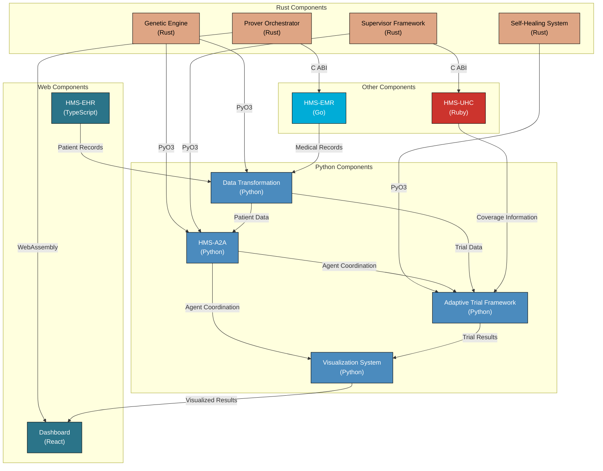
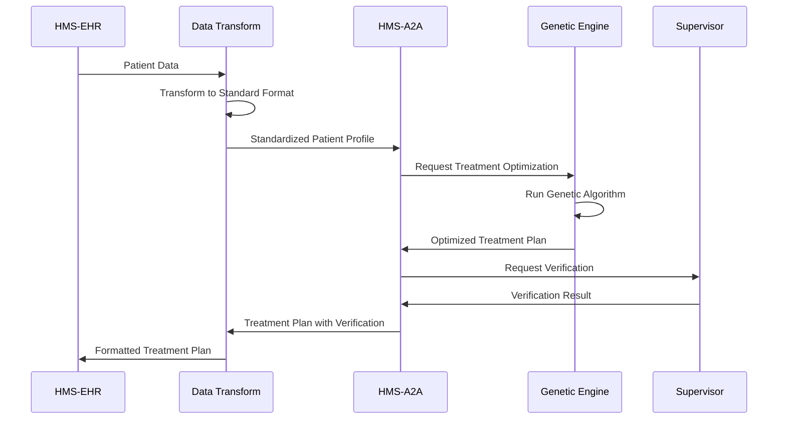
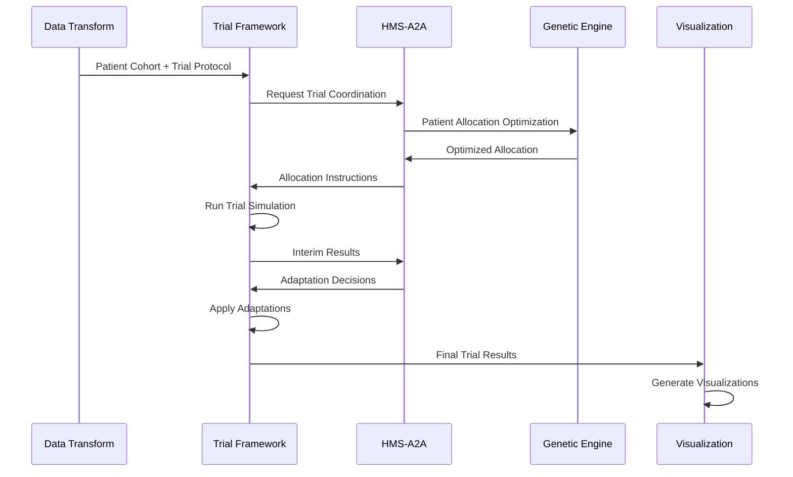
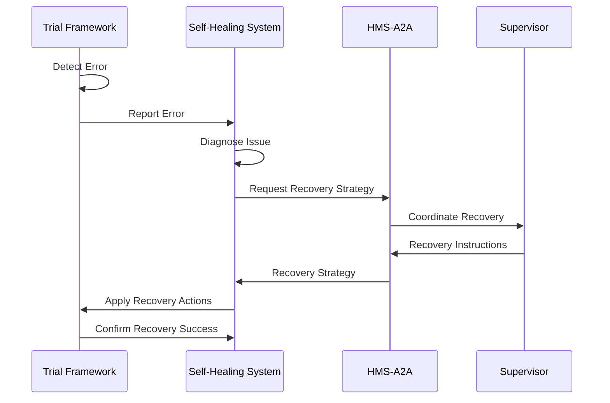

# FFI Integration Diagram for Crohn's Treatment System



## FFI Approach Details

### Rust to Python Integration (PyO3)

PyO3 provides seamless integration between Rust and Python:

```
┌───────────────────┐                  ┌────────────────────┐
│   Rust Component  │                  │  Python Component  │
│                   │                  │                    │
│  ┌─────────────┐  │  PyO3 Bindings   │  ┌──────────────┐  │
│  │ Rust Logic  │──┼──────────────────┼──▶ Python API   │  │
│  └─────────────┘  │                  │  └──────────────┘  │
│                   │                  │                    │
└───────────────────┘                  └────────────────────┘
```

**Implementation Pattern**:
1. Define Rust structs with `#[pyclass]` attribute
2. Implement methods with `#[pymethods]` attribute
3. Create Python module with `#[pymodule]` attribute
4. Import and use in Python code

**Key Interfaces**:
- `GeneticEngine → HMS-A2A`: Treatment optimization
- `Supervisor → HMS-A2A`: Component coordination
- `Self-Healing → Trial Framework`: Error recovery

### Rust to Web Integration (WebAssembly)

WebAssembly enables Rust code to run in browsers:

```
┌───────────────────┐                  ┌────────────────────┐
│   Rust Component  │                  │  Web Component     │
│                   │                  │                    │
│  ┌─────────────┐  │  wasm-bindgen    │  ┌──────────────┐  │
│  │ Rust Logic  │──┼──────────────────┼──▶ JavaScript API│  │
│  └─────────────┘  │                  │  └──────────────┘  │
│                   │                  │                    │
└───────────────────┘                  └────────────────────┘
```

**Implementation Pattern**:
1. Define Rust structs with `#[wasm_bindgen]` attribute
2. Implement methods with `#[wasm_bindgen]` attribute
3. Build with `wasm-pack`
4. Import and use in JavaScript/TypeScript

**Key Interfaces**:
- `Prover-Orchestrator → Dashboard`: Treatment verification
- `Self-Healing → Dashboard`: Error tracking

### Rust to Other Languages (C ABI)

C ABI provides language-agnostic interoperability:

```
┌───────────────────┐                  ┌────────────────────┐
│   Rust Component  │                  │  Other Language    │
│                   │                  │                    │
│  ┌─────────────┐  │  C ABI (FFI)     │  ┌──────────────┐  │
│  │ Rust Logic  │──┼──────────────────┼──▶ Foreign API   │  │
│  └─────────────┘  │                  │  └──────────────┘  │
│                   │                  │                    │
└───────────────────┘                  └────────────────────┘
```

**Implementation Pattern**:
1. Define Rust functions with `#[no_mangle]` and `extern "C"`
2. Use C-compatible types
3. Generate headers if needed
4. Use language-specific FFI mechanisms to call Rust functions

**Key Interfaces**:
- `Prover-Orchestrator → HMS-EMR`: Medical record verification
- `Supervisor → HMS-UHC`: Coverage verification

## Data Flow Diagrams

### Treatment Optimization Flow



### Adaptive Trial Flow



### Self-Healing Flow



## Integration Points

### 1. Genetic Engine Integration

**Interface**: PyO3 bindings for Rust-Python interoperability

**Key Functions**:
- `optimize_treatment(patient_data)`: Generate optimal treatment plan
- `evaluate_fitness(treatment_plan, patient_data)`: Evaluate treatment fitness

**Data Format**: JSON structure for patient data and treatment plans

### 2. Prover-Orchestrator Integration

**Interface**: WebAssembly for browser integration, C ABI for other languages

**Key Functions**:
- `verify_treatment_plan(treatment_json)`: Verify treatment safety and efficacy
- `simulate_treatment_outcome(patient_json, treatment_json)`: Simulate expected outcome

**Data Format**: JSON structure for treatment plans and verification results

### 3. Supervisor Integration

**Interface**: PyO3 for Python integration, C ABI for other languages

**Key Functions**:
- `coordinate_components(command, payload)`: Coordinate system components
- `monitor_health()`: Check system health status

**Data Format**: JSON structure for commands and health status

### 4. Self-Healing Integration

**Interface**: PyO3 for Python integration

**Key Functions**:
- `detect_anomalies(data)`: Detect data anomalies or errors
- `apply_healing(corrupted_data, context)`: Apply healing strategies
- `monitor_system_health()`: Monitor overall system health

**Data Format**: JSON structure for system health and error reports